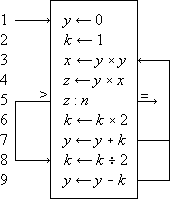
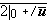
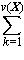
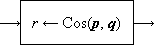
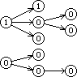
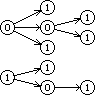
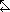
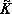
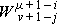

_To My Many Teachers_

## Preface

Applied mathematics is largely concerned with the design and analysis of explicit procedures for calculating the exact or approximate values of various functions. Such explicit procedures are called algorithms or _programs_. Because an effective notation for the description of programs exhibits considerable syntactic structure, it is called a _programming language_.

Much of applied mathematics, particularly the more recent computer-related areas which cut across the older disciplines, suffers from the lack of an adequate programming language. It is the central thesis of this book that the descriptive and analytic power of an adequate programming language amply repays the considerable effort required for its mastery. This thesis is developed by first presenting the entire language and then applying it in later chapters to several major topics.

The areas of application are chosen primarily for their intrinsic interest and lack of previous treatment, but they are also designed to illustrate the universality and other facets of the language. For example, the microprogramming of Chapter 2 illustrates the divisibility of the language, i.e., the ability to treat a restricted area using only a small portion of the complete language. Chapter 6 (Sorting) shows its capacity to compass a relatively complex and detailed topic in a short space. Chapter 7 (The Logical Calculus) emphasizes the formal manipulability of the language and its utility in theoretical work.

The material was developed largely in a graduate course given for several years at Harvard and in a later course presented repeatedly at the IBM Systems Research Institute in New York. It should prove suitable for a two-semester course at the senior or graduate level. Although for certain audiences an initial presentation of the entire language may be appropriate, I have found it helpful to motivate the development by presenting the minimum notation required for a given topic, proceeding to its treatment (e.g., microprogramming), and then returning to further notation. The 130-odd problems not only provide the necessary finger exercises but also develop results of general interest.

Chapter 1 or some part of it is prerequisite to each of the remaining “applications” chapters, but the applications chapters are virtually independent of one another. A complete appreciation of search techniques (Chapter 4) does, however, require a knowledge of methods of representation (Chapter 3). The cross references which do occur in the applications chapters are either nonessential or are specific to a given figure, table, or program. The entire language presented in Chapter 1 is summarized for reference at the end of the book.

In any work spanning several years it is impossible to acknowledge adequately the many contributions made by others. Two major acknowledgments are in order: the first to Professor Howard Aiken, Director Emeritus of the Harvard Computation Laboratory, and the second to Dr. F.P. Brooks, Jr. now of IBM.

It was Professor Aiken who first guided me into this work and who provided support and encouragement in the early years when it mattered. The unusually large contribution by Dr. Brooks arose as follows. Several chapters of the present work were originally prepared for inclusion in a joint work which eventually passed the bounds of a single book and evolved into our joint _Automatic Data Processing_ and the present volume. Before the split, several drafts of these chapters had received careful review at the hands of Dr. Brooks, reviews which contributed many valuable ideas on organization, presentation, and direction of investigation, as well as numerous specific suggestions.

The contributions of the 200-odd students who suffered through the development of the material must perforce be acknowledged collectively, as must the contributions of many of my colleagues at the Harvard Computation Laboratory. To Professor G.A. Salton and Dr. W.L. Eastman, I am indebted for careful reading of drafts of various sections and for comments arising from their use of some of the material in courses. Dr. Eastman, in particular, exorcised many subtle errors from the sorting programs of Chapter 6. To Professor A.G. Oettinger and his students I am indebted for many helpful discussions arising out of his early use of the notation. My debt to Professor R.L. Ashenhurst, now of the University of Chicago, is apparent from the references to his early (and unfortunately unpublished) work in sorting.

Of my colleagues at the IBM Research Center, Messrs. L.R. Johnson and A.D. Falkoff, and Dr. H. Hellerman have, through their own use of the notation, contributed many helpful suggestions. I am particularly indebted to L.R. Johnson for many fruitful discussions on the applications of trees, and for his unfailing support.

On the technical side, I have enjoyed the assistance of unusually competent typists and draughtsmen, chief among them being Mrs. Arthur Aulenback, Mrs. Philip J. Seaward, Jr., Mrs. Paul Bushek, Miss J.L. Hegeman, and Messrs. William Minty and Robert Burns. Miss Jacquelin Sanborn provided much early and continuing guidance in matters of style, format, and typography. I am indebted to my wife for assistance in preparing the final draft.

Kenneth E. Iverson

_May, 1962_

_Mount Kisco, New York_

  
  

## Chapter 1   The Language

**1.1 Introduction**

Applied mathematics is concerned with the design and analysis of algorithms or _programs_. The systematic treatment of complex algorithms requires a suitable _programming language_ for their description, and such a programming language should be concise, precise, consistent over a wide area of application, mnemonic, and economical of symbols; it should exhibit clearly the constraints on the sequence in which operations are performed; and it should permit the description of a process to be independent of the particular representation chosen for the data.

Existing languages prove unsuitable for a variety of reasons. Computer coding specifies sequence constraints adequately and is also comprehensive, since the logical functions provided by the branch instructions can, in principle, be employed to synthesize any finite algorithm. However, the set of basic operations provided is not, in general, directly suited to the execution of commonly needed processes, and the numeric symbols used for variables have little mnemonic value. Moreover, the description provided by computer coding depends directly on the particular representation chosen for the data, and it therefore cannot serve as a description of the algorithm per se.

Ordinary English lacks both precision and conciseness. The widely used Goldstine-von Neumann (1947) flowcharting provides the conciseness necessary to an over-all view of the processes, only at the cost of suppressing essential detail. The so-called pseudo-English used as a basis for certain automatic programming systems suffers from the same defect. Moreover, the potential mnemonic advantage in substituting familiar English words and phrases for less familiar but more compact mathematical symbols fails to materialize because of the obvious but unwonted precision required in their use.

Most of the concepts and operations needed in a programming language have already been defined and developed in one or another branch of mathematics. Therefore, much use can and will be made of existing notations. However, since most notations are specialized to a narrow field of discourse, a consistent unification must be provided. For example, separate and conflicting notations have been developed for the treatment of sets, logical variables, vectors, matrices, and trees, all of which may, in the broad universe of discourse of data processing, occur in a single algorithm.  
 

**1.2 Programs**

A _program statement_ is the specification of some quantity or quantities in terms of some finite operation upon specified operands. Specification is symbolized by an arrow directed toward the specified quantity. thus “`y` is specified by `sin x`” is a statement denoted by

`      _y_ ← sin _x_`

A set of statements together with a specified order of execution constitutes a _program_. The program is _finite_ if the number of executions is finite. The _results_ of the program are some subset of the quantities specified by the program. The _sequence_ or order of execution will be defined by the order of listing and otherwise by arrows connecting any statement to its successor. A cyclic sequence of statements is called a _loop_.

   

 

**Program 1.1 ** Finite Program

 

**Program 1.2 ** Infinite Program

Thus Program 1.1 is a program of two statements defining the result _v_ as the (approximate) area of a circle of radius _x_, whereas Program 1.2 is an infinite program in which the quantity _z_ is specified as (2_y_)_n_ on the _n_th execution of the two statement loop. Statements will be numbered on the left for reference.

A number of similar programs may be subsumed under a single more general program as follows. At certain _branch points_ in the program a finite number of alternative statements are specified as possible successors. One of these successors is chosen according to criteria determined in the statement or statements preceding the branch point. These criteria are usually stated as a _comparison_ or test of a specified relation between a specified pair of quantities. A branch is denoted by a set of arrows leading to each of the alternative successors, with each arrow labeled by the comparison condition under which the corresponding successor is chosen. The quantities compared are separated by a colon in the statement at the branch point, and a labeled branch is followed if and only if the relation indicated by the label holds when substituted for the colon. The conditions on the branches of a properly defined program must be disjoint and exhaustive.

Program 1.3 illustrates the use of a branch point. Statement α5 is a comparison which determines the branch to statements β1, δ1, or γ1, according as _z_ > _n_, _z_ = _n_, or _z_ < _n_. The program represents a crude by effective process for determining _x_ = _n_2/3 for any positive cube _n_.

**Program 1.3 ** Program for _x_ = _n_2/3

Program 1.4 shows the preceding program reorganized into a compact linear array and introduces two further conventions on the labeling of branch points. The listed successor of a branch statement is selected if none of the labeled conditions is met. Thus statement 6 follows statement 5 if neither of the arrows (to exit or to statement 8) are followed, i.e. if _z_ < _n_. Moreover, any unlabeled arrow is always followed; e.g., statement 7 is invariably followed by statement 3, never by statement 8.

A program begins at a point indicated by an _entry arrow_ (step 1) and ends at a point indicated by an _exit arrow_ (step 5). There are two useful consequences of confining a program to the form of a linear array: the statements may be referred to by a unique serial index (statement number), and unnecessarily complex organization of the program manifests itself in crossing branch lines. The importance of the latter characteristic in developing clear and comprehensible programs is not sufficiently appreciated.

   

 

**Program 1.4 ** Linear arrangement of Program 1.3

   

   

 

**Program 1.5 ** Matrix multiplication

A process which is repeated a number of times is said to be _iterated_, and a process (such as in Program 1.4) which includes one or more iterated subprocesses is said to be _iterative_. Program 1.5 shows an iterative process for the matrix multiplication

      **_C_** ← **_A_****_B_**

defined in the usual way as

     

**_C_**_j__i_ =  **_A_**_k__i_ × **_B_**_j__k_ ,

     

_i_ = 1,2, …, _μ_(**_A_**),  
_j_ = 1,2, …, _ν_(**_B_**),

where the dimensions of an _m_ × _n_ matrix **_X_** (of _m_ rows and _n_ columns) is denoted by _μ_(**_X_**) × _ν_(**_X_**).

 

**Program 1.5**. Steps 1-3 initialize the indices, and the loop 5-7 continues to add successive products to the partial sum until _k_ reaches zero. When this occurs, the process continues through step 8 to decrement _j_ and to repeat the entire summation for the new value of _j_, providing that it is not zero. If _j_ is zero, the branch to step 10 decrements _i_ and the entire process over _j_ and _k_ is repeated from _j_ = _ν_(**_B_**), providing that _i_ is not zero. If _i_ is zero, the process is complete, as indicated by the exit arrow.

 

In all examples used in this chapter, emphasis will be placed on clarity of description of the process, and considerations of efficient execution by a computer or class of computers will be subordinated. These considerations can often be introduced later by relatively routine modifications of the program. For example, since the execution of a computer operation involving an indexed variable is normally more costly than the corresponding operation upon a nonindexed variable, the substitution of a variable _s_ for the variable **_C_**_j__i_ specified by statement 5 of Program 1.5 would accelerate the execution of the loop. The variable _s_ would be initialized to zero before each entry to the loop and would be used to specify **_C_**_j__i_ at each termination.

The practice of first setting an index to its maximum value and then decrementing it (e.g., the index _k_ in Program 1.5) permits the termination comparison to be made with zero. Since zero often occurs in comparisons, it is convenient to omit it. Thus, if a variable stands alone at a branch point, comparison with zero is implied. Moreover, since a comparison on an index frequently occurs immediately after it is modified, a branch at the point of modification will denote branching upon comparison of the indicated index with zero, the comparison occurring _after_ modification. Designing programs to execute decisions immediately after modification of the controlling variable results in efficient execution as well as notational elegance, since the variable must be present in a central register for both operations.

Since the sequence of execution of statements is indicated by connecting arrows as well as by the order of listing, the latter can be chosen arbitrarily. This is illustrated by the functionally identical Programs 1.3 and 1.4. Certain principles of ordering may yield advantages such as clarity or simplicity of the pattern of connections. Even though the advantages of a particular organizing principle are not particularly marked, the uniformity resulting from its consistent application will itself be a boon. The scheme here adopted is called the _method of leading decisions_: the decision on each parameter is placed as early in the program as practicable, normally just before the operations indexed by the parameter. This arrangement groups at the head of each iterative segment the initialization, modification, and the termination test of the controlling parameter. Moreover, it tends to avoid program flaws occasioned by unusual values of the argument.

   

 

**Program 1.6 ** Matrix multiplication using leading decisions

For example, Program 1.6 (which is a reorganization of Program 1.5) behaves properly for matrices of dimension zero, whereas Program 1.5 treats every matrix as if it were of dimension one or greater.

Although the labeled arrow representation of program branches provides a complete and graphic description, it is deficient in the following respects: (1) a routine translation to another language (such as computer code) would require the tracing of arrows, and (2) it does not permit programmed modification of the branches.

The following alternative form of a branch statement will therefore be used as well:

      _x_ : _y_,  **_r_** → **_s_**.

This denotes a branch to statement number **_s_**_i_ of the program if the relation _x_**_r_**_ i __y_ holds. The parameters **_r_** and **_s_** may themselves be defined and redefined in other parts of the program. The _null element_ ∘ will be used to denote the relation which complements the remaining relations **_r_**_ i_; in particular, (∘)→(_s_), or simply →_s_, will denote an unconditional branch to statement _s_. Program 1.7 shows the use of these conventions in a reformulation of Program 1.6. More generally, two or more otherwise independent programs may interact through a statement in one program specifying a branch in a second. The statement number occurring in the branch must then be augmented by the name of the program in which the branch is effected. Thus the statement (∘) → Program 2.24 executed in Program 1 causes a branch to step 24 to occur in Program 2.

   

 

**Program 1.7 ** A reformulation of Program 1.6,  
using an algebraic statement of the branching

One statement in a program can be modified by another statement which changes certain of its parameters, usually indices. More general changes in statements can be effected by considering the program itself as a vector **_p_** whose components are the individual, serially numbered statements. All the operations to be defined on general vectors can then be applied to the statements themselves. For example, the _j_th statement can be respecified by the _i_th through the occurrence of the statement **_p_**_j_ ← **_p_**_i_.

The interchange of two quantities _y_ and _x_ (that is, _x_ specifies _y_ and the _original_ value of _y_ specifies _x_) will be denoted by the statement _y_ ↔ _x_.  
 

**1.3 Structure of the language**

**Conventions**

The Summary of Notation at the end of the book summarizes the notation developed in this chapter. Although intended primarily for reference, it supplements the text in several ways. It frequently provides a more concise alternative definition of an operation discussed in the text, and it also contains important but easily grasped extensions not treated explicitly in the text. By grouping the operations into related classes it displays their family relationships.

A concise programming language must incorporate families of operations whose members are related in a systematic manner. Each family will be denoted by a specific operation symbol, and the particular member of the family will be designated by an associated _controlling parameter_ (scalar, vector, matrix, or tree) which immediately precedes the main operation symbol. The operand is placed immediately after the main operation symbol. For example, the operation _k_ ↑ **_x_** (left rotation of **_x_** by _k_ places) may be viewed as the _k_th member of the set of rotation operators denoted by the symbol ↑.

Operations involving a single operand and no controlling parameter (such as ⌊_x_⌋, or ⌈_x_⌉) will be denoted by a pair of operation symbols which enclose the operand. Operations involving two operands and a controlling parameter (such as the mask operation /**_a_**, **_u_**, **_b_**/) will be denoted by a pair of operation symbols enclosing the entire set of variables, and the controlling parameter will appear between the two operands. In these cases the operation symbols themselves serve as grouping symbols.

In interpreting a compound operation such as _k_ ↑ (_j_ ↓ **_x_**) it is important to recognize that the operation symbol and its associated controlling parameter together represent an indivisible operation and must not be separated. It would, for example, be incorrect to assume that _j_ ↑ (_k_ ↓ **_x_**) were equivalent to _k_ ↑ (_j_ ↓ **_x_**), although it can be shown that the complete operations _j_ ↓ and _k_ ↑ do commute, that is _k_ ↑ (_j_ ↓ **_x_**) = _j_ ↓ (_k_ ↑ **_x_**).

The need for parentheses will be reduced by assuming that compound statements are, except for intervening parentheses, executed from right to left. Thus _k_ ↑ _j_ ↓ **_x_** is equivalent to _k_ ↑ (_j_ ↓ **_x_**), not to (_k_ ↑ _j_) ↓ **_x_**.

Structured operands such as vectors and matrices, together with a systematic component-by-component generalization of elementary operations, provide an important subordination of detail in the description of algorithms. The use of structured operands will be facilitated by _selection operations_ for extracting a specified portion of an operand, _reduction operations_ for extending an operation (such as logical or arithmetic multiplication) over all components, and _permutation operations_ for reordering components. Operations defined on vectors are extended to matrices: the extended operation is called a _row_ operation if the underlying vector operation is applied to each row of the matrix and a _column_ operation if it is applied to each column. A column operation is denoted by doubling the symbol employed for the corresponding row (and vector) operation.

A distinct typeface will be used for each class of operand as detailed in Table 1.8. Special quantities (such as the prefix vectors **⍺**_i_ defined in Sec. 1.7) will be denoted by Greek letters in the appropriate typeface. For mnemonic reasons, an operation closely related to such a special quantity will be denoted by the same Greek letter. For example, ⍺/**_u_** denotes the maximum prefix (Sec. 1.10) of the logical vector **_u_**. Where a Greek letter is indistinguishable from a Roman, sanserif characters will be used, e.g. **_E_** and **_I_** for the capitals of epsilon and iota.

Type of  
Operand

Representation

Printed

Typed

 

Literal

 

   

Alphabetic

 

   

Numeric

 

Variable

 

   

Alphabetic

 

   

Numeric

 

Vector

 

Matrix

 

Tree

Roman, u.c. and l.c.

Standard numeral

Italic, u.c. and l.c.

Italic numeral

l.c. boldface italic

u.c. boldface italic

u.c. boldface roman

Circled u.c. and l.c. roman

Standard numeral

Unmarked

Underscore

Underscore

Underscore

Wavy underscore

     **Table 1.8 ** Typographic conventions for classes of operands

**Literals and variables**

The power of any mathematical notation rests largely on the use of symbols to represent general quantities which, in given instances, are further specified by other quantities. Thus Program 1.4 represents a general process which determines _x_ = _n_2/3 for any suitable value of _n_. In a specific case, say _n_ = 27, the quantity _x_ is specified as the number 9.

Each operand occurring in a meaningful process must be specified ultimately in terms of commonly accepted concepts. The symbols representing such accepted concepts will be called _literals_. Examples of literals are the integers, the characters of the various alphabets, punctuation marks, and miscellaneous symbols such as $ and %. The literals occurring in Program 1.4 are 0, 1, 2.

It is important to distinguish clearly between general symbols and literals. In ordinary algebra this presents little difficulty, since the only literals occurring are the integers and the decimal point, and each general symbol employed includes an alphabetic character. In describing more general processes, however, alphabetic literals (such as proper names) also appear. Moreover, in a computer program, numeric symbols (register addresses) are used to represent the variables.

In general, then, alphabetic literals, alphabetic variables, numeric literals, and numeric variables may all appear in a complex process and must be clearly differentiated. The symbols used for literals will be Roman letters (enclosed in quotes when appearing in text) and standard numerals. The symbols used for variables will be italic letters, italic numerals, and boldface letters as detailed in Table 1.8. Miscellaneous signs and symbols when used as literals will be enclosed in quotes in both programs and text.

It is sometimes desirable (e.g., for mnemonic reasons) to denote a variable by a string of alphabetic or other symbols rather than by a single symbol. The monolithic interpretation of such a string will be indicated by the _tie_ used in musical notation, thus:  and  may denote the variable “inventory”, a vector of inventory values, and a matrix of inventory values, respectively.

In the set of alphabetic characters, the _space_ plays a special role. For other sets a similar role is usually played by some one element, and this element is given the special name of _null element_. In the set of numeric digits, the _zero_ plays a dual role as both null element and numeric quantity. The null element will be denoted by the degree symbol ∘.

In any determinate process, each operand must be specified ultimately in terms of literals. In Program 1.4, for example, the quantity _k_ is specified in terms of known arithmetic operations (multiplication and division) involving the literals 1 and 2. The quantity _n_, on the other hand, is not determined within the process and must presumably be specified within some larger process which includes Program 1.4. Such a quantity is called an _argument_ of the process.

**Domain and range**

The class of arguments and the class of results of a given operator are called its _domain_ and _range_, respectively. Thus the domain and range of the magnitude operation (|_x_|) are the real numbers and the nonnegative real numbers, respectively.

A variable is classified according to the range of values it may assume: it is _logical_, _integral_, or _numerical_, according as the range is the set of logical variables (that is, 0 and 1), the set of integers, or the set of real numbers. Each of the foregoing classes is clearly a subclass of each class following it, and any operation defined on a class clearly applies to any of its subclasses. A variable which is nonnumeric will be called _arbitrary_. In the Summary of Notation, the range and domain of each of the operators defined is specified in terms of the foregoing classes according to the conventions shown in Sec. S.1.  
 

**1.4 Elementary operations**

The elementary operations employed include the ordinary arithmetic operations, the elementary operations of the logical calculus, and the residue and related operations arising in elementary number theory. In defining operations in the text, the symbol ↔ will be used to denote equivalence of the pair of statements between which it occurs.

**Arithmetic operations**

The ordinary arithmetic operations will be denoted by the ordinary symbols +, –, ×, and ÷ and defined as usual except that the domain and range of multiplication will be extended slightly as follows. If one of the factors is a logical variable (0 or 1), the second may be arbitrary and the product then assumes the value of the second factor or zero according as the value of the first factor (the logical variable) is 1 or 0. Thus if the arbitrary factor is the literal “q”, then

 

      0 × q = q × 0 = 0

and

      1 × q = q × 1 = q

According to the usual custom in ordinary algebra, the multiplication symbol may be elided.

**Logical operations**

The elementary logical operations _and_, _or_, and _not_ will be denoted by ∧, ∨ and an overbar and are defined in the usual way as follows:

      _w_ ← _u_ ∧ _v_

  ↔  

_w_ = 1 if and only if _u_ = 1 and 

_v_ = 1,

      _w_ ← _u_ ∨ _v_

  ↔  

_w_ = 1 if and only if _u_ = 1 or

_v_ = 1,

      _w_ ← 

  ↔  

_w_ = 1 if and only if _u_ = 0.

If _x_ and _y_ are numerical quantities, then the expression _x_ < _y_ implies that the quantity _x_ stands in the relation “less than” to the quantity _y_. More generally, if _α_ and _β_ are arbitrary entities and R is any relation defined on them, the _relational statement_ (_α_ R _β_) is a logical variable which is true (equal to 1) if and only if _α_ stands in the relation R to _β_. For example, if _x_ is any real number, then the function

     (_x_ > 0) – (_x_ < 0)

(commonly called the _sign function_ or sgn _x_) assumes the values 1, 0, or –1 according as _x_ is strictly positive, 0, or strictly negative. Moreover, the magnitude function |_x_| may be defined as |_x_| = _x_ × sgn _x_ = _x_ × ((_x_ > 0) – (_x_ < 0)).

The relational statement is a useful generalization of the Kronecker delta, that is _δ__j__i_ = (_i_ = _j_). Moreover, it provides a convenient expression for a number of familiar logical operations. The _exclusive or_, for example, may be denoted by (_u_ ≠ _v_), and its negation (i.e., the equivalence function) may be denoted by (_u_ = _v_).

**Residues and congruence**

For each set of integers _n_, _j_, and _b_, with _b_ > 0, there exists a unique pair of integers _q_ and _r_ such that

      _n_ = _b__q_ + _r_,   _j_ ≤ _r_ < _j_ + _b_.

The quantity _r_ is called the _j-residue of n modulo b_ and is denoted by _b_ |_ j_ _n_. For example, 3 |0 9 = 0, 3 |1 9 = 3, and 3 |0 10 = 1. Moreover, if _n_ ≥ 0, then _b_ |0 _n_ is the remainder obtained in dividing _n_ by _b_ and _q_ is the integral part of the quotient. A number _n_ is said to be of _even parity_ if its 0-residue modulo 2 is zero and of _odd parity_ if 2 |0 _n_ = 1.

If two numbers _n_ and _m_ have the same _j_\-residue modulo _b_, they differ by an integral multiple of _b_ and therefore have the same _k_\-residue module _b_ for any _k_. If _b_ |_ j_ _n_ = _b_ |_ j_ _m_, then _m_ and _n_ are said to be _congruent mod b_. Congruency is transitive and reflexive and is denoted by

      _m_ ≡ _n_ (mod _b_).

In classical treatments, such as Wright (1939), only the 0-residue is considered. The use of 1-origin indexing (cf. Sec. 1.5) accounts for the interest of the 1-residue.

A number represented in a positional notation (e.g., in a base ten or a base two number system) must, in practice, employ only a finite number of digits. It is therefore often desirable to approximate a number _x_ by an integer. For this purpose two functions are defined:

1.

 

the _floor of x_ (or integral part of _x_), denoted by ⌊_x_⌋ and defined as the largest integer not exceeding _x_,

2.

 

the _ceiling of x_, denoted by ⌈_x_⌉ and defined as the smallest integer not exceeded by _x_.

Thus

     

⌈3.14⌉ = 4,

   

⌊3.14⌋ = 3,

   

⌊–3.14⌋ = –4,

 

⌈3.00⌉ = 3,

   

⌊3.00⌋ = 3,

   

⌊–3.00⌋ = –3.

Clearly ⌈_x_⌉ = –⌊–_x_⌋ and ⌊_x_⌋ ≤ _x_ ≤ ⌈_x_⌉. Moreover, _n_ = _b_⌊_n_ ÷ _b_⌋ + _b_ |0 _n_ for all integers _n_. Hence the integral quotient ⌊_n_ ÷ _b_⌋ is equivalent to the quantity _q_ occurring in the definition of the _j_\-residue for the case _j_ = 0.  
 

**1.5 Structured operands**

**Elementary operations**

Any operation defined on a single operand can be generalized to apply to each member of an array of related operands. Similarly, any binary operation (defined on two operands) can be generalized to apply to pairs of corresponding elements of two arrays. Since algorithms commonly incorporate processes which are repeated on each member of an array of operands, such generalization permits effective subordination of detail in their description. For example, the accounting process defined on the data of an individual bank account treats a number of distinct operands within the account, such as account number, name, and balance. Moreover, the over-all process is defined on a large number of similar accounts, all represented in a common format. Such structured arrays of variables will be called _structured operands_, and extensive use will be made of three types, called _vector_, _matrix_, and _tree_. As indicated in Sec. S.1 of the Summary of Notation, a structured operand is further classified as _logical_, _integral_, _numerical_, or _arbitrary_, according to the type of elements in contains.

A _vector_ **_x_** is the ordered array of elements (**_x_**1, **_x_**2, **_x_**3, …, **_x_**_ν_(**_x_**)). The variable **_x_**_i_ is called the _i_th _component_ of the vector **_x_**, and the number of components, denoted by _ν_(**_x_**) (or simply by _ν_ when the determining vector is clear from context), is called the _dimension_ of **_x_**. Vectors and their components will be represented in lower case boldface italics. A numerical vector **_x_** may be multiplied by a numerical quantity _k_ to produce the _scalar multiple_ _k_ × **_x_** (or _k_**_x_**) defined as the vector **_z_** such that **_z_**_ i_ = _k_ × **_x_**_i_.

All elementary operations defined on individual variables are extended consistently to vectors as component-by-component operations. For example,

     

**_z_** = **_x_** + **_y_**

  ↔  

**_z_**_i_ = **_x_**_i_ + **_y_**_i_,

 

**_z_** = **_x_** × **_y_**

  ↔  

**_z_**_i_ = **_x_**_i_ × **_y_**_i_,

 

**_z_** = **_x_** ÷ **_y_**

  ↔  

**_z_**_i_ = **_x_**_i_ ÷ **_y_**_i_,

 

**_z_** = ⌈**_x_**⌉

  ↔  

**_z_**_i_ = ⌈**_x_**_i_⌉

 

**_w_** = **_u_** ∧ **_v_**

  ↔  

**_w_**_i_ = **_u_**_i_ ∧ **_v_**_i_,

 

**_w_** = (**_x_** < **_y_**)

  ↔  

**_w_**_i_ = (**_x_**_i_ < **_y_**_i_).

Thus if **_x_** = (1, 0, 1, 1) and **_y_** = (0, 1, 1, 0) then **_x_** + **_y_** = (1, 1, 2, 1), **_x_** ∧ **_y_** = (0, 0, 1, 0), and (**_x_** < **_y_**) = (0, 1, 0, 0).

**Matrices**

A matrix **_M_** is the ordered two-dimensional array of variables

     

**_M_**11,

**_M_**21,

…,

**_M_**_ν_(**_M_**)1

.

**_M_**12,

**_M_**22,

…,

**_M_**_ν_(**_M_**)2

.

.

.

.

**_M_**1_μ_(**_M_**),

**_M_**2_μ_(**_M_**),

…,

**_M_**_ν_(**_M_**)_μ_(**_M_**)

The vector (**_M_**1_i_, **_M_**2_i_, …, **_M_**_ν__i_) is called the _i_th _row vector_ of **_M_** and is denoted by **_M_**_ i_. Its dimension _ν_(**_M_**) is called the _row dimension_ of the matrix. The vector (**_M_**_ j_1, **_M_**_ j_2, …, **_M_**_ j__ μ_) is called the _j_th _column vector_ of **_M_** and is denoted by **_M_**_ j_. Its dimension _μ_(**_M_**) is called the _column dimension_ of the matrix.

The variable **_M_**_ j__i_ is called the (_i_,_j_)th _component_ or _element_ of the matrix. A matrix and its elements will be represented by upper case boldface italics. Operations defined on each element of a matrix are generalized component by component to the entire matrix. Thus, if  is any binary operator,

      **_P_** = **_M_**  **_N_** ↔ **_M_**_j__i_  **_N_**_j__i_.

**Index systems**

The subscript appended to a vector to designate a single component is called an _index_, and the indices are normally chosen as a set of successive integers beginning at 1, that is, **_x_** = (**_x_**1, **_x_**2, … **_x_**_ν_). It is, however, convenient to admit more general _j_\-_origin indexing_ in which the set of successive integers employed as indices in any structured operand begin with a specified integer _j_.

The two systems of greatest interest are the common 1-origin system, which will be employed almost exclusively in this chapter, and the 0-origin system. The latter system is particularly convenient whenever the index itself must be represented in a positional number system and will therefore be employed exclusively in the treatment of computer organization in Chapter 2.  
 

**1.6 Rotation**

The _left rotation_ of a vector **_x_** is denoted by _k_ ↑ **_x_** and specifies the vector obtained by cyclical left shift of the components of **_x_** by _k_ places. Thus if **_a_** = (1, 2, 3, 4, 5, 6), and **_b_** = (c, a, n, d, y), then 2 ↑ **_a_** = (3, 4, 5, 6, 1, 2) and 3 ↑ **_b_** = 8 ↑ **_b_** = (d, y, c, a, n). Formally,[\[a\]](APL1.htm#note1a)

      **_z_** = _k_ ↑ **_x_** ↔ **_z_**_ i_ = **_x_**_ j_,     where _j_ = _ν_|1(_i_ + _k_).

_Right rotation_ is denoted by _k_ ↓ **_x_** and is defined analogously. Thus

      **_z_** = _k_ ↓ **_x_** ↔ **_z_**_ i_ = **_x_**_ j_,     where _j_ = _ν_|1(_i_ – _k_).

If _k_ = 1, it may be elided. Thus ↑ **_b_** = (a, n, d, y, c).

Left rotation is extended to matrices in two ways as follows:

     

**_A_** ← **_j_** ↑ **_B_**

 ↔ 

**_A_**_i_ = **_j_**_i_ ↑ **_B_**_i_

     

**_C_** ← **_k_**  **_B_**

 ↔ 

**_C_**_i_ = **_k_**_j_ ↑ **_B_**_j_

The first operation is an extension of the basic vector rotation to each row of the matrix and is therefore called _row rotation_. The second operation is the corresponding column operation and is therefore denoted by the doubled operation symbol . For example, if

      **_k_** = (0, 1, 2),

and

     

**_B_** =  

 

_a_   

_b_   

_c_

_d_   

_e_   

_f_

_g_   

_h_   

_i_

then

     

**_k_** ↑ **_B_** =  

 

_a_   

_b_   

_c_

_e_   

_f_   

_d_

_i_   

_g_   

_h_

      and      

**_k_**  **_B_** =  

 

_a_   

_e_   

_i_

_d_   

_h_   

_c_

_g_   

_b_   

_f_

.

Right rotation is extended analogously.  
 

**1.7 Special vectors**

Certain special vectors warrant special symbols. In each of the following definitions, the parameter _n_ will be used to specify the dimension. The _interval vector_ **⍳**_j_(_n_) is defined as the vector of integers beginning with _j_. Thus **⍳**0(4)=(0, 1, 2, 3), **⍳**1(4)=(1, 2, 3, 4), and **⍳**–7(5)= (–7, –6, –5, –4, –3). Four types of logical vectors are defined as follows. The _j_th _unit vector_ **∊**_ j_(_n_) has a one in the _j_th position, that is, (**∊**_ j_(_n_))_k_ = (_k_ = _j_). The _full vector_ **∊**(_n_) consists of all ones. The vector consisting of all zeros is denoted both by 0 and by (_n_).  The _prefix vector of weight j_ is denoted by **⍺**_ j_(_n_) and possesses ones in the first _k_ positions, where _k_ is the lesser of _j_ and _n_.  The _suffix vector_ **⍵**_ j_(_n_) is defined analogously. Thus **∊**2(3) = (0, 1, 0), **∊**(4) = (1, 1, 1, 1), **⍺**3(5) = (1, 1, 1, 0, 0), **⍵**3(5) = (0, 0, 1, 1, 1), and **⍺**7(5) = **⍺**5(5) = (1, 1, 1, 1, 1). Moreover, **⍵**_ j_(_n_) = _j_ ↑ **⍺**_ j_(_n_), and **⍺**_ j_(_n_) = _j_ ↓ **⍵**_ j_(_n_).

A logical vector of the form **⍺**_h_(_n_) ∧ **⍵**_ j_(_n_) is called an _infix vector_. An infix vector can also be specified in the form _j_ ↓ **⍺**_k_(_n_), which displays its weight and location more directly.

An operation such as **_x_** ∧ **_y_** is defined only for _compatible_ vectors **_x_** and **_y_**, that is, for vectors of like dimension. Since this compatibility requirement can be assumed to specify implicitly the dimension of one of the operands, elision of the parameter _n_ may be permitted in the notation for the special vectors. Thus, if _y_ = (3, 4, 5, 6, 7), the expression **∊** × **_y_** and **∊**_ j_ × **_y_** imply that the dimensions of **∊** and **∊**_ j_ are both 5. Moreover, elision of _j_ will be permitted for the interval vector **⍳**_ j_(_n_) (or **⍳**_ j_), and for the residue operator |_ j_ when _j_ is the index origin in use.

It is, of course, necessary to specify the index origin in use at any given time. For example, the unit vector **∊**3(5) is (0, 0, 1, 0, 0) in a 1-origin system and (0, 0, 0, 1, 0) in a 0-origin system, even though the definition (that is, (**∊**_ j_(_n_))_k_ = (_k_ = _j_)) remains unchanged. The prefix and suffix vectors are, of course, independent of the index origin. Unless otherwise specified, 1-origin indexing will be assumed.

The vector **∊**(0) is a vector of dimension zero and will be called the _null vector_. It should not be confused with the special null element ∘.  
 

**1.8 Reduction**

An operation (such as summation) which is applied to all components of a vector to produce a result of a simpler structure is called a _reduction_. The \-reduction of a vector **_x_** is denoted by /**_x_** and defined as

      **_z_** ← /**_x_**  ↔  **_z_** = (… ((**_x_**1  **_x_**2)  **_x_**3)  …)  **_x_**_ν_),

where  is any binary operator with a suitable domain. Thus +/**_x_** is the sum, ×/**_x_** is the product, and ∨/**_x_** is the logical sum of the components of a vector **_x_**. For example, ×/**⍳**1(5) = 1 × 2 × 3 × 4 × 5, ×/**⍳**1(_n_) = _n_!, and +/**⍳**1(_n_) = _n_(_n_ + 1)/2.

As a further example, De Morgan’s law may be expressed as ∧/**_u_** = , where **_u_** is a logical vector of dimension two. Moreover, a simple inductive argument (Exercise 1.10) shows that the foregoing expression is the valid generalization of De Morgan’s law for a logical vector **_u_** of arbitrary dimension.

A relation R incorporated into a relational statement (_x_R_y_) becomes, in effect, an operator on the variables _x_ and _y_. Consequently, the reduction R/**_x_** can be defined in a manner analogous to that of (/**_x_**), that is,

      R/**_x_** = (… ((**_x_**1 R **_x_**2) R **_x_**3) R …) R **_x_**_ν_).

The parentheses now imply relational statements as well as grouping. The relational reductions of practical interest are ≠/**_u_**, and =/**_u_**, the _exclusive-or_ and the _equivalence_ reduction, respectively.

The inductive argument of Exercise 1.10 shows that ≠/**_u_** = 2 |0 (+/**_u_**). For example, if **_u_** = (1,0,1,1,0), then

     

≠/**_u_**

 = 

((((1 ≠ 0) ≠ 1) ≠ 1) ≠ 0)

 

 = 

(((1 ≠ 1) ≠ 1) ≠ 0)

 

 = 

((0 ≠ 1) ≠ 0)

 

 = 

(1 ≠ 0) = 1,

and 2 |0 (+/**_u_**) = 2 |0 3 = 1. Similarly, =/**_u_** = , and as a consequence,

      ≠/**_u_** = ,

a useful companion to De Morgan’s law.

To complete the system it is essential to define the value of /**∊**(0), the reduction of the null vector of dimension zero, as the identity element of the operator or relation . Thus +/**∊**(0) = ∨/**∊**(0) = 0, and ×/**∊**(0) = ∧/**∊**(0) = 1.

A reduction operation is extended to matrices in two ways. A _row reduction_ of a matrix **_X_** by an operator  is denoted by

      **_y_** ← /**_X_**

and specifies a vector **_y_** of dimension _μ_(**_X_**) such that **_y_**_i_ = /**_X_**_i_.  A _column reduction_ of **_X_** is denoted by **_z_** ← //**_X_** and specifies a vector **_z_** of dimension _ν_(**_X_**) such that **_z_**_ j_ = //**_X_**_ j_.

For example, if

      **_U_**  = 

1   0   1   0

0   0   1   1

1   1   1   0

then +/**_U_** = (2, 2, 3), +//**_U_** = (2, 1, 3, 1), ∧//**_U_** = (0, 0, 1, 0), ≠/**_U_** = (0, 0, 1), =//**_U_** = (0, 1, 1, 1), and +/(=//**_U_**) = 3.  
 

**1.9 Selection**

**Compression**

The effective use of structured operands depends not only on generalized operations but also on the ability to specify and select certain elements or groups of elements. The selection of single elements can be indicated by indices, as in the expressions **_v_**_i_, **_M_**_ i_, **_M_**_ j_, and **_M_**_ i__ j_. Since selection is a binary operation (i.e., to select or not to select), more general selection is conveniently specified by a logical vector, each unit component indicating selection of the corresponding component of the operand.

The selection operation defined on an arbitrary vector **_a_** and a compatible (i.e., equal in dimension) logical vector **_u_** is denoted by **_c_** ← **_u_**/**_a_** and is defined as follows: the vector **_c_** is obtained from **_a_** by suppressing from **_a_** each component **_a_**_i_ for which **_u_**_i_ = 0. The vector **_u_** is said to _compress_ the vector **_a_**. Clearly _ν_(**_c_**) = +/**_u_**. For example, if **_u_** = (1, 0, 0, 0, 1, 1) and **_a_** = (M, o, n, d, a, y), then **_u_**/**_a_** = (M, a, y). Moreover, if _n_ is even and **_v_** = (2**∊**) |0 **⍳**1(_n_) = (1, 0, 1, 0, 1, …), then **_v_**/**⍳**1(_n_) = (1, 3, 5, …, _n_–1) and +/(**_v_**/**⍳**1(_n_)) = (_n_/2)².

_Row compression_ of a matrix, denoted by **_u_**/**_A_**, compresses each row vector **_A_**_i_ to form a matrix of dimension _μ_(**_A_**) × +/**_u_**. _Column compression_, denoted by **_u_**//**_A_**, compresses each column vector **_A_**_ j_ to form a matrix of dimension +/**_u_** × _ν_(**_A_**). Compatibility conditions are _ν_(**_u_**) = _ν_(**_A_**) for row compression, and _ν_(**_u_**) = _μ_(**_A_**) for column compression. For example, if **_A_** is an arbitrary 3 × 4 matrix, **_u_** = (0, 1, 0, 1) and **_v_** = (1, 0, 1); then

     

**_u_**/**_A_**  = 

**_A_**21   **_A_**41

,

**_A_**23   **_A_**43

**_A_**22   **_A_**42

     

**_v_**//**_A_**  = 

**_A_**11   **_A_**21   **_A_**31   **_A_**41

,

**_A_**13   **_A_**23   **_A_**33   **_A_**43

and

      **_u_**/**_v_**//**_A_**  =  **_v_**//**_u_**/**_A_**  = 

**_A_**21   **_A_**41

**_A_**23   **_A_**43

.

It is clear that _row_ compression _suppresses columns_ corresponding to zeros of the logical vector and that _column_ compression _suppresses rows_. This illustrates the type of confusion in nomenclature which is avoided by the convention adopted in Sec. 1.3: an operation is called a _row operation_ if the underlying operation from which it is generalized is applied to the row vectors of the matrix, and a _column operation_ if it is applied to columns.

 

**Example 1.1**. A bank makes a quarterly review of accounts to produce the following four lists:

1.

 

the name, account number, and balance for each account with a balance less than two dollars.

2.

 

the name, account number, and balance for each account with a negative balance exceeding one hundred dollars.

3.

 

the name and account number of each account with a balance exceeding one thousand dollars.

4.

 

all unassigned account numbers.

The ledger may be described by a matrix

      **_L_** = (**_L_**1,**_L_**2,**_L_**3)  = 

**_L_**1  
.  
.  
.  
**_L_**_m_

with column vectors **_L_**1, **_L_**2, and **_L_**3, representing names, account numbers, and balances, respectively, and with row vectors **_L_**1, **_L_**2, …, **_L_**_m_, representing individual accounts. An unassigned account number is identified by the word “none” in the name position. The four output lists will be denoted by the matrices **_P_**, **_Q_**, **_R_**, and **_S_**, respectively. They can be produced by Program 1.9.

 

  

         

**_L_**

 

Bank ledger.

**_L_**_k_

 

_k_th account.

**_L_**3_k_

 

Balance of _k_th account.

**_L_**2_k_

 

Account number of _k_th  account.

**_L_**1_k_

 

Name of _k_th account or “none” if account number **_L_**2_k_ unused.

**Legend**

**Program 1.9 ** Selection on bank ledger **_L_** (Example 1.1)

 

**Program 1.9**. Since **_L_**3 is the vector of balances, and 2**∊** is a compatible vector each of whose components equals two, the relational statement (**_L_**3 < 2**∊**) defines a logical vector having unit components corresponding to those accounts to be included in the list **_P_**. Consequently, the column compression of step 1 selects the appropriate rows of **_L_** to define **_P_**. Step 2 is similar, but step 3 incorporates an additional row compression by the compatible prefix vector **⍺**² = (1,1,0) to select columns one and two of **_L_**. Step 4 represents the comparison of the name (in column **_L_**1) with the literal “none”, the selection of each row which shows agreement, and the suppression of all columns but the second. The expression “none **∊**” occurring in step 4 illustrates the use of the extended definition of multiplication.

 

**Mesh, mask, and expansion**

A logical vector **_u_** and the two vectors **_a_** = /**_c_** and **_b_** = **_u_**/**_c_**, obtained by compressing a vector **_c_**, collectively determine the vector **_c_**. The operation which specifies **_c_** as a function of **_a_**, **_b_**, and **_u_** is called a _mesh_ and is defined as follows: If **_a_** and **_b_** are arbitrary vectors and if **_u_** is a logical vector such that +/ = _ν_(**_a_**) and +/**_u_** = _ν_(**_b_**), then the _mesh of_ **_a_** _and_ **_b_** _on_ **_u_** is denoted by \\**_a_**, **_u_**, **_b_**\\ and is defined as the vector **_c_** such that /**_c_** = **_a_** and **_u_**/**_c_** = **_b_**. The mesh operation is equivalent to choosing successive components of **_c_** from **_a_** or **_b_** according as the successive components of **_u_** are 0 or 1. If, for example, **_a_** = (s, e, k), **_b_** = (t, a), and **_u_** = (0, 1, 0, 1, 0), then \\**_a_**, **_u_**, **_b_**\\ = (s, t, e, a, k). As a further example,

  
(a)

         

  
(b)  
  

**_a_**, **_b_**

 

Given vectors.

**_c_**

 

**_c_** = (**_a_**1, **_b_**1, **_b_**2, **_a_**2, **_b_**3, **_b_**4, …)  

_i_

 

Index of **_a_**.

_j_

 

Index of **_b_**.

_k_

 

Index of **_c_**.

_u_

 

**_a_** = (0, 1, 1, 0, 1, 1, 0, …).

**Legend**

**Program 1.10 ** Interfiling program

Program 1.10a (which describes the merging of the vectors **_a_** and **_b_**, with the first and every third component thereafter chosen from **_a_**) can be described alternatively as shown in Program 1.10b. Since **⍳**1 = (1, 2, 3, 4, 5, 6, …), then (3**∊**) |0 **⍳**1 = (1, 2, 0, 1, 2, 0, …), and consequently the vector **_u_** specified by step 1 is of the form **_u_** = (0, 1, 1, 0, 1, 1, 0, …).

Mesh operations on matrices are defined analogously, row mesh and column mesh being denoted by single and double reverse virgules, respectively.

The _catenation_ of vectors **_x_**, **_y_**, …, **_z_** is denoted by **_x_**  **_y_**  …  **_z_** and is defined by the relation

      **_x_**  **_y_**  …  **_z_**  =  (**_x_**1, **_x_**2, …, **_x_**_ν_(**_x_**), **_y_**1, **_y_**2, …, **_z_**_ν_(**_z_**)).

Catenation is clearly associative and for two vectors **_x_** and **_y_** it is a special case of the mesh \\**_x_**, **_u_**, **_y_**\\ in which **_u_** is a suffix vector.

In numerical vectors (for which addition of two vectors is defined), the effect of the general mesh operation can be produced as the sum of two meshes, each involving one zero vector. Specifically,

      \\**_x_**, **_u_**, **_y_**\\

 = 

\\**_x_**, **_u_**, 0\\ + \\0, **_u_**, **_y_**\\

 

 = 

\\0, , **_x_**\\ + \\0, **_u_**, **_y_**\\.

The operation \\0, **_u_**, **_y_**\\ proves very useful in numerical work and will be called _expansion_ of the vector **_y_**, denoted by **_u_**\\**_y_**. Compression of **_u_**\\**_y_** by **_u_** and by  clearly yields **_y_** and 0, respectively. Moreover, any numerical vector **_x_** can be _decomposed_ by a compatible vector **_u_** according to the relation

      **_x_** = \\/**_x_** + **_u_**\\**_u_**/**_x_**.

The two terms are vectors of the same dimension which have no nonzero components in common. Thus if **_u_** = (1, 0, 1, 0, 1), the decomposition of **_x_** appears as

      **_x_** = (0, **_x_**2, 0, **_x_**4, 0) + (**_x_**1, 0, **_x_**3, 0, **_x_**5).

Row expansion and column expansion of matrices are defined and denoted analogously. The decomposition relations become

      **_X_** = \\/**_X_** + **_u_**\\**_u_**/**_X_**,  
and  
      **_X_** = \\\\//**_X_** + **_u_**\\\\**_u_**//**_X_**.

The _mask_ operation is defined formally as follows:

      **_c_** ← /**_a_**, **_u_**, **_b_**/  ↔  /**_c_** = /**_a_**, and **_u_**/**_c_** = **_u_**/**_b_**.

The vectors **_c_**, **_a_**, **_u_**, and **_b_** are clearly of a common dimension and **_c_**_i_ = **_a_**_i_ or **_b_**_i_ according as **_u_**_i_ = 0 or **_u_**_i_ = 1. Moreover, the compress, expand, mask, and mesh operations on vectors are related as follows:

      /**_a_**, **_u_**, **_b_**/

 = 

\\/**_a_**, **_u_**, **_u_**/**_b_**\\,

      \\**_a_**, **_u_**, **_b_**\\

 = 

/\\**_a_**, **_u_**, **_u_**\\**_b_**/.

Analogous relations hold for the row mask and row mesh and for the column mask and column mesh.

Certain selection operations are controlled by logical matrices rather than by logical vectors. The _row compression_ **_U_**/**_A_** selects elements of **_A_** corresponding to the nonzero elements of **_U_**. Since the nonzero elements of **_U_** may occur in an arbitrary pattern, the result must be construed as a vector rather than a matrix. More precisely, **_U_**/**_A_** denotes the catenation of the vectors **_U_**_ i_/**_A_**_i_ obtained by row-by-row compression of **_A_** by **_U_**. The _column compression_ **_U_**//**_A_** denotes the catenation of the vectors **_U_**_j_/**_A_**_j_. If, for example

     **_U_** =

0   1   0   1   1

1   1   0   0   0

0   1   1   0   0

then  
      **_U_**/**_A_** = (**_A_**21, **_A_**41, **_A_**51, **_A_**12, **_A_**22, **_A_**23, **_A_**33),  
and  
      **_U_**//**_A_** = (**_A_**12, **_A_**21, **_A_**22, **_A_**23, **_A_**33, **_A_**41, **_A_**51).

Compression by the full matrix **_E_** (defined by  = 0) produces either a _row list_ (**_E_**/**_A_**) or a _column list_ (**_E_**//**_A_**) of the matrix **_A_**. Moreover, a numerical matrix **_X_** can be represented jointly by the logical matrix **_U_** and the row list **_U_**/**_X_** (or the column list **_U_**//**_X_**), where **_U_** = (**_X_** ≠ 0). If the matrix **_X_** is sparse (i.e., the components are predominantly zero), this provides a compact representation which may reduce the computer storage required for **_X_**.

The compression operations controlled by matrices also generate a group of corresponding mesh and mask operations as shown in Sec. S.9.  
 

**1.10 Selection vectors**

The logical vector **_u_** involved in selection operations may itself arise in various ways. It may be a prefix vector **⍺**_ j_, a suffix **⍵**_ j_, or an infix (_i_ ↓ **⍺**_ j_); the corresponding compressed vectors **⍺**_ j_/**_x_**, **⍵**_ j_/**_x_**, and (_i_ ↓ **⍺**_ j_)/**_x_** are called a _prefix_, _suffix_, and _infix_ of **_x_**, respectively.

Certain selection vectors arise as functions of other vectors, e.g., the vector (**_x_** ≥ 0) can be used to select all nonnegative components of **_x_**, and (**_b_** ≠ \***∊**) serves to select all components of **_b_** which are not equal to the literal “\*”. Two further types are important: the selection of the longest unbroken prefix (or suffix) of a given logical vector, and the selection of the set of distinct components occurring in a vector. The first is useful in left (or right) justification or in a corresponding compression intended to eliminate leading or trailing “filler components” of a vector (such as left zeros in a number or right spaces in a short name).

For any logical vector _u_, the _maximum prefix_ of **_u_** is denoted by ⍺/**_u_** and defined as follows:

      **_u_** ← ⍺/**_u_**  ↔  **_v_** = **⍺**_ j_

where _j_ is the maximum value for which ∧/(**⍺**_ j_/**_u_**) = 1. The maximum suffix is denoted by ⍵/**_u_** and is defined analogously. If, for example, **_u_** = (1, 1, 1, 0, 1, 1, 0, 0, 1, 1), then ⍺/**_u_** = (1, 1, 1, 0, 0, 0, 0, 0, 0, 0), ⍵/**_u_** = (0, 0, 0, 0, 0, 0, 0, 0, 1, 1), +/⍺/**_u_** = 3, and +/⍵/**_u_** = 2.

The leading zeros of a numerical vector _x_ can clearly be removed either by compression:

      

or by left justification (normalization):

      **_z_** ← (+/⍺/(**_x_** = 0)) ↑ **_x_**.

The extension of the maximum prefix operation to the rows of a logical matrix **_U_** is denoted by ⍺/**_U_** and defined as the compatible logical matrix **_V_**, such that **_V_**_ i_ = ⍺/**_U_**_ i_. The corresponding maximum column prefix operation is denoted by ⍺//**_U_**. Right justification of a numerical matrix **_X_** is achieved by the rotation **_k_** ↓ **_X_**, where **_k_** = +/⍵/(**_X_** = 0), and _top justification_ is achieved by the rotation ((+//⍺//(**_X_** = 0)  **_X_** (see Sec. S.6.)

A vector whose components are all distinct will be called an _ordered set_. The _forward set selector_ on **_b_** is a logical vector denoted by _σ_/**_b_** and defined as follows: the statement **_v_** ← _σ_/**_b_** implies that **_v_**_j_ = 1 if and only if **_b_**_j_ differs from all preceding components of **_b_**. Hence **_v_**/**_b_** is a set which contains all distinct components of **_b_**, and +/**_v_**/**⍳** is a minimum. For example, if **_c_** = (C, a, n, a, d, a), then (_σ_/**_c_**)/**_c_** = (C, a, n, d) is a list of the distinct letters in **_c_** in order of occurrence. Clearly (_σ_/**_b_**)/**_b_** = **_b_** if and only if **_b_** is a set.

The backward set selector _τ_/**_b_** is defined analogously (e.g., (_τ_/**_c_**)/**_c_** = (C, n, d, a)). Forward and backward set selection are extended to matrices by both rows (_σ_/**_B_**, and _τ_/**_B_**) and columns (_σ_//**_B_**, and _τ_//**_B_**) in the established manner.  
 

**1.11 The generalized matrix product**

The ordinary matrix product of matrices **_X_** and **_Y_** is commonly denoted by **_XY_** and defined as follows:

     

**_Z_** ← **_XY_**  ↔  **_Z_**_ j__ i_ =  **_X_**_k__i_ × **_Y_**_j__k_,  

_i_ = 1, 2, …, _μ_(**_X_**)  
_j_ = 1, 2, …, _ν_(**_Y_**).

It can be defined alternatively as follows:

      (**_XY_**)_j__ i_ = +/(**_X_**_ i_ × **_Y_**_j_).

This formulation emphasizes the fact that matrix multiplication incorporates two elementary operations (+, ×) and suggests that they be displayed explicitly. The ordinary matrix product will therefore be written as **_X_**  **_Y_**.

More generally, if 1 and 2 are any two operators (whose domains include the relevant operands), then the _generalized matrix product_  is defined as follows:

      ()_j__i_  =  1/(**_X_**_ i_ 2 **_Y_**_j_),  

_i_ = 1, 2, …, _μ_(**_X_**)  
_j_ = 1, 2, …, _ν_(**_Y_**).

For example, if

     

**_A_**  = 

1   3   2   0

2   1   0   1

4   0   0   2

    and    

**_B_**  = 

4   1

0   3

0   2

2   0

then

     

**_A_**  **_B_**  = 

4   14

,

10    5

20    4

       

**_A_**  **_B_**  = 

0   1

,

0   0

1   0

     

**_A_**  **_B_**  = 

1   0

,     and

1   1

0   1

   

(**_A_** ≠ 0)  **_B_**  = 

4   6

.

6   4

6   1

The generalized matrix product and the selection operations together provide an elegant formulation in several established areas of mathematics. A few examples will be chosen from two such areas, symbolic logic and matrix algebra.

In symbolic logic, De Morgan’s laws (∧/**_u_** =  and =/**_u_** = ) can be applied directly to show that

      **_U_**  **_V_** = .

In matrix algebra, the notion of partitioning a matrix into submatrices of contiguous rows and columns can be generalized to an arbitrary partitioning specified by a logical vector **_u_**. The following easily verifiable identities are typical of the useful relations which result:

     

**_X_**  **_Y_**

 

\=

 

(/**_X_**)  (//**_Y_**) + (**_u_**/**_X_**)  (**_u_**//**_Y_**),

 

**_u_**/(**_X_**  **_Y_**)

 

\=

 

**_X_**  (**_u_**/**_Y_**),

 

**_u_**//(**_X_**  **_Y_**)

 

\=

 

(**_u_**//**_X_**)  **_Y_**.

The first identity depends on the commutativity and associativity of the operator + and can clearly be generalized to other associative commutative operators, such as ∧, ∨, and ≠.

The generalized matrix product applies directly (as does the ordinary matrix product **_X_**  **_Y_**) to vectors considered as row (that is, 1 × _n_) or as column matrices. Thus:

     

**_z_** ← **_X_**  **_y_**

  ↔  

**_z_**_ i_

\=

1/(**_X_**_ i_ 2 **_y_**),

 

**_z_** ← **_y_**  **_X_**

  ↔  

**_z_**_ j_

\=

1/(**_y_** 2 **_X_**_j _),

 

**_z_** ← **_y_**  **_x_**

  ↔  

**_z_**

\=

1/(**_y_** 2 **_x_**).

The question of whether a vector enters a given operation as a row vector or as a column vector is normally settled by the requirement of conformability, and no special indication is required. Thus **_y_** enters as a column vector in the first of the preceding group of definitions and as a row vector in the last two. The question remains, however, in the case of the two vector operands, which may be considered with the pre-operand either as a row (as in the scalar product **_y_**  **_x_**) or as a column. The latter case produces a matrix **_Z_** and will be denoted by

      **_Z_** ← **_y_** 2 **_x_**,

where **_Z_**_j__i_ = **_y_**_i_ 2 **_x_**_j_, _μ_(**_Z_**) = _ν_(**_y_**), and _ν_(**_Z_**) = _ν_(**_x_**).[\[b\]](APL1.htm#note1b) For example, if each of the vectors indicated is of dimension three, then

     

**∊**  **_y_**  = 

**_y_**1   **_y_**2   **_y_**3 

;

**_y_**1   **_y_**2   **_y_**3 

**_y_**1   **_y_**2   **_y_**3 

     

**_y_**  **∊**  = 

**_y_**1   **_y_**1   **_y_**1 

;

**_y_**2   **_y_**2   **_y_**2 

**_y_**3   **_y_**3   **_y_**3 

**⍺**2(3)  **⍺**2(3)  = 

1   1   0

.

1   1   0

0   0   0

  

**1.12 Transpositions**

Since the generalized matrix product is defined on columns of the post-operand and rows of the pre-operand, convenient description of corresponding operations on the rows of the post-operand and columns of the pre-operand demands the ability to _transpose_ a matrix **_B_**, that is, to specify a matrix **_C_** such that **_C_**_i__ j_ = **_B_**_j__i_. In ordinary matrix algebra this type of transposition suffices, but in more general work transpositions about either diagonal and about the horizontal and the vertical are also useful. Each of these transpositions of a matrix **_B_** is denoted by a superior arrow whose inclination indicates the axis of the transposition. Thus:

     

**_C_** ← 

       

**_C_**_i__ j_ = **_B_**_j __i_

    

_i_ = 1, 2, …, _μ_(**_B_**)  
_j_ = 1, 2, …, _ν_(**_B_**)

 

**_C_** ← 

   

 

**_C_** ← 

   

 

**_C_** ← 

   

For a vector **_x_**, either  or  will denote reversal of the order of the components.  For ordinary matrix transposition (that is, ), the commonly used notation  will also be employed.

Since transpositions can effect any one or more of three independent alternatives (i.e., interchange of row and column indices or reversal of order of row or of column indices), repeated transpositions can produce eight distinct configurations. There are therefore seven distinct transformations possible; all can be generated by any pair of transpositions having nonperpendicular axes.[\[c\]](APL1.htm#note1c)  
 

**1.13 Special logical matrices**

Certain of the special logical vectors introduced in Sec. 1.7 have useful analogs in logical matrices. Dimensions will again be indicated in parentheses (with the column dimension first) and may be elided whenever the dimension is determined by context. If not otherwise specified, a matrix is assumed to be square.

Cases of obvious interest are the _full matrix_ **_E_**(_m_ × _n_), defined by (_m_ × _n_) = 0,  and the _identity matrix_ **_I_**(_m_ × _n_), defined by **_I_**_j__i_ = (_i_ = _j_).  More generally, _superdiagonal_ matrices _k_**_I_**(_m_ × _n_) are defined such that _k_**_I_**_j__i_(_m_ × _n_) = (_j_ = _i_ + _k_), for _k_ ≥ 0. Clearly _0_**_I_** = **_I_**. Moreover, for square matrices, _h_**_I_**  _k_**_I_** = (_h_ + _k_)**_I_**.

Four _triangular_ matrices will be defined, the geometrical symbols employed for each indicating the (right-angled isosceles) triangular area of the _m_ × _n_ rectangular matrix which is occupied by _ones_. Thus

     

**_C_** ← (_m_ × _n_)

 ↔ 

**_C_**_ j__ i_

\= (_i_ + _j_ ≤ min(_m_, _n_))    

for _i_ = 1, 2, …, _m_  
and _j_ = 1, 2, …, _n_.

     

**_C_** ← (_m_ × _n_)

 ↔ 

     

**_C_** ← (_m_ × _n_)

 ↔ 

     

**_C_** ← (_m_ × _n_)

 ↔ 

The use of the matrices **_E_** and **_I_** will be illustrated briefly. The relation **_u_**  **_v_** = 2 |0 (**_u_**  **_v_**) can be extended to logical matrices as follows:

      **_U_**  **_V_** = (2**_E_**) |0 (**_U_**  **_V_**);

the trace of a square numerical matrix **_X_** may be expressed as _t_ = +/**_I_**/**_X_**. The triangular matrices are employed in the succeeding section.  
 

**1.14 Polynomials and positional number systems**

Any positional representation of a number _n_ in a base _b_ number system can be considered as a numerical vector **_x_** whose _base b value_ is the quantity _n_ = **_w_**  **_x_**, where the _weighting vector_ **_w_** is defined by **_w_** = (_b__ν_(**_x_**)–1, _b__ν_(**_x_**)–2, … _b_2, _b_1, 1). More generally, **_x_** may represent a number in a mixed-radix system in which the successive radices (from high to low order) are the successive components of a _radix vector_ **_y_**.

The _base_ **_y_** _value of_ **_x_** is a scalar denoted by **_y_** ⊥ **_x_** and defined as the scalar product **_y_** ⊥ **_x_** = **_w_**  **_x_**, where **_w_** =   **_y_** is the weighting vector. For example, if **_y_** = (7, 24, 60, 60) is the radix vector for the common temporal system of units, and if **_x_** = (0, 2, 1, 18) represents elapsed time in days, hours, minutes, and seconds, then

      _t_ = **_w_**  **_x_** = (86400, 3600, 60, 1)  (0, 2, 1, 18) = 7278

is the elapsed time in seconds, and the weighting vector **_w_** is obtained as the product

     

  **_y_**   =  

0   1   1   1

    

7

  =  

×/(24, 60, 60)

  =  

86400

0   0   1   1

24

×/(60, 60)

3600

0   0   0   1

60

×/(60)

60

0   0   0   0

60

×/**∊**(0)

1

If _b_ is any integer, then the value of **_x_** in the fixed base _b_ is denoted by (_b_**∊**) ⊥ **_x_**. For example, (2**∊**) ⊥ **⍺**2(5) = 24. More generally, if _y_ is any real number, then (_y_**∊**) ⊥ **_x_** is clearly a polynomial in _y_ with coefficients **_x_**1, **_x_**2, … **_x_**_ν_, that is,

      (_y_**∊**) ⊥ **_x_**  =  **_x_**1 _y__ν_(**_x_**)–1 + … + **_x_**_ν_–1 _y_ + **_x_**_ν_ .

Writing the definition of **_y_** ⊥ **_x_** in the form

      **_y_** ⊥ **_x_**  =  (  **_y_**)  **_x_**

exhibits the fact that the operation ⊥ is of the double operator type. Its use in the generalized matrix product therefore requires no secondary scan operator. This will be indicated by a null placed over the symbol ⊥. Thus

      **_Z_** ← **_X_**  **_Y_**  ↔  **_Z_**_ j__ i_ = **_X_**_ i_ ⊥ **_Y_**_ j_.

For example, (_y_**∊**)  **_X_** represents a set of polynomials in _y_ with coefficients **_X_**1, **_X_**2, …, **_X_**_ν_, and **_Y_**  **_x_** represents a set of evaluations of the vector **_x_** in a set of bases **_Y_**1, **_Y_**2, …, **_Y_**_μ_.  
 

**1.15 Set operations**

In conventional treatments, such as Jacobson (1951) or Birkhoff and MacLane (1941), a _set_ is defined as an unordered collection of distinct elements. A calculus of sets is then based on such elementary relations as set membership and on such elementary operations as _set intersection_ and _set union_, none of which imply or depend on an ordering among members of a set. In the present context it is more fruitful to develop a calculus of _ordered sets_.

A vector whose components are all distinct has been called (Sec. 1.10) an _ordered set_ and (since no other types are to be considered) will hereafter be called a _set_. In order to provide a closed system, all of the “set operations” will, in fact, be defined on vectors. However, the operations will, in the special case of sets, be analogous to classical set operations. The following vectors, the first four of which are sets, will be used for illustration throughout.

     

**_t_** = (t, e, a)

 

**_a_** = (a, t, e)

 

**_s_** = (s, a, t, e, d)

 

**_d_** = (d, u, s, k)

 

**_n_** = (n, o, n, s, e, t)

 

**_r_** = (r, e, d, u, n, d, a, n, t)

A variable _z_ is a _member_ of a vector **_x_** if _z_ = **_x_**_i_ for some _i_. Membership is denoted by _z_ ε **_x_**. A vector **_x_** _includes_ a vector **_y_** (denoted by either **_x_** ⊇ **_y_** or **_y_** ⊆ **_x_**) if each element **_y_**_i_ is a member of **_x_**. If both **_x_** ⊇ **_y_** and **_x_** ⊆ **_y_**, then **_x_** and **_y_** are said to be _similar_. Similarity of **_x_** and **_y_** is denoted by **_x_** ≡ **_y_**. For example, **_t_** ⊆ **_s_**, **_t_** ⊆ **_r_**, **_t_** ⊆ **_a_**, **_a_** ⊆ **_t_**, **_t_** ≡ **_a_**, and **_t_** ≢ **_r_**. If **_x_** ⊆ **_y_** and **_x_** ≢ **_y_**, then **_x_** is _strictly_ included in **_y_**. Strict inclusion is denoted by **_x_** ⊂ **_y_**.

The _characteristic vector_ of **_x_** on **_y_** is a logical vector denoted by **∊****_y_****_x_**, and defined as follows:

      **_u_** = **∊****_y_****_x_**  ↔  _ν_(**_u_**) = _ν_(**_y_**), and **_u_**_j_ = (**_y_**_j_ ε **_x_**).

For example, **∊****_s_****_t_** = (0, 1, 1, 1, 0), **∊****_t_****_s_** = (1, 1, 1), **∊****_s_****_d_** = (1, 0, 0, 0, 1), **∊****_d_****_s_** = (1, 0, 1, 0), and **∊****_n_****_r_** = (1, 0, 1, 0, 1, 1).

The intersection of **_y_** with **_x_** is denoted by **_y_** ∩ **_x_**, and defined as follows:

      **_y_** ∩ **_x_** = **∊****_y_****_x_**/**_y_**.

For example, **_s_** ∩ **_d_** = (s, d), **_d_** ∩ **_s_** = (d, s), **_s_** ∩ **_r_** = (a, t, e, d), and **_r_** ∩ **_s_** = (e, d, d, a, t). Clearly, **_x_** ∩ **_y_** ≡ **_y_** ∩ **_x_**, although **_x_** ∩ **_y_** is not, in general, equal to **_y_** ∩ **_x_**, since the components may occur in a different order and may be repeated a different number of times. The vector **_x_** ∩ **_y_** is said to be _ordered_ on **_x_**. Thus **_a_** is ordered on **_s_**. If **_x_** and **_y_** contain no common elements (that is, (**_x_** ∩ **_y_**) = **∊**(0)), they are said to be _disjoint_.

The _set difference_ of **_y_** and **_x_** is denoted by **_y_** ∆ **_x_** and is defined as follows:

      **_y_** ∆ **_x_** = **_y_****_x_**/**_y_**.

Hence **_y_** ∆ **_x_** is obtained from **_y_** by suppressing those components which belong to **_x_**. For example, **_s_****_t_** = (1, 0, 0, 0, 1) and **_s_** ∆ **_t_** = (s, d). Moreover, **_t_****_s_** = (0, 0, 0) and **_t_** ∆ **_s_** = **∊**(0).

The _union_ of **_y_** and **_x_** is denoted by **_y_** ∪ **_x_** and defined as follows:[\[d\]](APL1.htm#note1d) **_y_** ∪ **_x_** = **_y_**  (**_x_** ∆ **_y_**). For example, **_s_** ∪ **_d_** = (s, a, t, e, d, u, k), **_d_** ∪ **_s_** = (d, u, s, k, a, t, e), **_s_** ∪ **_a_** = **_s_** ∪ **_t_** = **_s_**, and **_n_** ∪ **_t_** = (n, o, n, s, e, t, a). In general, **_x_** ∪ **_y_** ≡ **_y_** ∪ **_x_**, and **_x_** ≡ (**_x_** ∩ **_y_**) ∪ (**_x_** ∆ **_y_**). If **_x_** and **_y_** are disjoint, their union is equivalent to their catenation, that is, **_x_** ∩ **_y_** = **∊**(0) implies that **_x_** ∪ **_y_** = **_x_**  **_y_**.

In the foregoing development, the concepts of inclusion and similarity are equivalent to the concepts of inclusion and equality in the conventional treatment of (unordered) sets. The remaining definitions of intersection, difference, and union differ from the usual formulation in that the result of any of these operations on a pair of ordered sets is again an _ordered_ set. With respect to _similarity_, these operations satisfy the same identities as do the analogous conventional set operations on unordered sets with respect to equality.

The forward selection _σ_/**_b_** and the backward selection _τ_/**_b_** defined in Sec. 1.10 can both be used to reduce any vector **_b_** to a similar set, that is,

      (_σ_/**_b_**)/**_b_** ≡ (_τ_/**_b_**)/**_b_** ≡ **_b_**.

Moreover, if **_f_** = (_σ_/**_x_**)/**_b_**, **_g_** = (_σ_/**_y_**)/**_y_**, and **_h_** = (_σ_/**_z_**)/**_z_**, then **_x_** = **_y_** ∩ **_z_** implies that **_f_** = **_g_** ∩ **_h_**, and **_x_** = **_y_** ∪ **_z_** implies that **_f_** = **_g_** ∪ **_h_**.

The unit vector **∊**_ j_(_n_) will be recognized as a special case of the characteristic vector **∊****_y_****_x_** in which **_x_** consists of the single component _j_, and **_y_** = **⍳**_h_(_n_), where _h_ is the index origin in use. In fact, the notation **∊**_ j__i__h_ can be used to make explicit the index origin _h_ assumed for **∊**_ j_.

If **_z_** is any vector of dimension two such that **_z_**1 ε **_x_** and **_z_**2 ε **_y_**, then **_z_** is said to belong to the _Cartesian product_ of **_x_** and **_y_**. Thus if **_x_** = (a, b, c) and **_y_** = (0, 1), the rows of the matrix

     

**_A_**  = 

a   0

a   1

b   0

b   1

c   0

c   1

are a complete list of the vectors **_z_** belonging to the product set of **_x_** and **_y_**. The matrix **_A_** will be called the Cartesian product of **_x_** and **_y_** and will be denoted **_x_**  **_y_**.

The foregoing definition by example will be formalized in a more general way that admits the Cartesian product of several vectors (that is, **_u_**  **_v_**  …  **_y_**) which need not be sets, and which specifies a unique ordering of the rows of the resulting matrix. Consider a family of vectors **_x_**1, **_x_**2, …, **_x_**_s_ of dimensions **_d_**1, **_d_**2, …, **_d_**_s_. Then

      **_A_** ← **_x_**1  **_x_**2  …  **_x_**_s_  ↔  **_A_**1 + **_d_** ⊥ (**_k_** – **∊**) = (**_x_**1**_k_**1, **_x_**2**_k_**2, …, **_x_**_s_**_k_**_s_),

for all vectors **_k_** such that 1 ≤ **_k_**_i_ ≤ **_d_**_i_. Clearly, _ν_(**_A_**) = _s_, and _μ_(**_A_**) = ×/**_d_**. As illustrated by Table 1.11, the rows of the Cartesian product **_A_** are not distinct if any one of the vectors **_x_**_i_ is not a set.

     

**_x_**1

\= (a, b, a)

**_x_**2

\= (#, \*)

**_x_**3

\= (0, 1)

**_d_**

\= (3, 2, 2)

       

**_A_**  = 

a   #   0

a   #   1

a   \*   0

a   \*   1

b   #   0

b   #   1

b   \*   0

b   \*   1

a   #   0

a   #   1

a   \*   0

a   \*   1

      **Table 1.11 ** The Cartesian product **_A_** = **_x_**1  **_x_**2  **_x_**3

If the vectors **_x_**_i_ are all of the the same dimension, they may be considered as the columns of a matrix **_X_**, that is, **_X_**_i_ = **_x_**_i_. The product **_x_**1  **_x_**2  …  **_x_**_s_ = **_X_**1  **_X_**2  …  **_X_**_s_ may then be defined by /**_X_**, or alternatively by //**_Y_**, where **_Y_** is the transpose of **_X_**. For example, if

      **_X_** = **⍳**0(2)  **∊**(3) =

0  0  0

,

1  1  1

then /**_X_** is the matrix of arguments of the truth table for three variables.  
 

**1.16 Ranking**

The _rank_ or _index_ of an element _c_ ε **_b_** is called the **_b_** _index of c_ and is defined as the smallest value of _i_ such that _c_ = **_b_**_i_. To establish a closed system, the **_b_** index of any element **_a_**  **_b_** will be defined as the null characer ∘. The **_b_** index of any element _c_ will be denoted by **_b_** ⍳ _c_; if necessary, the index origin in use will be indicated by a subscript appended to the operator ⍳. Thus, if **_b_** = (a, p, e), **_b_** ⍳0 p = 1, and **_b_** ⍳1 p = 2.

The **_b_** index of a vector **_c_** is defined as follows:

      **_k_** ← **_b_** ⍳ **_c_**  ↔  **_k_**_ i_ = **_b_** ⍳ **_c_**_ i_.

The extension to matrices may be either row by row or (as indicated by a doubled operator symbol ⍳⍳) column by column, as follows:

     

**_J_** ← **_B_** ⍳ **_C_**

 ↔ 

**_J_**_ i_ ← **_B_**_ i_ ⍳ **_C_**_ i_,

 

**_K_** ← **_B_** ⍳⍳ **_C_**

 ↔ 

**_K_**_j_ ← **_B_**_j_ ⍳ **_C_**_j_.

Use of the ranking operator in a matrix product requires no secondary scan and is therefore indicated by a superior null symbol. Moreover, since the result must be limited to a two-dimensional array (matrix), either the pre- or post-operand is required to be a vector. Hence

     

**_J_** ← **_B_**  **_c_**

 ↔ 

**_J_**_ i_ ← **_B_**_ i_ ⍳ **_c_**_ i_,

 

**_K_** ← **_b_**  **_C_**

 ↔ 

**_K_**_j_ ← **_b_**_j_ ⍳ **_C_**_j_.

The first of these ranks the components of **_c_** with respect to each of a set of vectors **_B_**1, **_B_**2, …, **_B_**_μ_, whereas the second ranks each of the vectors **_C_**1, **_C_**2, …, **_C_**_ν_ with respect to the fixed vector **_b_**.

The use of the ranking operation can be illustrated as follows. Consider the vector **_b_** = (a, b, c, d, e) and the set of all 35 three-letter sequences (vectors) formed from its components. If the set is ordered lexically, and if **_x_** is the _j_th member of the set (counting from zero), then

      _j_ = (_ν_(**_b_**)**∊**) ⊥ (**_b_** ⍳0 **_x_**).

For example, if **_x_** = (c, a, b), then (**_b_** ⍳0 **_x_**) = (2, 0, 1), and _j_ = 51.  
 

**1.17 Mapping and permutation**

**Reordering operations**

The selection operations employed thus far do not permit convenient reorderings of the components. This is provided by the _mapping_ operation defined as follows:[\[e\]](APL1.htm#note1e)

      **_c_** ← **_a_** **_k_**  ↔  **_c_**_ i_ = **_a_** **_k_**_i_

For example, if **_a_** = (a, b, …, z) and **_k_** = (6, 5, 4), then **_c_** = (f, e, d).

The foregoing definition is meaningful only if the components of **_k_** each lie in the range of the indices of **_a_**, and it will be extended by defining **_a_**_ j_ as the null element ∘ if _j_ does not belong to the index set of **_a_**. Formally,

     

**_c_** ← **_a_** **_m_**  ↔  **_c_**_ i_ =

 

**_a_** **_m_**_i_

 

if **_m_**_ i_ ε **⍳**1(_ν_(**_a_**))

∘

if **_m_**_ i_  **⍳**1(_ν_(**_a_**)).

The ability to specify an arbitrary index origin for the vector **_a_** being mapped is provided by the following alternative notation for mapping:

     

**_c_** ← **_m_** ∫_j_ **_a_**  ↔  **_c_**_ i_ =

 

**_a_** **_m_**_i_

 

if **_m_**_ i_ ε **⍳**_j_(_ν_(**_a_**))

∘

if **_m_**_ i_  **⍳**_j_(_ν_(**_a_**)),

where _j_\-origin indexing is assumed for the vector **_a_**. For example, if **_a_** is the alphabet and **_m_** = (5, ∘, ∘, 4, 27, ∘, 3), then **_c_** = **_m_** ∫0 **_a_** = (f, ∘, ∘, e, ∘, ∘, d), and (**_c_** ≠ ∘**∊**)/**_c_** = (f, e, d). Moreover, **_m_** ∫2 **_a_** = (d, ∘, ∘, c, z, ∘, b). Elision of _j_ is permitted.

If **_a_** ⊆ **_b_**, and **_m_** = **_b_** ⍳_j_ **_a_**, then clearly **_m_** ∫_j_ **_b_** = **_a_**. If **_a_**  **_b_**, then **_m_** ∫_j_ **_b_** contains (in addition to certain nulls) those components common to **_b_** and **_a_**, arranged in the order in which they occur in **_a_**. In other words,

      (**_m_** ≠ ∘**∊**)/(**_m_** ∫_j_ **_b_**) = **_a_** ∩ **_b_**.

Consequently, if **_p_**, **_q_**, …, **_t_** are vectors, each contained in **_b_**, then each can be represented jointly by the vector **_b_** and a mapping vector. If, for example, **_b_** is a glossary and **_p_**, **_q_**, etc. are texts, the total storage required for **_b_** and the mapping vectors might be considerably less than for the entire set of texts.

Mapping may be shown to be associative, that is, **_m_**1 ∫_i_ (**_m_**2 ∫_j_ **_a_**) = (**_m_**1 ∫_i_ **_m_**2) ∫_j_ **_a_**. Mapping is not, in general, commutative.

Mapping is extended to matrices as follows:

     

**_A_** ← **_M_** ∫_h_ **_B_**

  ↔  

**_A_**_i_ = **_M_**_ i_ ∫_h_ **_B_**_i_,

 

**_C_** ← **_M_** ∫∫_h_ **_B_**

  ↔  

**_C_**_j_ = **_M_**_j_ ∫_h_ **_B_**_j_.

Row and column mappings are associative. A row mapping 1**_M_** and a column mapping 2**_M_** do not, in general, commute, but do if all rows of 1**_M_** agree (that is, 1**_M_** = **∊**  **_p_**), and if all columns of 2**_M_** agree (that is, 2**_M_** = **_q_**  **∊**). The generalized matrix product is defined for the cases **_M_**  **_A_**, and **_M_**  **_a_**.

The alternative notation (that is, **_c_** = **_a_****_m_**), which does not incorporate specification of the index origin, is particularly convenient for matrices and is extended as follows:

     

**_A_** ← **_B_****_m_**

  ↔  

**_A_**_i_ = **_B_****_m_**_i_,

 

**_A_** ← **_B_****_m_**

  ↔  

**_A_**_i_ = **_B_****_m_**_i_.

**Permutations**

A vector **_k_** of dimension _n_ is called a _j_\-origin _permutation vector_ if **_k_** ≡ **⍳**_j_(_n_). A permutation vector used to map any set of the same dimension produces a reordering of the set without either repetition or suppression of elements, that is, **_k_** ∫j **_a_** ≡ **_a_** for any set **_a_** of dimension _ν_(**_k_**). For example, if **_a_** = (f, 4, \*, 6, z), and **_k_** = (4, 2, 5, 1, 3), then **_k_** ∫1 **_a_** = (6, 4, z, f, \*).

If **_p_** is an _h_\-origin permutation vector and **_q_** is any _j_\-origin permutation vector of the same dimension, then **_q_** ∫_j_ **_p_** is an _h_\-origin permutation vector.

Since

      **⍳**_j_(_ν_(**_a_**)) ∫_j_ **_a_** = **_a_**,

the interval vector **⍳**_j_(_n_) will also be called the _j-origin identity permutation vector_. If **_p_** and **_q_** are two _j_\-origin permutation vectors of the same dimension _n_ and if **_q_** ∫_j_ **_p_** = **⍳**_j_(_n_), then **_p_** ∫_j_ **_q_** = **⍳**_j_(_n_) also and **_p_** and **_q_** are said to be _inverse_ permutations. If **_p_** is any _j_\-origin permutation vector, then **_q_** = **_p_** ⍳_j_ **⍳**_j_ is inverse to **_p_**.

The rotation operation _k_ ↑ **_x_** is a special case of permutation.

**Function mapping**

A function _f_ which defines for each element **_b_**_i_ of a set **_b_** a unique correspondent **_a_**_k_ in a set **_a_** is called a _mapping from_ **_b_** _to_ **_a_**. If _f_(**_b_**_i_) = **_a_**_k_, the element **_b_**_i_ is said to _map into_ the element **_a_**_k_. If the elements _f_(**_b_**_i_) exhaust the set **_a_**, the function _f_ is set to map **_b_** onto **_a_**. If **_b_** maps onto **_a_** and the elements _f_(**_b_**_i_) are all distinct, the mapping is said to be one-to-one or _biunique_. In this case, _ν_(**_a_**) = _ν_(**_b_**), and there exists an inverse mapping from **_a_** to **_b_** with the same correspondences.

A program for performing the mapping _f_ from **_b_** to **_a_** must therefore determine for any given element _b_ ε **_b_**, the correspondent _a_ ε **_a_**, such that _a_ = _f_(_b_). Because of the convenience of operating upon integers (e.g., upon register addresses or other numeric symbols) in the automatic execution of programs, the mapping is frequently performed in three successive phases, determining in turn the following quantities:

1.

 

the index _i_ = **_b_** ⍳ _b_,

2.

 

the index _k_ such that **_a_**_k_ = _f_(**_b_**_i_),

3.

 

the element **_a_**_k_.

The three phases are shown in detail in Program 1.12a. The ranking is performed (steps 1-3) by scanning the set **_b_** in order and comparing each element with the argument _b_. The second phase is a permutation of the integers 1, 2, …, _ν_(**_b_**), which may be described by a permutation vector **_j_**, such that **_j_**_i_ = _k_. The selection of **_j_**_i_ (step 4) then defines _k_, which, in turn, determines the selection of **_a_**_k_ on step 5.

 

**Example 1.2**. If

     

**_b_** = (apple, booty, dust, eye, night),

 

**_a_** = (Apfel, Auge, Beute, Nacht, Staub)

are, respectively, a set of English words and a set of German correspondents (both in alphabetical order), and if the function required is the mapping of a given English word _b_ into its German equivalent _a_ according to the dictionary correspondences:

     

English:

 

apple  

booty  

dust  

eye  

night  

 

English:

 

Apfel  

Beute  

Staub  

Auge  

Nacht  

then **_j_** = (1, 3, 5, 2, 4). If _b_ = “night”, then _i_ = 5, **_j_**_i_ = 4, and _a_ = **_a_**4 = Nacht.

 

If **_k_** is a permutation vector inverse to **_j_**, then Program 1.12b describes a mapping inverse to that of Program 1.12a. If **_j_** = (1, 3, 5, 2, 4), then **_k_** = (1, 4, 2, 5, 3). The inverse mapping can also be described in terms of **_j_**, as is done in Program 1.12c. The selection of the _i_th component of the permutation vector is then necessarily replaced by a scan of its components. Programs 1.12d and 1.12e show alternative formulations of Program 1.12a.

(a) **_b_**_i_ ↔ **_a_****_j_**_i_

         

(b) **_a_**_i_ ↔ **_b_****_k_**_i_

(c) **_a_**_i_ ↔ **_b_****_k_**_i_

 

(d) **_b_**_i_ ↔ **_a_****_j_**_i_  
 

 

(e) **_b_**_i_ ↔ **_a_****_j_**_i_

  

**_a_**

     

Set of correspondents in Programs (a, d, e) and set of arguments in Programs (b, c).

**_b_**

 

Set of arguments in Programs (a, d, e) and set of correspondents in Programs (b, c).

**_j_**, **_k_**

 

Mutually inverse permutation vectors.

**Legend**

**Program 1.12 ** Mapping defined by a permutation vector _j_

**Ordering vector**

If **_x_** is a numeric vector and **_k_** is a _j_\-origin permutation vector such that the components of **_y_** = **_k_** ∫j **_x_** are in ascending order, then **_k_** is said to _order_ **_x_**. The vector **_k_** can be determined by an ordering operation defined as follows:

      **_k_** ← _θ__j_/**_x_**

implies that **_k_** is a _j_\-origin permutation vector, and that if **_y_** = **_k_** ∫_j_ **_x_**, then either **_y_**_i_ < **_y_**_i_+1 or **_y_**_i_ = **_y_**_i_+1 and **_k_**_i_ < **_k_**_i_+1. The resulting vector **_k_** is unique and preserves the original relative order among equal components. For example, if **_x_** = (7, 3, 5, 3), then _θ_1/**_x_** = (2, 4, 3, 1).

The ordering operation is extended to arbitrary vectors by treating all nonnumeric quantities as equal and as greater than any numeric quantity. For example, if **_a_** = (7, ∘, 3,∘, 5, 3), then _θ_1/**_a_** = (3, 6, 5, 1, 2, 4), and if **_b_** is any vector with no numerical components, then _θ__j_/**_b_** = **⍳**_j_(_ν_(**_b_**)).

Ordering of a vector **_a_** with respect to a vector **_b_** is achieved by ordering the **_b_**\-index of **_a_**. For example, if **_a_** = (e, a, s, t, 4, 7, t, h), and **_b_** is the alphabet, then **_m_** = **_b_** ⍳1 **_a_** = (5, 1, 19, 20, ∘, ∘, 20, 8) and _θ_1/**_m_** = (2, 1, 8, 3, 4, 7, 5, 6).

The ordering operation is extended to matrices by the usual convention. If **_K_** = _θ__j_//**_A_**, then each column of the matrix **_B_** = **_K_** ∫∫_j_ **_A_** is in ascending order.  
 

**1.18 Maximization**

In determining the maximum _m_ over components of a numerical vector _x_, it is often necessary to determine the indices of the maximum components as well. The maximization operator is therefore defined so as to determine a logical vector **_v_** such that **_v_**/**_x_** = _m_**∊**.

Maximization over the entire vector **_x_** is denoted by **∊**⌈**_x_**, and is defined as follows: if **_v_** = **∊**⌈**_x_**, then there exists a quantity _m_ such that **_v_**/**_x_** = _m_**∊** and such that all components of /**_x_** are strictly less than _m_. The maximization is assumed by a single component of **_x_** if and only if +/**_v_** = 1. The actual value of the maximum is given by the first (or any) component of **_v_**/**_x_**. Moreover, the _j_\-origin indices of the maximum components are the components of the vector **_v_**/**⍳**_j_.

More generally, the maximization operation **_v_** ← **_u_**⌈**_x_** will be defined so as to determine the maximum over the subvector **_u_**/**_x_** only, but to express the result **_v_** with respect to the entire vector **_x_**. More precisely,

      **_v_** ← **_u_**⌈**_x_**  ↔  **_v_** = **_u_**\\(**∊**⌈(**_u_**/**_x_**)).

The operation may be visualized as follows — a horizontal plane punched at points corresponding to the zeros of **_u_** is lowered over a plot of the components of **_x_**, and the positions at which the plane first touches them are the positions of the unit components of **_v_**. For example, maximization over the negative components of **_x_** is denoted by

      **_v_** ← (**_x_** < 0)⌈**_x_**

and if **_x_** = (2, –3, 7, –5, 4, –3, 6), then (**_x_** < 0) = (0, 1, 0, 1, 0, 1, 0), **_v_** = (0, 1, 0, 0, 0, 1, 0), **_v_**/**_x_** = (–3, –3), (**_v_**/**_x_**)1 = –3, and **_v_**/**⍳**1 = (2, 6). Minimization is defined analogously and is denoted by **_u_**⌊**_x_**.

The extension of maximization and minimization to arbitrary vectors is the same as for the ordering operation, i.e., all nonnumeric quantities are treated as equal and as exceeding all numeric quantities. The extensions to matrices are denoted and defined as follows:

     

**_V_** ← **_U_** ⌈ **_X_**

  ↔  

**_V_**_ i_

\=

**_U_**_ i_ ⌈ **_X_**_ i_,

 

**_V_** ← **_U_** ⌈⌈ **_X_**

  ↔  

**_V_**_j_

\=

**_U_**_j_ ⌈ **_X_**_j_,

     

**_V_** ← **_U_**  **_x_**

  ↔  

**_V_**_ i_

\=

**_U_**_ i_ ⌈ **_x_**,

 

**_V_** ← **_u_**  **_X_**

  ↔  

**_V_**_j_

\=

**_u_** ⌈ **_X_**_j_.

As in the case of the ordering operation, maximization in a vector **_a_** with respect to order in a set **_b_** is achieved by maximizing over the **_b_**\-index of **_a_**. Thus if

      **_H_**

  =  

d c h d h s h d c h c h d

a 6 k q 4 3 5 k 8 2 j 9 2

represents a hand of thirteen playing cards, and if

      **_B_**

  =  

c d h s ∘ ∘ ∘ ∘ ∘  ∘ ∘ ∘ ∘

,

2 3 4 5 6 7 8 9 10 j q k a

then

      **_B_** ⍳0 **_H_**

  =  

 1 0  2  1 2 3 2  1 0 2 0 2 1

,

12 4 11 10 2 1 3 11 6 0 9 7 0

      (4, 13)  (**_B_** ⍳0 **_H_**)   =   (25, 4, 37, 23, 28, 40, 29, 24, 6, 26, 9, 33, 13),

and

      (**∊**⌈((4, 13)  (**_B_** ⍳0 **_H_**)))/**_H_**   =   (s, 3)

is the highest ranking card in the hand.  
 

**1.19 Inverse functions**

To every biunique[\[f\]](APL1.htm#note1f) function _f_ there corresponds an _inverse_ function _g_ such that _g_(_f_(_x_)) = _x_ for each argument _x_ in the domain of the function _f_. It is common practice either to introduce a distinct symbolism for the inverse function, as for the inverse functions of logarithm (logb _x_) and exponentiation (_b_³), or to use a superscript –1, as in sin–1_x_ or _f_ –1(_x_).

The first alternative doubles the number of distinct operator symbols required and obscures the relation between pairs of inverse functions; the second raises other difficulties. The solution adopted here is that of _implicit_ specification; i.e. a statement is permitted to specify not only a variable but also any function of that variable. Functions may therefore appear on both sides of the specification arrow in a statement. For example,

      (2**∊**) ⊥ _x_ ← _z_

specifies the variable _x_ as the vector whose base two value is the number _z_.

Certain ambiguities remain in the foregoing statement. First, the dimension of _x_ is not specified. For example, if _z_ = 12, _x_ = (1, 1, 0, 0) is an admissible solution, but so are (0, 1, 1, 0, 0) and (0, 0, 0, 1, 1, 0, 0). This could be clarified by compatibility with a specified dimension of **∊**. Thus the statement

      (2**∊**(5)) ⊥ _x_ ← _z_

specifies _x_ unambiguously as (0, 1, 1, 0, 0). More generally, however, any previously specified auxiliary variables will be listed to the right of the main statement, with a semicolon serving as a separation symbol. The current example could therefore be written as

      _ν_(_x_) ← 5  
      (2**∊**) ⊥ _x_ ← _z_;   _ν_(_x_)

The second ambiguity concerns the permissible range of the individual components of _x_. For example, the base two value of _x_ = (5, 2) is also twelve. For certain functions it is therefore necessary to adopt some obvious conventions concerning the range of the result. The assumption implicit in the preceding paragraph is that each component of _x_ is limited to the range of the residues modulo the corresponding radix. This convention will be adopted. Hence the pair of statements

      _y_ ← (7, 24, 60, 60)  
      _y_ ⊥ _x_ ← 7278; _y_

determines _x_ unambiguously as the vector (0, 2, 1, 18).

it is also convenient, though not essential, to use selection operations on the left of a statement. Thus the statement

      **_u_**/**_b_** ← **_a_**

is understood to respecify only the selected components of **_b_** and to leave all others unchanged. It is therefore equivalent to the statement

      **_b_** ← \\/**_b_**, **_u_**, **_a_**\\.

Similarly,

      **_u_**/**_b_** ← **_u_**/**_a_**

is equivalent to

      **_b_** ← /**_b_**, **_u_**, **_a_**/.  
 

**1.20 Levels of structure**

Vectors and matrices are arrays which exhibit one level and two levels of structure, respectively. Although in certain fields, such as tensor analysis, it is convenient to define more general arrays whose _rank_ specifies the number of levels of structure (i.e., zero for a scalar, one for a vector of scalars, two for a vector of vectors (matrix), three for a vector of matrices, etc.), the notation will here be limited to the two levels provided by the matrix.[\[g\]](APL1.htm#note1g) The present section will, however, indicate methods for removing this limitation.

The only essential particularization to two levels occurs in the provision of single and double symbols (e.g. “/” and “//”, “⊥” and “”) for row and column operations, respectively, and in the use of superscripts and subscripts for denoting rows and columns, respectively. In applications requiring multiple levels, the former can be generalized by adjoining to the single symbol an index which specifies the coordinate (e.g. “/1” and “/2”, for row and for column compression, and, in general, “/_j_”.) The latter can be generalized by using a vector index subscript possessing one component index for each coordinate.

The generalized notation can be made compatible with the present notation for vectors and matrices by adopting the name _tensor_ and a symbol class (such as capital letters) for the general array of arbitrary rank.  
 

**1.21 Subroutines**

Detail can be subordinated in a more general manner by the use of subroutines. The name of one program appearing as a single statement in a second program implies execution of the named program at that point; the named program is called a _subroutine_ of the second program. If, for example, “Cos” is the name of a program which specifies _z_ as the cosine of the angle between the vectors **_x_** and **_y_**, then Program 1.13a uses the program “Cos” as a subroutine to determine _r_ as the cosine of the angle between the vectors **_p_** and **_q_**.

 

 

(a)

     

(b)

     

(c)

**Program 1.13 ** Modes of subroutine reference

It is sometimes convenient to include the names of the arguments or results or both in the name of the subroutine as dummy variables. Thus if “Cos(**_x_**, **_y_**)” is the name of a subroutine which determines _z_ as the cosine of the angle between **_x_** and **_y_**, then Program 1.13b uses Cos(_x_, _y_) as a subroutine to determine _r_ as the cosine of the angle between **_p_** and **_q_**. Similarly, the program “_z_ ← Cos(_x_, _y_)” can be used as in Program 1.13c to produce the same result.  
 

**1.22 Files**

Many devices used for the storage of information impose certain restrictions upon its insertion or withdrawal. The items recorded on a magnetic tape, for example, may be read from the tape much more quickly in the order in which they appear physically on the tape than in some other prescribed order.

Certain storage devices are also self-indexing in the sense that the item selected in the next read from the device will be determined by the current state or position of the device. The next item read from a magnetic tape, for example, is determined by the position in which the tape was left by the last preceding read operation.

To allow the convenient description of algorithms constrained by the characteristics of storage devices, the following notation will be adopted. A _file_ is a representation of a vector **_x_** arranged as follows:

      **_p_**1, **_x_**1, **_p_**2, **_x_**2, …, **_x_**_ν_(**_x_**), **_p_**_ν_(**_x_**) + 1, ∘, **_p_**_ν_(**_x_**) + 2, ∘, …, **_p_**_ν_(**_p_**).

The null elements denote “unused” portion of the file not employed in representing **_x_**. Each _partition_ **_p_**_j_ determines a _position_ (position _j_) in the file. If a file **Φ** is in position _j_, then a _forward read_, denoted by

      _x_, _p_ ← 0**Φ**,

specifies _x_ by the component **_x_**_j_, the auxiliary variable _p_ by the succeeding partition **_p_**_j_+1, and stops the file in the position _j_ + 1.

The position of a file **Φ** will be denoted by _π_(**Φ**). Thus the statement _j_ ← _π_(**Φ**) specifies _j_ as the position of **Φ**, whereas _π_(**Φ**) ← _j_ _positions_ the file to _j_. In particular, _π_(**Φ**) ← 1 denotes the _rewinding_ of the file and _π_(**Φ**) ← _ν_ denotes _winding_, i.e. positioning to the extreme end of the file. Any file for which the general positioning operation _π_(**Φ**) ← _j_ is to be avoided as impossible or inefficient is called a _serial_ or _serial-access_ file.

Each terminal partition (that is, **_p_**1 and **_p_**_ν_(**_p_**)) assumes a single fixed value denoted by _λ_. Each nonterminal partition **_p_**_j_ may assume one of several values denoted by **λ**1, **λ**2, …, **λ**_ν_(**λ**), the partitions with larger indices normally demarking larger subgroups of components within the file. Thus if **_x_** were the row list of a matrix, the last component might be followed by the partition **λ**3, the last component of each of the preceding rows by **λ**2, and the remaining components by **λ**1. The auxiliary variable _p_ specified by the partition symbol during the read of a file is normally used to control a subsequent branch.

A file may be produced by a sequence of _forward record_ statements:

      0**Φ** ← **_x_**_i_, _p_       for _i_ ε **⍳**1(_ν_(**_x_**)),

where _p_ is the partition symbol recorded after the component **_x_**_i_. As in reading, each forward record operation increments the position of the file by one. A file which is only recorded during a process is called an _output file_ of the process; a file which is only read is called an _input file_.

Different files occurring in a process will be distinguished by righthand subscripts and superscripts, the latter being usually employed to denote major classes of files, such as input and output.

 

**Example 1.3**. A set of _m_ input files **Φ**_i_1, _i_ ε **⍳**1(_m_), each terminated by a partition _λ_2, is to be copied to a single output file **Φ**12 as follows. Successive items (components) are chosen in turn from files **Φ**11, **Φ**21, …, **Φ**_m_1, **Φ**11, **Φ**21, …, always omitting from the sequence any exhausted file. A partition _λ_2 is to be recorded with the last item recorded on **Φ**12, and all files are to be rewound. The process is described by Program 1.14.

 

  

     

**Φ**_i_1

   

Input files for _i_ ε **⍳**1(_m_).

**Φ**12

 

Output file.

**_u_**

 

File **Φ**_i_1 is exhausted  
if and only if **_u_**_i_ = 1.

_b_

 

Item to be recorded.

**Legend**

**Program 1.14**   Program for Example 1.3

  

 

**Program 1.14**. Step 8 cycles _k_ through the values 1 to _m_, and step 9 allows the read on steps 10 to occur only if **_u_**_k_ = 0. The logical vector **_u_** is of dimension _m_ and designates the set of exhausted files. Its _k_th component is set to unity by step 11 when file _k_ is exhausted, as indicated by the occurrence of the partition **λ**2. Each read is normally followed by step 13, which records on the output file the item read. However, when the last file becomes exhausted, step 14 is executed instead to record the last item, together with the final partition **λ**2.

Steps 1-6 initialize the parameters **_u_** and _k_ and rewind all files. After the last item is recorded by step 14, the file rewinds are repeated before the final termination on step 7.

 

It is sometimes convenient to suppress explicit reference to the partition symbol read from a file by using a statement of the form  

     

,

where the indicated branches depend on the value of the partition **_p_**_j_+1 which terminates the read. Thus the left or the right branch is taken according to whether **_p_**_j_+1 = **_λ_**1 or **_p_**_j_+1 = **_λ_**2. Certain files (such as the IBM 7090 tape files) permit only such “immediate” branching and do not permit the partition symbol to be stored for use in later operations, as was done in Program 1.14.

In recording, the lowest level partition **_λ_**1 may be elided. Thus statement 13 of Program 1.14 may be written as

      **Φ**12 ← _b_.

A file may be read or recorded backward as well as forward. A backward read is denoted by

      _x_, _p_ ← 1**Φ**,

and if **Φ** is initially in position _j_ + 1, then _x_ = **_x_**_ j_, _p_ = **_p_**_ j_, and the final position becomes _j_. Backward recording is defined analogously. The zero prescript may be omitted from the symbol 0**Φ** for both forward reading and recording.

The conventions used for matrices can be applied in an obvious way to an array of files **Φ**_ j__i_. For example, the statement

      _π_(**Φ**_ i_) ← **∊**

denotes the rewinding of the _row of files_ **Φ**_ j__ i_,  _j_ ε **⍳**1(_ν_(**Φ**)); the statement

      _π_(**Φ**_ j_) ← **∊**

denotes the rewinding of the _column of files_ **Φ**_ j__ i_,  _i_ ε **⍳**1(_μ_(**Φ**)); and the statement

      **_u_**/**Φ**_ i_ ← **_u_**/**_x_**, **_u_**/**_p_**

denotes the recording of the vector components **_x_**_ j_ on the file **Φ**_ j__ i_ together with partition **_p_**_ j_ for all _j_ such that **_u_**_ j_ = 1.

As for vectors and matrices, _j_\-origin indexing may be used and will apply to the indexing of the file positions and the partition vector **λ** as well as to the array indices. However, the prescripts (denoting direction of read and record) are independent of index origin. 0-origin indexing is used in the following example.

 

**Example 1.4**. Files **Φ**00 and **Φ**10 contain the vectors **_x_** and **_y_**, respectively, each of dimension _n_. In the first phase, the components are to be merged in the order **_x_**0, **_y_**0, **_x_**1, **_y_**1, … **_x_**_ ν_–1, **_y_**_ ν_–1, and the first _n_ components of the resulting vector are to be recorded on file **Φ**01, and the last _n_ on file **Φ**11. In other words, the vectors **_x_**1 = **⍺**_n_/**_z_** and **_y_**1 = **⍵**_n_/**_z_** are to be recorded on **Φ**01 and **Φ**11, respectively, where **_z_** = \\**_x_**, **_u_**, **_y_**\\, and **_u_** = (0, 1, 0, 1, …, 0, 1). In the next phase, the roles of input and output files are reversed, and the same process is performed on **_x_**1 and **_y_**1, that is, **_x_**2 = **⍺**_n_/(\\**_x_**1, **_u_**, **_y_**1\\) and **_y_**2 = **⍵**_n_/(\\**_x_**1, **_u_**, **_y_**1\\) are recorded on **Φ**00 and **Φ**10, respectively. The process is to be continued through _m_ phases.

 

  

         

0-origin indexing

**Φ**

   

File array of dimension 2 × 2; original input **Φ**0; original output **Φ**1.

**_u_**

 

Control vector.

**_u_**0

 

Column index of input file.

**_u_**1

 

Column index of output file.

**_u_**2

 

Row index of current input file, and direction of read and record.

_n_

 

Number of items per file.

_m_

 

Required number of merges.

**Legend**

**Program 1.15**   Program for Example 1.4

  

 

**Program 1.15**. The program for Example 1.4 begins with the rewind of the entire 2 × 2 array of files. To obviate further rewinding, the second (and each subsequent even-numbered) execution is performed by reading and recording all files in the backward direction. Step 6 performs the essential read and record operation under control of the logical vector **_u_**, whose components **_u_**0, **_u_**1, **_u_**2 determine, respectively, the subscript of the file to be read, the subscript of the file to be recorded, and the direction of read and record. The file superscripts (determining which classes serve as input and output in the current repetition) are also determined by **_u_**2, the input being **_u_**2 and the output 2. The loop 6-8 copies _n_ items, alternating the input files through the negation of **_u_**0 on step 7. When the loop terminates, **_u_**1 is negated to interchange the outputs, and the loop is repeated unless **_u_**1 = **_u_**2. Equality occurs and causes a branch to step 3 if and only if all 2_n_ items of the current phase have already been copied.

Step 3 decrements _m_ and is followed by the negation of **_u_** on step 4. The component **_u_**2 must, of course, be negated to reverse direction, but the need to negate **_u_**0 and **_u_**1 is not so evident. It arises because the copying order was prescribed for the forward direction, beginning always with the operation

      .

An equivalent backward copy must therefore begin with the operation

      .

 

Not all computer files have the very general capabilities indicated by the present notation. Some files, for example, can be read and recorded in the forward direction only and, except for rewind, cannot be positioned directly. Positioning to an arbitrary position _k_ must then be performed by a rewind and a succession of (_k_ – 1) reads. In some files, recording can be performed in the forward direction only, and the positions are defined only by the recorded data. Consequently, recording in position _k_ makes unreliable the data in all subsequent positions, and recording must always proceed through all successive positions until terminated.  
 

**1.23 Ordered trees**

**Directed graphs**

For many processes it is convenient to use a structured operand with the treelike structure suggested by Fig. 1.16. It is helpful to begin with a more general structure (such as Fig. 1.17) in which a unidirectional association may be specified between any pair of its components.

**Figure 1.16 ** A general triply root tree with _λ_(**T**) = 16, **ν**(**T**) = (3, 3, 4, 3, 2),  
_ν_(**T**) = 5, **μ**(**T**) = (3, 7, 8, 5, 3), and _μ_(**T**) = 26

A _directed graph_ comprises a vector **_n_** and an arbitrary set of unilateral associations specified between pairs of its components. The vector **_n_** is called a _node vector_ and its components are also called _nodes_. The associations are conveniently specified by a (logical) _connection matrix_ **_U_** of dimensions _ν_(**_n_**) × _μ_(**_n_**) with the following convention: there is an association, called a _branch_, from node _i_ to node _j_ if and only if **_U_**_ j__ i_ = 1.

A directed graph admits of a simple graphical interpretation, as illustrated by Fig. 1.17. The nodes might, for example, represent places, and the lines, connecting streets. A two-way street is then represented by a pair of oppositely directed lines, as shown between nodes 3 and 4.

     

**_U_**  = 

0   0   0   0   1   0   1

0   0   0   0   0   1   0

0   0   0   1   1   1   0

0   0   1   0   0   0   0

0   0   0   0   0   1   1

1   0   0   0   0   0   0

0   1   0   0   0   0   1

  
**Figure 1.17 ** A graphical representation of the graph (**_n_**, **_U_**).

If **_k_** is any mapping vector such that

      

 = 1     for _i_ = 2, 3, …, _ν_(**_k_**),

then the vector **_p_** = **_k_** ∫ **_n_** is called _a path vector_ of the graph (**_n_**, **_U_**). The dimension of a path vector is also called its _length_. Nodes **_k_**1 and **_k_**_ν_ are called the _initial_ and _final_ nodes, respectively; both are also called _terminal_ nodes. If **_j_** is any infix of **_k_**, then **_q_** = **_j_** ∫ **_n_** is also a path. It is called a subpath of **_p_** and is said to be _contained_ in **_p_**. If _ν_(**_q_**) < _ν_(**_p_**), then **_q_** is a _proper_ subpath of **_p_**. If **_k_**1 = **_k_**_ν_ and **_p_** = **_k_** ∫ **_n_** is a path of a length exceeding one, **_p_** is called a _circuit_. For example, if **_k_** = (6, 1, 7, 7, 2, 6, 1, 5), then **_p_** = (**_n_**6, **_n_**1, **_n_**7, **_n_**7, **_n_**2, **_n_**6, **_n_**1, **_n_**5) is a path vector of the graph of Fig. 1.17, which contains the proper subpaths (**_n_**7, **_n_**2, **_n_**6), (**_n_**1, **_n_**7, **_n_**7, **_n_**2, **_n_**6, **_n_**1), and (**_n_**7, **_n_**7), the last two of which are circuits. Node _j_ is said to be reachable from node _i_ if there exists a path from node _i_ to node _j_.

**Ordered trees**

A graph (such as Fig. 1.16) which contains no circuits and which has at most one branch entering each node is called a _tree_. Since each node is entered by at most one branch, a path existing between any two nodes in a tree is unique, and the length of path is also unique. Moreover, if any two paths have the same final node, one is a subpath of the other.

Since a tree contains no circuits, the length of path in a finite tree is bounded. There therefore exist _maximal paths_ which are proper subpaths of no longer paths. The initial and final nodes of a maximal path are called a _root_ and _leaf_ of the tree, respectively. A root is said to lie on the _first level_ of the tree, and, in general, a node which lies at the end of a path of length _j_ from a root, lies in the _j_th _level_ of the tree.

A tree which contains _n_ roots is said to be _n-tuply rooted_. The sets of nodes reachable from each of the several roots are disjoint, for if any node is reachable by paths from each of two disjoint roots, one is a proper subpath of the other and is therefore not maximal. Similarly, any node of a tree defines a _subtree_ of which it is the root, consisting of itself and all nodes reachable from it, with the same associations as the parent tree.

If for each level _j_, a simple ordering is assigned to each of the disjoint sets of nodes reachable from each node of the preceding level, and if the roots are also simply ordered, the tree is said to be _ordered_. Attention will henceforth be restricted to ordered trees, which will be denoted by uppercase boldface roman characters. The _height_ of a tree **T** is defined as the length of the longest path in **T** and is denoted by _ν_(**T**). The number of nodes on level _j_ is called the _moment of level j_ and is denoted by **μ**_j_(**T**). The vector **μ**(**T**) is called the _moment vector_. The total number of nodes in **T** is called the moment of **T** and is denoted by _μ_(**T**). Clearly, _ν_(**μ**(**T**)) = _ν_(**T**), and +/**μ**(**T**) = _μ_(**T**) = _ν_(**_n_**). The number of roots is equal to **μ**1(**T**), and the number of leaves will be denoted by _λ_(**T**).

The number of branches leaving a node is called its _branching ratio_ or _degree_, and the maximum degree occurring in a tree **T** is denoted by _δ_(**T**). The _dispersion vector_ of a tree **T** is denoted by **ν**(**T**) and is defined as follows: **ν**1(**T**) = **μ**1(**T**), and for _j_ = 2, 3, …, _ν_(**T**), **ν**_j_(**T**) is equal to the maximum over the branching ratios of the nodes on level _j_ – 1. For the tree of Fig. 1.16, **ν**(**T**) = (3, 3, 4, 3, 2). The number of roots possessed by a tree **T** (that is, **ν**1(**T**)) is called its _dispersion_. A tree possessing unity dispersion is called _rooted_ or _singular_.

Each node **_n_**_i_ of a graph (and hence of a tree) may be identified by its index _i_. Since a tree admits of more convenient index vectors, the underlying index _i_ will henceforth be referred to as the _graph index_.

In an ordered tree, any path of length _k_ from a root can be uniquely specified by an _index vector_ **_i_** of dimension _k_, where **_i_**1 specifies the particular root, and the remaining components specify the (unique) path as follows: the path node on level _j_ is the **_i_**_j _th element of the set of nodes on level _j_ reachable from the path node on level _j_ – 1. The node at the end of the path can therefore be designated uniquely by the index vector **_i_**. The degree of node **_i_** will be denoted by _δ_(**_i_**, **T**). The index vectors are shown to the left of each node in Fig. 1.16.

The path from a root whose terminal node is **_i_** will be denoted by **T****_i_**. In Fig. 1.16, for example, **T****_i_** = (**_n_**2, **_n_**8, **_n_**13, **_n_**24) if **_i_** = (2, 2, 2, 3). A vector **_i_** is said to be an index of **T** if it is the index of some node in **T**.

The subtree of **T** rooted in node **_i_** will be denoted by **T****_i_**. Thus in Fig. 1.16, **P** = **T**(2,2,2) is a rooted subtree with **ν**(**P**) = (1, 3, 2), and **μ**(**P**) = (1, 3, 3). A path in **T****_i_** is denoted by (**T****_i_**)**_ j_**. For example, if **G** is an ascending genealogical tree[\[h\]](APL1.htm#note1h) with the sword and distaff sides denoted by the indices 1 and 2, respectively, then any individual _x_ and the nearest (_n_ – 1) paternal male ancestors are represented by the path vector (**G****_i_**)**∊**(_n_), where **_i_** is the index of _x_ in **G**.

 

**Example 1.5**. Determine the index **_i_** such that the path **T** **_i_** is equal to a given argument **_x_** and is the “first” such path in **T**; that is, the function

      (**⍺**_ν_(**_x_**)/**ν**(**_T_**)) ⊥ **_i_**

is a minimum.

 

  

         

1-origin indexing

**T**

   

Given tree.

**_x_**

 

Given path vector.

**_i_**

 

Path index vector to be determined.

**μ**1(**T**)

 

Number of roots of **T**.

_δ_(**_i_**,**T**)

 

Degree of node **_i_**.

**Legend**

**Program 1.18**   Determination of **_i_** such that **T****_i_** = **_x_**

  

 

**Program 1.18**. The index vector **_i_** specifies the path currently under test. Its last component is incremented repeatedly by step 7 until the loop 6-8 is terminated. If the path **T****_i_** agrees with the corresponding prefix of the argument **_x_**, termination occurs through the branch to step 9, which tests for completion before step 10 augments **_i_** by a final zero component. Step 5 then respecifies _d_ as the degree of the penultimate node of the set of _d_ paths next to be tested by the loop. Termination by a branch from step 6 to step 2 occurs if all _d_ possible paths are exhausted without finding agreement on step 8. In this event, retraction by one level occurs on step 2, and _d_ is again respecified. If _ν_(**_i_**) = 1, the paths to be searched comprise the roots of the tree and _d_ must therefore be specified as the number of roots. This is achieved by executing step 3 and skipping step 5. Retraction to a vector **_i_** of dimension zero occurs only if all roots have been exhausted, and final termination from step 4 indicates that the tree possesses no path equal to the argument **_x_**.

 

If **_d_** is a vector of dimension _ν_(**_n_**) such that **_d_**_ i_ is the degree of node **_n_**_ i_ of a tree **T**, then **_d_** is called the _degree vector associated with_ **_n_**. In Fig. 1.16, for example,

      **_d_** = (3, 2, 4, 0, 0, 0, 2, …, 1, 0, 0).

Moreover, if **_n_** is itself the alphabet (that is, **_n_** = (a, b, c, ... , z)), then the vector **_n_**′ of Table 1.19a is a permutation of **_n_**, and **_d_**′ is the associated degree vector. Table 1.19b shows another such pair, **_n_**′′ and **_d_**′′.

The degree vector provides certain useful information most directly. For example, since each leaf is of degree zero, _λ_(**T**) = +/(**_d_** = 0). Moreover, the number of roots is equal to the number of nodes less the total of the degrees, that is, **μ**1(**T**) = _ν_(**_d_**) – +/**_d_**, and the maximal degree occurring in **T** is given by _δ_(**T**) = ((**∊**⌈**_d_**)/**_d_**)1. Finally, the degree vector and the node vector together can, in certain permutations (those of Table 1.19), provide a complete and compact description of the tree.

**_d_** ′

**_n_**′

**_I_** ′

  3  

  4  

  0  

  0  

  0  

  0  

  0  

  1  

  2  

  0  

  0  

  2  

  0  

  3  

  0  

  3  

  0  

  2  

  0  

  0  

  1  

  0  

  0  

  2  

  0  

  0  

  a  

  c  

  f  

  d  

  r  

  e  

  z  

  n  

  i  

  p  

  q  

  b  

  k  

  h  

  o  

  m  

  u  

  s  

  t  

  w  

  x  

  y  

  v  

  g  

  j  

  l  

 

1

∘

∘

∘

∘

 

 

1

1

∘

∘

∘

 

 

1

1

1

∘

∘

 

 

1

1

2

∘

∘

 

 

1

1

3

∘

∘

 

 

1

1

4

∘

∘

 

 

1

2

∘

∘

∘

 

 

1

3

∘

∘

∘

 

 

1

3

1

∘

∘

 

 

1

3

1

1

∘

 

 

1

3

1

2

∘

 

 

2

∘

∘

∘

∘

 

 

2

1

∘

∘

∘

 

 

2

2

∘

∘

∘

 

 

2

2

1

∘

∘

 

 

2

2

2

∘

∘

 

 

2

2

2

1

∘

 

 

2

2

2

2

∘

 

 

2

2

2

2

1

 

 

2

2

2

2

2

 

 

2

2

2

3

∘

 

 

2

2

2

3

1

 

 

2

2

3

∘

∘

 

 

3

∘

∘

∘

∘

 

 

3

1

∘

∘

∘

 

 

3

2

∘

∘

∘

 

Full left list matrix \[**T**  
(_a_)

     

1

2

3

4

5

6

7

8

9

10

11

12

13

14

15

16

17

18

19

20

21

22

23

24

25

26

     

**_d_** ′′

**_n_**′′

**_I_** ′′

  3  

  2  

  2  

  4  

  0  

  1  

  0  

  3  

  0  

  0  

  0  

  0  

  0  

  0  

  2  

  0  

  3  

  0  

  0  

  0  

  0  

  2  

  1  

  0  

  0  

  0  

  a  

  b  

  g  

  c  

  z  

  n  

  k  

  h  

  j  

  l  

  f  

  d  

  r  

  e  

  i  

  o  

  m  

  v  

  p  

  q  

  u  

  s  

  x  

  t  

  w  

  y  

 

∘

∘

∘

∘

1

 

 

∘

∘

∘

∘

2

 

 

∘

∘

∘

∘

3

 

 

∘

∘

∘

1

1

 

 

∘

∘

∘

1

2

 

 

∘

∘

∘

1

3

 

 

∘

∘

∘

2

1

 

 

∘

∘

∘

2

2

 

 

∘

∘

∘

3

1

 

 

∘

∘

∘

3

2

 

 

∘

∘

1

1

1

 

 

∘

∘

1

1

2

 

 

∘

∘

1

1

3

 

 

∘

∘

1

1

4

 

 

∘

∘

1

3

1

 

 

∘

∘

2

2

1

 

 

∘

∘

2

2

2

 

 

∘

∘

2

2

3

 

 

∘

1

3

1

1

 

 

∘

1

3

1

2

 

 

∘

2

2

2

1

 

 

∘

2

2

2

2

 

 

∘

2

2

2

3

 

 

2

2

2

2

1

 

 

2

2

2

2

2

 

 

2

2

2

3

1

 

Full right list matrix \]**T**  
(_b_)

**Table 1.19**. Full list matrices of the tree of Fig. 1.16

**Right and left list matrices**

If each one of the _μ_(**T**) index vectors **_i_** of a tree **T** is listed together with its associated node (**T****_i_**)_ν_(**_i_**), the list determines the tree completely. Since the index vectors are, in general, of different dimensions, it is convenient to append null components[\[i\]](APL1.htm#note1i) to extend each to the common maximum dimension _ν_(**T**). They may then be combined in an _index matrix_ of dimension _μ_(**T**) × _ν_(**T**), which, together with the associated node vector, completely describes the tree. If, for example, the node vector **_n_** is the alphabet, the tree of Fig. 1.16 is described by the node vector **_n_**′ and index matrix **_I_** ′ of Table 1.19a or, alternatively, by **_n_**′′ and **_I_** ′′ of Table 1.19b.

Because of the utility of the degree vector, it will be annexed to the array of node vector and index matrix, as shown in Table 1.19a to form a _full list matrix_ of the tree. The degree vector and node vector together will be called a _list matrix_. As remarked, the list matrix can in certain permutations, alone describe the tree.

Formally, the full list matrix **_M_** of a tree **T** is defined as follows: 2/**_M_** is an index matrix of the tree, **_M_**1 is the associated degree vector, and **_M_**2 is the associated node vector. Thus for each _k_ ε **⍳**1(_μ_(**T**)), **_M_**1_k_ = _δ_(**_i_**, **T**), and **_M_**2_k_ = (**T****_i_**)_ν_(**_i_**), where **_i_** is the nonnull portion of 2/**_M_**_ k_, that is, **_i_** = ((2/**_M_**_k_) ≠ ∘**∊**)/(2/**_M_**_k_). The corresponding list matrix is **⍺**2/**_M_**.

Since a full list matrix provides a complete description of a tree regardless of the order in which the nodes occur in the list, any column permutation **_M_** **_p_** (that is, any reordering among the rows) is also a full list matrix. Two particular arrangements of the full list matrix are of prime interest because each possesses the following properties: (1) the nodes are grouped in useful ways, and (2) the list matrix (i.e., the degree vector and node vector) alone describes the tree without reference to the associated index matrix. They are called the full _left_ list matrix and full _right_ list matrix and are denoted by \[**T** and \]**T**, respectively. Table 1.19 shows the full left and full right lists of the tree of Fig. 1.16.

The left list index matrix **_I_** is left justified,[\[j\]](APL1.htm#note1j) that is, the null elements are appended at the right of each index. The rows **_I_** _j_ are arranged in increasing order on their values as decimal (or rather (_δ_(**T**) + 1)-ary) fractions with the radix point at the left and the nulls replaced by zeros. More precisely, the rows are arranged in increasing order on the function (_ν_(**_a_**)**∊**) ⊥ (**_a_** **⍳**0 **_I_** _j_), where **_a_** = (∘, 1, 2, …, _δ_(**T**)).[\[k\]](APL1.htm#note1k)

The right list matrix is right justified and is ordered on the same function, namely (_ν_(**_a_**)**∊**) ⊥ (**_a_** **⍳**0 **_I_** _j_). The rows are therefore ordered on their values as integers, i.e., with the decimal point at the right. From the example of Table 1.19b it is clear that the right list groups the nodes by levels, i.e., level _j_ is represented by the infix (_i_ ↓ **⍺**_k_)//(\]**T**), where _k_ = **μ**_j_(**T**), and _i_ = +/**⍺**_j_–1/**μ**(**T**). In Table 1.19b, for example, **μ**(**T**) = (3, 7, 8, 5, 3), and if _j_ = 3, then _k_ = 8, _i_ = 10, and level _j_ is represented by rows _i_ + 1 = 11 to _i_ + _k_ = 18. The right list is therefore useful in executing processes (such as the _p_th degree selection sort) which require a scan of successive levels of the tree.

The left list groups the nodes by subtrees, i.e., any node **_i_** is followed immediately by the remaining nodes of its subtree **T****_i_**. Formally, if **_I_** = 2/\[**T**, and if **_i_** = (**_I_**_ k_ ≠ ∘**∊**)/**_I_**_ k_, then the tree **T****_i_** is represented by the infix ((_k_ – 1) ↓ **⍺**_ μ_(**T****_i_**))//\[**T**. In Fig. 1.19a, for example, if **_k_** = 16, then **_i_** = (2, 2, 2), _μ_(**T****_i_**) = 7, and **T****_i_** is represented by rows 16 to 22 of \[**T**. The left list is therefore useful in processes (such as the construction of a Huffman code and the evaluation of a compound statement) which require a treatment of successive subtrees.

The row index of a node in a right (left) list matrix is a graph index of the node and will be called the _right_ (_left_) _list index_.

**Well formation**

A two-column matrix which forms the right list of some tree is said to be a _well formed right list_. Since the ordering of the nodes in a right list of a given tree is unique, the right list of a given tree is unique. Conversely, any well formed right list specifies a unique tree according to the algorithm of Program 1.20.

Identical remarks apply to the left list, except that Program 1.20 is replaced by Program 1.21. Moreover, the necessary and sufficient conditions for the well formation of a left list are identical with those for a right list and are derived by virtually identical arguments. The case will be stated for the right list only.

If **_R_** is a well formed right list representing a tree **T**, then the dispersion (i.e., the number of roots) **ν**1(**T**) = _ν_(**_R_**1) – (+/**_R_**1) must be strictly positive. Moreover, if **_S_** = _ j_//**_R_** is any suffix of **_R_**, then **_S_** is a right list of the tree obtained by deleting from **T** the first _j_ nodes of the original list. For, such level-by-level deletion always leaves a legitimate tree with the degrees of the remaining nodes unchanged. Consequently, the number of roots determined by every suffix of **_R_**1 must also be strictly positive. In other words, all components of the _suffix dispersion vector_ **_s_** defined by

      **_s_**_j_ = _ν_(_ j_–1/**_R_**1),     _j_ ε **⍳**1(_ν_(**_R_**1))

must be strictly positive. The condition is also sufficient.

Sufficiency is easily established by induction on the column dimension of **_R_**. The condition is clearly sufficient for _ν_(**_R_**1) = 1. Assume it sufficient for dimension _ν_(**_R_**1) – 1. If **_s_**, the suffix dispersion vector of **_R_**, is strictly positive, then 1/**_s_**, the suffix dispersion vector of 1//**_R_**, is also positive, and by hypothesis 1//**_R_** represents a tree **_G_** possessing **_s_**2 roots. Moreover,

      0 < **_s_**1 = **_s_**2 + (1 – **_R_**11)

implies that **_s_**2 ≥ **_R_**11, and the number of roots possessed by **_G_** therefore fulfills the number of branches required by the added node **_R_**21. A legitimate tree corresponding to **_R_** can therefore be formed by joining the last **_R_**11 roots of **_G_** to the node **_R_**21.

Tests for well formation can therefore be incorporated in any algorithm defined on a right or left list matrix **_M_** by computing the components of the suffix dispersion vector **_s_**. The recursion **_s_**_i_–1 = **_s_**_i_ + 1 – **_M_**1_i_–1 is convenient in a backward scan of **_M_**, and the equivalent recursion **_s_**_i_ = **_s_**_i_–1 – 1 + **_M_**1_i_–1 serves for a forward scan. The starting condition for a forward scan is **_s_**1 = _ν_(**_M_**1) – (+/**_M_**1), and for a backward scan is **_s_**_ν_ = 1 – **_M_**1_μ_. Since the criteria of well formation are identical for right and left lists, a matrix may be characterized simply as well or ill formed.

The purpose served by the degree vector **_d_** in the description of a tree is sometimes served instead \[e.g., Burks et al. (1954)\] by the vector **_g_** = **∊** – **_d_**. It is somewhat more convenient in the analysis of well formation, since the expression for the suffix dispersion vector then simplifies to

      **_s_**_j_+1 = (+/_ j_/**_g_**),   or   **_s_** = (**_I_** + )/**_g_**.

**The index matrix as a function of the degree vector**

The complete determination of the tree corresponding to a given list matrix **_M_** is best described as the determination of the associated index matrix **_I_**. For both left and right lists this can be achieved by a single forward scan of the rows of **_M_** and of **_I_**.

For a right list **_R_** it is first necessary to determine _r_, the number of roots. The first _r_ components of **_R_** are then the roots of the tree in order, the next **_R_**11 components of **_R_** are the second-level nodes reachable from the first root, and so forth. Programs 1.20 and 1.21 describe the processes for a right list and a left list, respectively.

         

1-origin indexing

**_R_**

   

Right list of **T**.

**_I_**

 

Right index matrix of **T**.

**_i_**

 

Index of row of **_R_** currently examined.

_j_

 

Right list index of node reachable from node _i_.

**_v_**

 

Current index vector.

_φ_

 

Origin with respect to which **_I_** is finally expressed.

**Legend**

**Program 1.20**   Determination of the index matrix **_I_**  
associated with a right list matrix **_R_**

  

 

**Program 1.20**. In each execution of the main loop 13-16, the _i_th row of the right list **_R_** is examined to determine the index vector of each node on the succeeding level which is directly reachable from it. The number of such nodes is controlled by the parameter _d_, initialized to the degree of the _i_th node by step 12. The (right list) index of the nodes reachable from node _i_ is determined by _j_, which is incremented on step 14 as the index vector of each node is determined. The index vectors of the successive nodes reachable from node _i_ have the final components 1, 2, 3, …, and each must be prefixed by the index vector of node _i_. This assignment is effected by the vector **_v_**, which is initialized by the index vector of node _i_ rotated left by one (step 11), and which is incremented by step 15 before each assignment occurring on step 16. At the outset, **_v_** is set to zero and _d_ is set to the number of roots as determined by step 4.

Since _j_ is, at step 10, equal to the current number of roots _r_ augmented by the cumulative degrees of the first _i_ – 1 nodes, then _r_ = _j_ – _i_ + 1 and the exit on step 10 therefore occurs always and only in the event of ill formation. Alternatively, the test can be viewed as an assurance that each row of the matrix **_I_** is specified before it is itself used in specification.

When step 5 is first reached, the index matrix **_I_** is complete but is expressed in 1-origin indexing with zeros representing the null elements. Steps 5-7 translate the matrix to the origin _φ_ and mask in the necessary null elements.

 

  

         

1-origin indexing

**_L_**

   

Right list of **T**.

**_I_**

 

Left index matrix of **T**.

_j_

 

Index of row of **_I_** currently determined.

_i_

 

Left list index of path node _j_ in current path (step 16), or index of last previous node whose branches remain unexhausted (step 22).

**_c_**_i_+1

 

Index of node following node _i_ in the last path traced from _i_.

_r_

 

Pararmeter for testing well formation.

**_v_**

 

Current index vector.

_φ_

 

Origin with respect to which **_I_** is expressed.

**Legend**

**Program 1.21**   Determination of the index matrix **_I_**  
associated with a left list matrix **_L_**

  

 

**Program 1.21**. The index vectors **_I_**_ j_ are determined in order under control of the parameter. The loop 5-18 traces a continuous path through the tree, determining the index of each successive node of the path by rotating the index of the preceding node (step 17) and adding one to the last component (step 13), and maintaining in the connection vector **_c_** a record **_c_**_i_+1 of the index _j_ of the successor of node _i_ in the path traced. The path is interrupted by the occurrence of a leaf (that is, **_L_**1_j_ = 0 on step 18), and the degree vector **_L_**1 is then scanned by the loop (19-20) to determine the index _i_ of the last preceding node whose branches remain incompleted. Steps 22-23 then respecify **_v_** as the index vector of the node following node _i_ in the path last traced, and step 21 decrements the component **_L_**1_i_ of the degree vector. The branch from step 19 to step 22 occurs at the completion of each rooted subtree. The test for well formation (step 12) is the same as that applied to the right list in Program 1.20, except that the notation for the relevant parameters differs. The concluding operations (6-9) include left justification on step 7.

 

**Tree, path, and level compression**

The _tree compression_

      **P** ← **U**/**T**

specifies a tree **P** obtained from **T** by suppressing those nodes corresponding to zeros of the logical tree **U**, and reconnecting so that for every pair of nodes _x_, _y_ of **P**, _x_ belongs to the subtree of **P** rooted in _y_ if and only if _x_ belongs to the subtree of **T** rooted in _y_. If, for example, **T** is the tree of Fig. 1.16 with **_n_** as the alphabet, and **U** is the tree of Fig. 1.22a, then **P** is the tree of Fig. 1.22b. The new indices are shown to the left of each node of **P**. The set of nodes 221, 222, …, 226, are all on the same level of **P** although they have been shown with branches of different lengths to permit easy identification with the nodes of the original tree **T**.

**U**  
(_a_)

**U**/**T**  
(_b_)

**Figure 1.22**. Compression of tree **T** of Fig. 1.16 (with **_n_** = alphabet)

The compress operation is best executed on the left list because of the grouping by subtrees. Program 1.23 gives a suitable algorithm which also serves as a formal definition of the compress operation.

         

1-origin indexing

**_u_**

   

Left node vector of **U**.

**_L_**

 

Left list of **T**.

_j_

 

Index of first zero of **_u_** (steps 4-8). Index of root of smallest subtree containing deleted node (step 12).

_d_

 

Change of degree caused by deletion of _j_.

_r_

 

Number of roots indicated by infix (**⍺**_ j_ ∧ _ k_)//**_L_**, where _j_ is initial value and _k_ + 1 is current value of _j_.

**Legend**

**Program 1.23**   Determination of the left list **_L_** = **⍺**2/\[(**U**/**T**)

  

 

**Program 1.23**. The vector **_u_** is specified as the node vector of the left list of the controlling logical tree **U** and controls the subsequent process. Step 4 determines _j_ as the index of the first zero component of **_u_**. Steps 6 and 7 then delete the corresponding nodes of **_u_** and of the left list of **T**, but only after step 5 has determined _d_ as the change in degree which this deletion will occasion to the root of the smallest subtree containing the deleted node. Steps 9-11 perform a backward scan of the degree vector to determine _j_ as the index of the root of the subtree, and step 12 effects the requisite change in its degree. The exit on step 9 occurs only if the node deleted is a root of the original tree, in which event no change is produced in the degree of any other node.

 

Two further compress operations controlled by logical vectors are defined as follows. _Path compression_ is denoted by

      **P** ← **_u_**/**T**.

**P** is obtained from **T** by suppressing every node on level _j_ if **_u_**_ j_ = 0, and reconnecting as in tree compression. _Level compression_ is denoted by

      **P** ← **_u_**//**T**,

and **P** is obtained from **T** by deleting each rooted subtree **T**_i_ for which **_u_**_ i_ = 0.

Path compression by a unit vector **∊**_ j_ produces a tree of height one. Such a tree is, in effect, a vector and will be treated as one.

Two related special logical trees are defined: the _path tree_ **_u_****E** such that /**_ u_****E** = 0 and **_u_**/**_ u_****E** is the full tree **E** whose nodes are all unity, and the _level tree_ **_u_****E** such that //**_u_****E** = 0, and **_u_**//**_u_****E** = **E**.

**Extension of other operations to trees**

Two trees are _compatible_ if they have the same structure. Elementary binary operations are extended node by node to compatible trees. For example,

      **Z** ← **X** × **Y**

implies that node **_i_** of **Z** is the product of node **_i_** of **X** and node **_i_** of **Y** for all **_i_**. Similarly,

      **M** ← **_b_** **⍳**_ j_ **T**

specifies **M** as a tree (of the same structure as **T**) such that node **_i_** of **M** is the _j_\-origin **_b_**\-index of node **_i_** of **T**.

The mapping operation is extended to trees so as to permute the rooted subtrees of a tree. Formally

      **P** ← **_m_** ∫_j_ **T**

implies that **μ**1(**P**) = _ν_(**_m_**), that **P**_i_ is a single null character if **_m_**_i_ ∉ **⍳**_j_(**μ**1(**T**)), and otherwise **P**_i_ = **T****_m_**, where _j_\-origin indexing is used for **T**.

Permutation of the subtrees rooted in node **_i_** of **T** can be effected as follows:

      1/**T****_i_** ← **_m_** ∫ (1/**T****_i_**)

The notation //**T** will denote the application of the binary operator or relation  to the nodes of **T** in right list order (i.e., _down_ successive levels) and /**T** will denote the same application in left list order (i.e., _across_ paths). If the operator is symmetric (i.e., its operands commute), then //**T** = /**T**.

Maximization (**U**⌈**T**) and minimization (**U**⌊**T**) are extended to trees in the obvious way.

**U**     

⍺/**U**     

     ⍺//**U**

⍵/**U**     

     ⍵//**U**

_σ_/**U**     

     _σ_//**U**

_τ_/**U**     

     _τ_//**U**

  
**Figure 1.24**. Set selection and maximum prefix and suffix operations

The operations ⍺/**_u_**, ⍵/**_u_**, _σ_/**_u_**, and _τ_/**_u_** are each extended in two ways: across paths and down levels. Examples of each appear in Fig. 1.24. Operations extending down levels are denoted by double virgules and represent an application of the corresponding vector operation to each level of the tree considered as a vector. For example, the statement

      **V** ← _σ_//**A**

implies that each level of **V** is the forward set selection of the corresponding level of **A**, that is, **∊**_ j_/**V** = _σ_/**∊**_ j_/**A**. Operations extending across paths are denoted by single virgules and are defined in terms of subtrees. Thus

      **V** ← ⍺/**U**

implies that **V** is obtained from the logical tree **U** by setting to zero all nodes of any subtree rooted in a zero node, and

      **V** ← ⍵/**U**

implies that **V** is obtained from **U** by setting to zero every node whose subtree contains a zero node. The definitions of _σ_/**U** and _τ_/**U** are analogous.

**Homogeneous trees**

If, for all _j_, every node on level _j_ of a tree **T** is either of degree zero or of degree **ν**_ j_+1(**T**), then the tree **T** is said to be _uniform_. If all leaves of a uniform tree **T** lie in the same level (necessarily the top), then the tree is said to be _homogeneous_. The structure of a homogeneous tree is completely characterized by its dispersion vector **ν**(**T**)). All maximal paths in a homogeneous tree are clearly of the same length, namely _ν_(**T**) = _ν_(**ν**(**T**)). Figure 1.25 shows a homogeneous tree and its associated dispersion vector.

**ν**(**H**)

\=

(2, 3, 2)

**μ**(**H**)

\=

(2, 6, 12)

**Figure 1.25**. Homogeneous tree **H** and dispersion and moment vectors

A tree **T** for which **ν**(**T**) = _m_**∊** is called an _m-way tree_, and a tree for which **ν**1(**T**) = 1 and 1/**ν**(**T**) = _m_**∊** is called a _singular m-way tree_.

The _j_th component of the moment vector of a homogeneous tree is clearly equal to the product of the first j components of the dispersion vector, that is, **μ**(**T**) = ( + **_I_**)  **ν**(**T**)). The dispersion vector is, in turn, uniquely determined by the moment vector. The total number of nodes is given by _μ_(**T**) = +/**μ**(**T**), and it can also be shown that _μ_(**T**) = **_y_** ⊥ **_y_**, where **_y_** is the dispersion vector in reverse order.

Tree compression of a homogeneous tree **H** (that is, **U**/**H**) does not generally produce a homogeneous tree, and, in fact, any tree **P** of arbitrary structure can be represented by a pair of homogeneous trees **U** and **H** such that **P** = **U**/**H**. On the other hand, both path and level compression of homogeneous trees produce homogeneous trees. Moreover, if **P** = **_u_**/**H**, then **ν**(**P**) = **_u_**/**ν**(**H**), and if **P** = **_u_**//**H**, then **ν**(**P**) = **ν**(**H**) – (+/)**⍺**1.

Since the structure of a homogeneous tree is completely specified by its dispersion vector **_k_**, the structure of the special logical trees can be specified in the forms **_E_**(**_k_**), **_u_****_E_**(**_k_**), and **_u_****_E_**(**_k_**).

In a homogeneous tree, the right list or left list index of a node can be determined as an explicit function of its index vector. Conversely, the index vector **_i_** can be determined directly from the corresponding left list index, to be denoted by _l_(**_i_**), or from the right list index _r_(**_i_**). In developing the relations between indices it will be convenient to use 0-origin indexing throughout.

The right list index is given by

      _r_(**_i_**) = _f_(**_i_**) + _g_(**_i_**),

where  
      _f_(**_i_**) = +/**⍺**_ν_(**_i_**)–1/**μ**(**T**)

is the number of nodes in the first _ν_(**_i_**) – 1 levels, and

      _g_(**_i_**) = (**⍺**_ν_(**_i_**)/**ν**(**T**)) ⊥ **_i_**

is the rank of node **_i_** in the _ν_(**_i_**)th level. For example, if **_i_** = (1, 0, 1) in the tree of Fig. 1.25, then **μ**(**H**) = (2, 6, 12), _f_(**_i_**) = +/(2, 6) = 8, and _g_(**_i_**) = (2, 3, 2) ⊥ (1, 0, 1) = 7.

Since _f_(**_i_**) depends only on _ν_(**_i_**), the index **_i_** may be determined from _r_ by first determining _ν_(**_i_**) as the largest value for which _f_(**_i_**) ≤ _r_, and then determining **_i_** such that

      (**⍺**_ν_(**_i_**)/**ν**(**T**)) ⊥ **_i_** = _r_ – _f_(**_i_**).

In tracing a path through a tree, the _k_th node of the set reachable from node **_i_** is the node **_j_** = **_i_**  (_k_). It is therefore useful to express _r_(**_j_**) as a function of _r_(**_i_**). Clearly

     

_f_(**_j_**) = _f_(**_i_**) + (**μ**(**T**))_ν_(**_i_**)–1,

 

_g_(**_j_**) = _g_(**_i_**) × (**ν**(**T**))_ν_(**_i_**) + **_j_**_ν_–1.

In the special case of a singular homogeneous _m_\-way tree,

     

_f_(**_i_**)

\=

1+ _m_ + _m_2 + … + _m__ν_(**_i_**)–2

 

\=

(_m_**∊**) ⊥ **∊**(_ν_(**_i_**) – 1)

 

\=

_m__ν_(**_i_**)–1 – 1  
  
_m_ – 1

Hence _f_(**_j_**) = 1 + _m_ × _f_(**_i_**), and _g_(**_j_**) = m × _g_(**_i_**) + **_j_**_ν_–1. Recursion can therefore be performed simply upon the single function _r_(**_i_**) as follows:

      _r_(**_j_**) = _m_ × _r_(**_i_**) + 1 + **_j_**_ν_–1.

The left list index _l_(**_i_**) is most conveniently expressed as a function of _ν_(**_i_**) and of the vector **_z_**(**_i_**) (zero extension of **_i_**), where **_z_** = **⍺**_ν_(**_i_**)(_ν_(**T**))\\ **_i_**. Clearly _ν_(**_z_**) = _ν_(**T**) and **_z_** is the index of the “earliest” leaf reachable from node **_i_**. In Fig. 1.25, for example, **_z_**((1, 2)) = (1,2,0).

The zero extension has the obvious property that every node above the path **T** **_z_**(**_i_**) precedes node **_i_** in the left list, and every node below the path follows it. The number of nodes in the path which precede node **_i_** is _ν_(**_i_**) – 1.

The number of leaves above the path **T** **_z_**(**_i_**) is **ν**(**T**) ⊥ **_z_**(**_i_**), and more generally, the number of (_j_ – 1)th level nodes above it is given by (**⍺**_j_/**ν**(**T**)) ⊥ (**⍺**_ j_/**_z_**(**_i_**)). Consequently,

      _l_(**_i_**) = _ν_(**_i_**) – 1 +  (**⍺**_ j_/**ν**(**T**)) ⊥ (**⍺**_ j_/**_z_**(**_i_**)).

For example, if **_i_** = (1,0) in Fig. 1.25, then **_z_**(**_i_**) = (1, 0, 0) and _l_(**_i_**) = _ν_(**_i_**) – 1 + (2) ⊥ (1) + (2, 3) ⊥ (1, 0) + (2, 3, 2) ⊥ (1, 0, 0) = 11. The foregoing result may be written alternatively as

      _l_(**_i_**) = _ν_(**_i_**) – 1 + **_w_**  **_z_**(**_i_**),

where **_w_**_ν_ = 1, and **_w_**_i_–1 = 1 + (**_w_**_i_ × **ν**_i_(**T**)). In the foregoing example, **_w_** = (10, 3, 1), and **_w_**  **_z_**(**_i_**) = 10. This form is most convenient for determining **_i_** as a function of _l_, for since **_w_**  **_z_** = _l_ + 1 – _ν_(**_i_**), then **_z_** 0(**_i_**) = ⌊_l_ ÷ **_w_**0⌋, **_z_** 1(**_i_**) = ⌊((**_w_**0 | _l_) – 1) ÷ **_w_**1⌋, etc. for all positive values of the quotient, and all components thereafter are zero. The dimension _ν_(**_i_**) is then determined from the relation _ν_(**_i_**) = _l_ + 1 – **_w_**  **_z_**(**_i_**).  
 

**References**

•  

Birkhoff, G., and S. MacLane (1941), _A Survey of Modern Algebra_, Macmillian, New York.

•  

Burks, A.W., D.W. Warren, and J.B. Wright (1954), “An Analysis of a Logical Machine Using Parenthesis-free Notation”, _Mathematical Tables and Other Aids to Computation_, vol. VIII, pp. 53-57.

•  

Dickson, L.E. (1939), _New First Course in the Theory of Equations_, Wiley, New York.

•  

Garner, Harvey L. (1959), “The Residue Number System”, _IRE Transactions_, vol. EC-8, pp. 140-147.

•  

Goldstine, H.H., and J. von Neumann (1947), “Planning and Coding of Problems for an Electronic Computing Instrument”, _Report on the Mathematical and Logical Aspects of an Electronic Computing Instrument_, Part II, vol. 1, Institute for Advanced Study, Princeton.

•  

Iverson, K.E. (1954), [“Machine Solutions of Linear Differential Equations”](http://www.jsoftware.com/papers/MSLDE.htm), Doctoral Thesis, Harvard University.

•  

Jacobson, N. (1951), _Lectures in Abstract Algebra_, vol. 1, Van Nostrand, New York.

•  

Kunz, K.S. (1957), _Numerical Analysis_, McGraw-Hill, New York.

•  

Margenau, H., and G.M. Murphy (1943), _The Mathematics of Physics and Chemistry_, Van Nostrand, New York.

•  

Phister, M. (1958), _Logical Design of Digital Computers_, Wiley, New York.

•  

Richards, R.K. (1955), _Arithmetic Operations in Digital Computers_, Van Nostrand, New York.

•  

Riordan, J. (1958), _An Introduction to Combinatorial Analysis_, Wiley, New York.

•  

Rutishauser, H. (1959), “Zur Matrizeninversion nach Gauss-Jordan”, _Zeitschrift für Angewandte Mathematik und Physik_, vol. X, pp. 281-291.

•  

Wright, H.N. (1939), _First Course in Theory of Numbers_, Wiley, New York.

  

**Notes**

a.  

Restating the relation in terms of the 0-residue will illustrate the convenience of the 1-residue used here.

b.  

Since each “vector” **_y_**_i_ 2 **_x_**_j_ is of dimension one, no scan operator 1 is required, and the symbol ∘ may be interpreted as a “null” scan.

c.  

These transpositions generate the rotation group of the square \[cf. Birkhoff and MacLane (1941) Chap. VI\]. A pair of transpositions commute if and only if their axes are perpendicular. Hence the pair ← and ↑ may be written unambiguously as . Moreover,  =  . The remaining two transformations can be denoted by  and  , with the convention that the operator nearest the operand (i.e., the horizontal) is executed first.

d.  

The symbols ∪ and ∩ (and the operations they denote) are commonly called _cup_ and _cap_, respectively.

e.  

For the purposes of describing algorithms, this notation is superior to the classical “disjoint cycles” notation for permutations \[cf. Birkhoff and MacLane, (1941)\] because (1) the direction of the transformation (from **_a_** to **_c_**) is unequivocally indicated, and (2) the notation directly indicates a straightforward and efficient method for the actual execution, namely, indirect addressing.

f.  

If the function _f_ is many-to-one, the specification of a unique inverse _g_ is achieved by restricting the range of _g_ to some set of “principal” values, as is done, for example, for the inverse trigonometric functions.

g.  

Further levels can, of course, be handled by considering a family of matrices 1**_M_**, 2**_M_**, …, _n_**_M_**, or families of families _j__ i_**_M_**.

h.  

Although such a genealogical tree is not necessarily a tree in the mathematical sense, it will be assumed so for present purposes.

i.  

In the 1-origin indexing system used here it would be possible to use the numeric zero to represent the null. In 0-origin indexing, however, zeros occur as components of index vectors and must be distinguishable from the nulls used.

j.  

The term _left list_ and the notation \[**T** are both intended to suggest left justification.

k.  

These statements hold only for 1-origin indexing. In 0-origin indexing, **_a_** = (∘, 0, 1, …, _δ_(**T**) – 1).

  

**Exercises**

Organize each of the programs according to the method of leading decisions. Except where otherwise indicated, use 1-origin indexing. The conventions of Sec. S.1 of the Summary of Notation will be used in the statement of each of the exercises.

**1.1 ** Let **_d_** = (a, 2, 3, 4, 5, 6, 7, 8, 9, 10, j, q, k), **_s_** = (c, d, h, s), **_u_** = (1, 0, 1, 0, 1), **_v_** = (0, 1, 1, 1, 0), **_x_** = (16, 8, 4, 2, 1), and **_y_** = (2, 3, 4, 5, 6). Determine

(a)

 

the dimensions _ν_(**_d_**), _ν_(**_s_**), and _ν_(**_x_**).

(b)

 

the vectors **_x_** + **_y_**, **_x_** – **_y_**, **_x_** × **_y_**, **_x_** ÷ **_y_**, and **_u_** + **_v_**.

(c)

 

the logical vectors **_u_** ∧ **_v_**, **_u_** ∨ **_v_**, (**_u_** ≠ **_v_**), and (**_u_** = **_v_**).

(d)

 

the reductions +/**_x_**, ×/**_y_**, ∧/**_u_**, and ∨/**_v_**.

(e)

 

the base two values of **_u_** and of **_v_**, that is, +/(**_x_** × **_u_**), and +/(**_x_** × **_v_**).

(f)

 

the rotated vectors 2 ↓ **_d_**, 4 ↑ **_s_**, and ↑ **_y_**.

(g)

 

the unit vectors **∊**1(5) in a 1-origin system, and **∊**2(5) in a 0-origin system.

(f)

 

the infixes (**⍺**5(7) ∧ **⍵**5(7)) and 2 ↓ **⍺**3(7).

**1.2 ** Show that

(a)

 

×/**⍳**1(_n_) = _n_! (Include the case _n_ = 0.)

(b)

 

+/**⍳** _j_(_n_) = _n_(_n_ + 2_j_ – 1) ÷ 2.

(c)

 

×/(_k_ ↑ **_x_**) = ×/**_x_**.

(d)

 

(_k_ ↑ **_x_**) + (_k_ ↑ **_y_**) = _k_ ↑ (**_x_** + **_y_**).

**1.3 ** Write detailed (i.e., component-by-component) programs for the following operations. Include tests for compatibility of the operands.

(a)

 

**_w_** ← **_u_** ∧ **_v_**.

(b)

 

**_W_** ← **_U_** ∨ **_V_**.

(c)

 

**_b_** ← **_u_**/**_a_**.

(d)

 

**_B_** ← **_u_**/**_A_**.

(e)

 

**_B_** ← **_u_**/**_v_**//**_A_**.

(f)

 

**_x_** ← (**_x_** > 0)/**_x_**.

       

(g)

 

**_u_** ← **⍺**_ j_(_k_).

(h)

 

**_u_** ← _i_ ↓ **⍺**_ j_(_k_).

(i)

 

**_c_** ← \\**_a_**, **_u_**, **_b_**\\.

(j)

 

**_c_** ← /**_a_**, **_u_**, **_b_**/.

(k)

 

**_c_** ← **_u_**\\**_a_**.

**1.4 ** Established the identities

(a)

 

/**_a_**, **_u_**, **_b_**/ = \\/**_a_**, **_u_**, **_u_**/**_b_**\\.

(b)

 

\\**_a_**, **_u_**, **_b_**\\ = /\\**_a_**, **_u_**, **_u_**\\**_b_**/.

**1.5 ** The classic “rings-_o_\-seven” puzzle can be posed as follows: an order collection of _n_ rings is to be placed on (removed from) a bar under the following constraints:

(i)

 

ring _n_ may be placed on or removed at will.

(ii)

 

ring _k_ may be placed on or removed only if ring (_k_ + 1) is on and all succeeding rings are off.

The state of the rings can be described by a logical vector **_u_**, with **_u_**_k_ = 1 if ring _k_ is on. Write programs on **_u_** which describe the removal of the rings beginning with

(a)

 

**_u_** = **∊** \[The successive values of **_u_** represent a _reflected Gray code_; see Phister (1958).\]

(b)

 

**_u_** arbitrary.

**1.6 ** The ordered array of variables used to represent a variable _x_ in some coding system may be considered as a _vector representation_ of _x_, denoted by **⍴**(_x_). In the 8421 code for decimal digits, for example, **⍴**(0) = (0, 0, 0, 0), **⍴**(1) = (0, 0, 0, 1), and, in general, **⍴**(_x_) is defined by the relation +/\[**_w_** × **⍴**(_x_)\] = _x_, where **_w_** = (8, 4, 2, 1). For each of the following coding systems, (see Richards, pp. 183-184 for definitions), write a concise expression for **⍴**(_x_):

(a)

 

the excess-three code for decimal digits.

(b)

 

any chosen two-out-of-five code.

(c)

 

any chosen biquinary code.

(d)

 

the semaphore code for the alphabet (see any good dictionary). Denote each code by a two-component vector **⍴**(_x_) ⊆ **⍳**0(8). Use **_a_**⍳_x_, where **_a_** = (a, b, c, …, z).

**1.7 ** Let **_X_** be a square sparse matrix represented by the logical matrix **_U_** = (**_X_** ≠ 0) and either or both the vectors **_r_** = **_U_**/**_X_**, and **_c_** = **_U_**//**_X_**. Write programs to determine the product **_Y_** = **_X_**  **_X_**, using the arguments

(a)

 

**_r_**, **_c_**, and **_U_**.

(b)

 

**_r_** and **_U_**.

(c)

 

**_c_** and **_U_**.

**1.8 ** Prove that

(a)

 

⌈_x_⌉ = –⌊–_x_⌋

(b)

 

⌊⌊ _a_ ÷ _b_⌋ ÷ _c_⌋ = ⌊ _a_ ÷ _bc_⌋ for all positive integers _a_, _b_, and _c_.

**1.9 ** Let **_r_** = **_E_**/**_A_**, and **_c_** = **_E_**//**_A_** be the row list and column list, respectively, of the matrix **_A_**, and let **_r_**_ h_, **_A_**_j__i_, and **_c_**_k_ be the corresponding elements of the three representations of **_A_**. Determine:

(a)

 

_h_ as a function of _k_, _ν_(**_A_**), and _μ_(**_A_**).

(b)

 

_k_ as a function of _h_, _ν_(**_A_**), and _μ_(**_A_**).

(c)

 

the permutation vector **_h_** such that **_c_** = **_h_** ∫ **_r_**.

**1.10 ** Show that

(a)

 

∧/**_u_** =  (Use De Morgan’s law for two variables and induction.)

(b)

 

≠/**_u_** = 2|0 +/**_u_** (Use induction.)

(c)

 

\=/**_u_** = .

(d)

 

≠/**_u_** = .

(e)

 

**_U_**  **_v_** = (2**∊**) |0 (**_U_**  **_v_**).

(f)

 

**_U_**  **_V_** = .

(g)

 

(**_t_**  **_u_**) ∧ (**_v_**  **_w_**) = (**_t_**  **_w_**) ∧ (**_v_**  **_u_**).

**1.11 **

(a)

 

Show that +/**_x_** = +/(/**_x_**) +(**_u_**/**_x_**). (Include the case **_u_** = 0.)

(b)

 

What properties are required of an operator  that it satisfy the relation established for + in part (a)?

**1.12 ** Show that

(a)

 

**_X_**  **_Y_** = (/**_X_**)  (//**_Y_**) + (**_u_**/**_X_**)  (**_u_**//**_Y_**).

(b)

 

**_u_**/(**_X_**  **_Y_**) = **_X_**  (**_u_**/**_Y_**).

(c)

 

**_u_**//(**_X_**  **_Y_**) = (**_u_**//**_X_**)  **_Y_**.

(d)

 

(**_u_** ∧ **_v_**)/**_a_** = (**_u_**/**_v_**)/(**_u_**/**_a_**).

**1.13 ** Use the result of Exercise 1.11 (b) to extend the results of Exercise 1.12 (a-c) to logical operators.

**1.14 ** Write programs to determine:

(a)

 

the value of the polynomial **_x_** at the point _a_, that is, to evaluate (_y_**∊**) ⊥ **_x_** for _y_ = _a_. Use no more than _ν_(**_x_**) multiplications.

(b)

 

the derivative of the polynomial **_x_**, that is, the vector **_z_** such that  
      (_y_**∊**) ⊥ **_z_** =  ((_y_**∊**) ⊥ **_x_**), and _ν_(**_z_**) = _ν_(**_x_**).

(c)

 

the integral **_z_** of the polynomial **_x_** satisfying the boundary condition  
      (_a_**∊**) ⊥ **_z_** = _b_.

(d)

 

the quotient **_q_** and remainder **_r_** obtained in dividing the polynomial **_n_** by the polynomial **_d_**, for _ν_(**_d_**) ≤ _ν_(**_n_**).

(e)

 

the value of the polynomial **_n_** at the point _a_ by using part (d) with **_d_** = (1, –_a_).

(f)

 

the value of  ((_y_**∊**) ⊥ **_n_**) at the point _a_ by two applications of part (e).

(g)

 

an approximate real root of the equation (_y_**∊**) ⊥ **_x_** = 0 using parts (e) and (f) and the Newton-Raphson formula \[Kunz (1957)\].

**1.15 ** Let the components of the vector **_r_** be the real roots of a polynomial **_x_**. Write a program to

(a)

 

determine the symmetric functions of **_r_**. \[Dickson (1939), Ch. X.\]

(b)

 

determine **_x_** as a function of **_r_**.

**1.16 ** Write a program to determine the polynomial _x_ consisting of the first _n_ terms of the exponential series 1 + _y_ + _y_²/2! + … .

**1.17 ** Write a program to determine the moduli of all roots of the polynomial _x_, using the Graeffe method \[Kunz (1957)\]. Assume that operations for the logarithm and exponential functions are available as subroutines.

**1.18 ** List all the 1-origin permutation vectors of dimension four which are self-inverse.

**1.19 ** Using 1-origin indexing, write programs to derive

(a)

 

the permutation **_k_** which is inverse to the permutation **_j_**.

(b)

 

a permutation **_j_** which transforms a given logical vector **_u_** to a prefix vector.

**1.20 ** A square logical matrix **_U_** such that +/**_U_** = +//**_U_** = **∊** is sometimes called a _permutation matrix_, since premultiplication of a numerical vector **_x_** determines a permutation of **_x_**. Write programs to determine

(a)

 

the permutation matrix **_U_** corresponding to the 1-origin permutation vector **_k_**, that is, determine **_U_** such that **_U_**  **_x_** = **_k_** ∫1 **_x_**.

(b)

 

the permutation **_k_** corresponding to a given permutation matrix **_U_**.

(c)

 

the permutation **_V_** which is inverse to the permutation **_U_**.

**1.21 ** Let **_p_** be the vector representation of a permutation and let **_c_** be the standard representation in terms of disjoint cycles, including all cycles of one \[Jacobson (1951), p. 34\]. Each cycle of **_c_** is enclosed in square brackets, each half-bracket being considered as a component of **_c_**. For example, **_c_** = (\[, 1, 3, 5, \], \[, 2, 4, \], \[, 6, \]), then **_p_** = (3, 4, 5, 2, 1, 6), _ν_(**_p_**) = 6, and, in general, _ν_(**_c_**) = _ν_(**_p_**) + 2_k_ where _k_ is the number of disjoint cycles in **_p_**. The usual elision of cycles of one would give **_c_** = (\[, 1, 3, 5, \], \[, 2, 4, \]), but this determines a unique correspondent **_p_** only if the dimension of **_p_** is otherwise specified, and inclusion of all cycles of one will therefore be assumed. If each infix of numerical components in **_c_** is preceded by a left bracket and followed by a right bracket, and if **_c_** determines a legitimate permutation vector **_p_**, then **_c_** is said to be _well formed_.

(a)

 

Write a program to determine **_p_** as a function of a well formed permutation **_c_**. Include determination of the dimension of **_p_**.

(b)

 

Modify the program in part (a) to incorporate checks on the well formation of **_c_**. If **_c_** is ill formed, the vector **_p_** is to be defined as the literal “ill formed”.

(c)

 

Modify part (b) to process a sequence of vectors **_c_**1, **_c_**2, …, each pair being separated by a single null element, and the end of the sequence being indicated by a pair of successive null elements, i.e., to process **_z_** = **_c_**1  (∘)  **_c_**2  …  **_c_**_ r_  (∘,∘). Include checks on the well formation of each permutation.

(d)

 

Write a program to determine the parity \[Jacobson (1951), p. 36\] of a permutation vector **_p_**.

**1.22 ** Write detailed programs for the following processes:

(a)

 

**_k_** ← θ1/**_x_**

(b)

 

**_y_** ← **_m_** ∫1 **_x_**

(c)

 

**_v_** ← **_u_** ⌈ **_x_**

(d)

 

**_V_** ← **_u_**  **_X_**

(e)

 

**_v_** ← ⍺/**_u_**

(f)

 

**_V_** ← ⍵//**_U_**

(g)

 

**_v_** ← _σ_/**_b_**

(h)

 

**_V_** ← _τ_//**_B_**

       

(i)

 

**_m_** ← **_b_** ⍳0 **_a_**

(j)

 

**_M_** ← **_B_** 0 **_a_**

(k)

 

**_u_** ← **∊****_b_****_a_**

(l)

 

**_c_** ← **_b_** ∩ **_a_**

(m)

 

**_c_** ← **_b_** ∆ **_a_**

(n)

 

**_c_** ← **_b_** ∪ **_a_**

(o)

 

**_C_** ← **_b_**  **_a_**

**1.23 **

(a)

 

Copy onto file Φ12 successive groups of items from the row of files Φ⍳ in cyclic order, omitting any exhausted files. The end of each group is demarked by a partition λ2, and the end of each file by a partition λ3.

(b)

 

A file which is always recorded in the forward direction and read in the backward direction functions as a _stack_. Using file Φ22 as a stack, modify the program of part (a) so as to reverse (in the output file Φ12) the order of the items within each group.

**1.24 ** The accompanying node vector **_n_** and connecting matrix **_C_** together specify a directed graph (**_C_**_ j__ i_ = 1 indicates a branch from node _i_ to node _j_) which is, in fact, a tree.

      **_n_** = (a, b, c, d, e, f, g)

      **_C_** = 

0   0   0   0   1   1   0

0   0   0   0   0   0   0

1   0   0   1   0   0   0

0   0   0   0   0   0   0

0   0   0   0   0   0   0

0   0   0   0   0   0   0

0   1   0   0   0   0   0

(a)

 

Draw one of the possible ordered trees represented by **_n_** and **_C_**.

(b)

 

For the tree **T** of part (a) show the full left list \[**T**.

(c)

 

Show the full right list \]**T**.

**1.25 ** Write programs which includes tests on compatibility and which determine

(a)

 

**_L_** = \[**T** from **_R_** = \]**T**

(b)

 

**_S_** = \](**_u_**/**T**) from **μ**(**T**), \]**T**, and **_u_**

(c)

 

**_M_** = \[(**_u_**//**T**) from **_L_** = \[**T** and **_u_**

(d)

 

**_M_** = \[(**_k_** ∫1 **T**) from **_L_** = \[**T** and **_k_**

**1.26 **

(a)

 

Give an example of a well formed right list which demonstrates that a _prefix_ of a right list is not, in general, well formed.

(b)

 

Show clearly where the argument used in establishing the well formation of any suffix of a well formed list breaks down when applied to a prefix.

**1.27 ** Give formal proofs for the facts that

(a)

 

a left list groups nodes by subtrees.

(b)

 

a right list groups nodes by levels.

(c)

 

**μ**1(**T**) = _ν_(**_d_**) – +/**_d_**, where **_d_** is the degree vector of **T**.

**1.28 ** Write programs to determine **μ**(**T**) as a function of

(a)

 

the left list degree vector of **T**.

(b)

 

the right list degree vector of **T**.

**1.29 ** Trace Programs 1.20 and 1.21 for the tree of Exercise 1.24.

**1.30 ** Show that for a homogeneous tree **H**, _μ_(**H**) = **_y_** ⊥ **_y_**, where  = **ν**(**H**).

**1.31 ** If **H** is homogeneous, **ν**(**H**) = (3, 2, 3, 4), and **_i_** = (1, 0, 2), determine, in a 0-origin system

(a)

 

the left list index _l_(**_i_**).

(b)

 

the right list index _r_(**_i_**).

(c)

 

the index **_j_** of the node whose left list index is 27.

**1.32 **

(a)

 

If **_K_** = **⍳**0(_n_) ↓ (**∊**(_n_)  **⍳**0(_n_)), show that **_K_** +  = _n_(**_E_** – **_I_**).

(b)

 

If **_y_** is any permutation of **_x_** and _ν_(**_x_**) = _n_, show that **_x_**  **_K_**  **_x_** = **_y_**  **_K_**  **_y_**.

**1.33 ** Using the Euclidean algorithm, write programs to determine:

(a)

 

_d_ as the greatest common divisor of positive integers _x_ and _y_.

(b)

 

**_d_** as the g.c.d. of **_x_** and **_y_**, where **_d_**, **_x_**, and **_y_** represent polynomials in _z_ (e.g., ((_z_**∊**) ⊥ **_x_**).

**1.34 ** To assure uniqueness, the number of different digits (symbols) used in a base _b_ number system must not exceed _b_. The limitation to the particular range 0 ≤ **_a_**_ i_ < _b_ is, however, not essential. For example, a base three system can be constructed using digits –1, 0, and 1, for which it is convenient to adopt the symbols –, 0, and +, respectively. The positive numbers beginning at zero are then represented by the sequence 0, +, + –, +0, + +, + – –, + –0, + – +, + 0 –, +00, etc. The negative numbers beginning at 0 are 0, –, – +, –0, – –, – + +, – +0, – + –, –0 +, –00, etc.

(a)

 

Construct addition and multiplication tables for this number system and calculate the sum and the product of the numbers 0 – and – –. Use the decimal system to check all results.

(b)

 

Negative numbers are represented in this system without the attachment of a special sign position. Special rules regarding sing are therefore banished except that it is necesssary to formulate a rule for changing the sign of a number, i.e. to multiply by minus one. Formulate such a rule.

**1.35 ** For any integer _n_, let _x_2 = 2 |0 _n_, _x_3 = 3 |0 _n_, _x_5 = 5 |0 _n_, and _x_7 = 7 |0 _n_. As shown by Garner (1959), the ordered array (_x_2, _x_3, _x_5, _x_7) provides a representation of the integer _n_ in a so-called _residue_ number system.

(a)

 

Write the residue representations of the first ten nonnegative integers.

(b)

 

For integers _n_ in the range 0 ≤ _n_ < (2 × 3 × 5 × 7) show:

(1)

 

that the representation is unique.

(2)

 

that an addition algorithm may be defined which treats the several columns independently, i.e., there are no carries. (The sums must also lie within the specified range.)

(c)

 

Discuss the choice of moduli for extending the range of the representation.

(d)

 

Show that the algorithm derived in part (b) is valid for all positive and negative integers in the range –_a_/2 ≤ _n_ < _a_/2 for _a_ = 2 × 3 × 5 × 7.

(e)

 

Derive an algorithm for obtaining –_n_ from _n_.

(f)

 

Derive an algorithm for multiplication.

(g)

 

The sign of the number (i.e., its relation to zero) is not displayed directly by this representation. Convince yourself that its determination is nontrivial.

**1.36 ** Let **_x_**, **_y_**, and **_z_** be the positional representations of the numbers _x_, _y_, and _z_ respectively. Using the floor and residue operations, write programs to determine **_z_** as a function of **_x_** and **_y_**, where _z_ = _x_ + _y_ and the representation in use is

(a)

 

base _b_.

(b)

 

mixed base _b_.

(c)

 

the +, –, 0 base three system (of Exercise 1.34).

(d)

 

the residue number system (of Exercise 1.35).

**1.37 ** Write programs for the multiplication _z_ = _x_ × _y_ for each of the cases of Exercise 1.36.

**1.38 ** Write programs to convert in each direction between the following pairs of number systems:

(a)

 

base _b_1 and _b_2.

(b)

 

base **_b_**1 and **_b_**2.

(c)

 

base three and the +, –, 0 base three of Exercise 1.34.

(d)

 

residue and base _b_ (Exercise 1.35).

**1.39 **

(a)

 

Show that the superdiagonal matrices satisfy  _j_**_I_**  _k_**_I_** = (_j_+_k_)**_I_**.

(b)

 

A matrix of the form **_J_** = (_x_**_I_** + 1**_I_**) is called a _Jordan box_. Write the expansion of the _n_th power of **_J_**.

(c)

 

Show that **_X_**  **_Y_** = **_X_**1  **_Y_**1 + **_X_**2  **_Y_**2 + … + **_X_**_ν_(**_X_**)  **_Y_** _ν_(**_X_**).

(d)

 

Determine an explicit solution to the set of linear equations **_A_**  **_x_** = **_y_**, where **_u_**/**_x_** = **_a_** and **_v_**/**_y_** = **_b_** are known and where +/**_u_** + +/**_v_** = _ν_(**_A_**) = _&mu_(**_A_**). State the conditions for the existence of a unique solution.

**1.40 ** Any nonsingular matrix **_A_** can be reduced to the identity **_I_** by a sequence of _row operations_ of the form **_A_**_i_ ← _x_**_A_**_i_ + _y_**_A_**_i_, or **_A_**_i_ ← **_A_**_ j_. The process which accomplishes this (using row operations only) by reducing successive column vectors to the successive unit vectors is called _Jordan_ or _complete_ elimination. If the same sequence of row operations is executed upon the identity matrix, it will be transformed to the matrix **_B_** such that **_B_**  **_A_** = **_I_**. The inverse of **_A_** can therefore be obtained by performing Jordan elimination on the matrix **_M_** = **_A_**  **_I_** so as to reduce the first _ν_(**_A_**) columns to the identity. The last _ν_(**_A_**) columns are then the inverse of **_A_**.

(a)

 

Write a program to determine the inverse of **_A_** by Jordan elimination.

(b)

 

The sequence of operations which reduce the _i_th column of **_A_** to **∊**_i_ is called the _i_th _step_ of the process, and the _i_th diagonal element at the beginning of the _i_th step is called the _i_th pivot element. Modify the program of part (a) so that each step is preceded by a column permutation which yields the largest (in absolute value) pivot element possible. This modification tends to reduce the accumulation of round-off errors.

(c)

 

In the Jordan elimination of part (a), it is unnecessary to store the identity matrix explicitly, and, since the _i_th column is first affected at the _i_th step, only one new column need be brought in at each step. Moreover, the _i_th column of **_A_** may be discarded after its reduction to **∊**_i_ on the _i_th step, and it is therefore necessary to store only a square matrix at all times. Show that by shifting all columns to the left and by moving the rows upward cyclically, a very uniform process results, with the pivot element in the leading position at every step \[Iverson (1954) or Rutishauser (1959)\]. Write a program for the process.

(d)

 

Modify part (c) to allow the choice of pivot elements as in part (b). The effects of the permutation on the not explicitly recorded identity cannot be indicated directly, but the performance of the same set of permutations in reverse order upon the _rows_ of the resulting inverse produces the same result. Verify this and program the process.

**1.41 **

(a)

 

Show that a group \[Jacobson (1951)\] can be represented by a square matrix **_M_** such that each row and each column is a permutation vector.

(b)

 

Show that **_M_**_ i_ = **_M_**_i_ = **⍳**1 for some _i_.

(c)

 

What are the necessary and sufficient conditions that the group represented by **_M_** be Abelian?

(d)

 

What a program to determine all cyclic subgroups of a group represented by **_M_**.

**1.42 ** If **_U_** is a logical matrix whose rows are each nonzero, mutually disjoint, and collectively exhaustive (that is, (+/**_U_** ≥ **∊**) = **∊**, and +//**_U_** = **∊**), then **_U_** defines an _m-way partition_ of _n_, where _m_ = _μ_(**_U_**), and _n_ = _ν_(**_U_**). The partition is more commonly represented by the vector _p_ = +/**_U_** \[Riordan (1958), p. 107\]. Clearly +/**_p_** = _n_. Write a program to generate

(a)

 

all partitions **_U_** of a given integer _n_.

(b)

 

all distinct partitions of _n_, where **_U_** and **_V_** are considered equivalent if **_p_** = +/**_U_** is a permutation of **_q_** = +/**_V_**.

**1.43 ** Let = **_x_** be a _space_ vector (i.e., of dimension three), and let **_R_**(**_x_**) be the square matrix **⍳** ↑ (**∊**  **_x_**). Show that

(a)

 

+/**_R_**(**_x_** × **_y_**) = (**_x_**  **_y_**) × **∊**

(b)

 

**∊**  (**_x_** × **_y_**) = **_x_**  **_y_**

(c)

 

(+/**_R_**(**_x_** × **_y_**))  (**_w_** × **_z_**) = (**_x_**  **_y_**) × (**_w_**  **_z_**)

(d)

 

(**_x_**  **_y_**) × (**_x_**  **_y_**) = (**_x_** × **_y_**) + (**_x_** × **_y_**) + 2(↓ **_x_** × ↑ **_y_**)  (↓ **_x_** × ↑ **_y_**).

**1.44 ** Let **_x_** · **_y_** = (↑ **_x_** × ↓ **_y_**) – (↓ **_x_** × ↑ **_y_**) be the _vector product_ of **_x_** and **_y_** for vectors of dimension three. Show that

(a)

 

this agrees with the usual definition \[Margenau and Murphy (1943)\].

(b)

 

**_x_** · **_y_** = –(**_y_** · **_x_**)

(c)

 

**_x_** · **_y_** is perpendicular to **_x_**, that is, **_x_**  (**_x_** · **_y_**) = 0. (Use the fact that ↓ **_x_** = 2↑**_x_** for a vector of dimension three.)

**1.45 ** Let \[**_x_**\] =  be the _length of_ **_x_**, and let **_x_** γ **_y_** =  be the cosine of the angle between **_x_** and **_y_**, and let **_x_** _σ_ **_y_** =   be the sine of the angle. Use the results of Exercises 1.43 and 1.44 to show that for space vectors

(a)

 

\[**_x_** · **_y_**\] = \[**_x_**\] × \[**_y_**\] × (**_x_** _σ_ **_y_**). Note that \[**_x_** · **_y_**\] is the area enclosed by the parallelogram defined by **_x_** and **_y_**.

(b)

 

(**_x_** · **_y_**) · **_z_** = (**_x_**  **_z_**) × **_y_** – (**_y_**  **_z_**) × **_x_**

(c)

 

(**_x_** · **_y_**)  **_z_** = **_x_**  (**_y_** · **_z_**).

  

Chapter 3   Representation of Variables

**3.1 Allocation and encoding**

Although the abstract description of a program may be presented in any suitable language, its automatic execution must be performed on some specified representation of the relevant operands. The specification of this representation presents two distinct aspects—allocation and encoding.

An _allocation_ specifies the correspondences between physical devices and the variables represented thereby. An _encoding_ specifies the correspondences between the distinct states of the physical devices and the literals which they represent. If, for example, certain numerical data are to be represented by a set of 50 two-state devices, the two-out-of-five coding system of Exercise 1.6 might be chosen, and it would then remain to specify the allocation. The two-digit quantity “hours worked” might be allocated as follows: devices 31-35 represent components 1-5, respectively, of the first digit, and devices 29, 16, 17, 24, and 47 represent components 1, 2, 3, 4, 5, respectively, of the second digit.

The encoding of a variable will be specified by an _encoding matrix_ **_C_** and associated _format vector_ **_f_** such that the rows of /**_C_** list the representands and the rows of **_f_**/**_C_** list the corresponding representations. The encoding is normally fixed and normally concerns the programmer only in the translation of input or output data. Even this translation is usually handled in a routine manner, and attention will therefore be restricted primarily to the problem of allocation.

However, the encoding of numeric quantities warrants special comment. It includes the representation of the sign and of the scale, as well as the representation of the significant digits. Small numbers, such as indices, admit not only of the usual positional representation but also of the use of the unit vector **∊**_ j_ to represent the number _j_ (i.e., a one-out-of-_n_ coding system), or of the use of a logical vector of weight _j_ (i.e., a base 1 number system).

Allocation will be described in terms of the _physical vector_ **π**, which denotes the physical storage elements of the computer. Each component of **π** corresponds to one of the _ν_(**π**) similar physical devices available, its range of values is the set of physical states achievable by each device, and its index is the address of the device. Each component of **π** may correspond to a computer register, an individual character position in a register, or an individual binary digit within a character, depending on the degree of resolution appropriate to the allocation problem considered. The 0-origin indexing normally used for computer addresses will be used for the physical vector, but 1-origin indexing will, throughout this chapter, normally be employed for all other structured operands.

An index of the physical vector will be called an _address_ and will itself be represented in the (perhaps mixed) radix appropriate to the given computer. The Univac, for example, employs base ten addressing for the registers, and (because of the use of 12-character words) a radix of twelve for finer resolution. The address of the fourth character of register 675 might therefore be written as 675.3. In computers which have two or more independent addressing systems (e.g., the independent addressing systems for main memory and for auxiliary storage in the IBM 705), superscripts may be used to identify the several physical vectors **π**_ j_.

In general, the _representation_ of a quantity _x_ is a vector (to be denoted by **⍴**(_x_)) whose components are chosen from the physical vector **π**. Thus **⍴**(_x_) = **_k_**∫**π**, where **_k_** is a mapping vector associated with _x_. The dimension of the representation (that is, _ν_(**⍴**(_x_))) is called the _dimension of_ _x_ _in_ **π**. If, for example, **⍴**(_x_) = (**π**10, **π**9, **π**17, **π**18), then **_k_** = (10, 9, 17, 18), and the dimension of _x_ in **π** is four. If **⍴**(_x_) is an infix of **π**, then the representation of _x_ is said to be _solid_. A solid representation can be characterized by two parameters, its dimension _d_ and its _leading address_ _f_, that is, the index in **π** of its first component. Then **⍴**(_x_) = (_f_ ↓ **⍺**_d_)/**π**.  
 

**3.2 Representation of structured operands**

**The grid matrix**

If each component of a vector **_x_** has a solid representation, then the representation of the entire vector is said to be solid and may be characterized by the _grid matrix_ **Γ**(**_x_**), of dimension _ν_(**_x_**) × 2, defined as follows: **Γ**1_i_(**_x_**) is the leading address of **⍴**(**_x_**_i_), and **Γ**2_i_(**_x_**) is the dimension of **_x_**_i_ in **π**. If, for example, the vector **_x_** is represented as shown in Fig. 3.1_a_, then

     

**Γ**(**_x_**) = 

17 2

.

19 4

27 5

23 1

32 3

Any structured operand can first be reduced to an equivalent vector, and the grid matrix therefore suffices for describing the representation of any construct, providing only that the representation of each of its elements is solid. Thus a matrix **_X_** may be represented by either the row-by-row list **_r_** = **E**/**_X_** or the column-by-column list **_c_** = **E**//**_X_**, and a tree **T** may be represented by the left list matrix \[**T** or the right list matrix \]**T**, either of which may be represented, in turn, by a vector.

If a process involves only a small number of variables, it is practical to make their allocation implicit in the algorithm, i.e., to incorporate in the algorithm the selection operations on the vector **π** necessary to extract the appropriate variables. This is the procedure usually employed, for example, in simple computer programs. In processes involving numerous variables, implicit allocation may become too cumbersome and confusing, and more systematic procedures are needed.

**Figure 3.1**  
 

**Figure 3.2** Linear Representation of a matrix **_X_**

**Linear representations**

The representation of a structured operand is said to be _linear_ if each component is represented by an infix of the form (_l_ ↓ **⍺**_d_)/**π**, where _l_ is a linear function of the indices of the component. For example, the representation of the matrix **_X_** indicated by Fig. 3.2 is linear, with _d_ = 2 and _l_ = –11 + 5_i_ + 8_j_.

A linear representation is solid and can clearly be characterized by a small number of parameters—the dimension _d_ of each component and the coefficients in the linear expression _l_. The representation of a vector **_x_** is linear if and only if **Γ**2(**_x_**) = _d_**∊** and the difference _δ_ = **Γ**1_i_(**_x_**) – **Γ**1_i_–1(**_x_**) is constant for _i_ = 2, 3, … , _ν_(**_x_**).

If _l_ = _p_ + _qi_ + _rj_ is the function defining a linear representation of a matrix **_x_** and if _a_ is the leading address of a given element, then the leading address of the succeeding element in the row (or column) is simply _a_ + _r_ (or _a_ + _q_). Frequently, the succession must be cyclic, and the resulting sum must be reduced modulo _ν_(**_x_**) × _r_ (or _μ_(**_x_**) × _q_). The inherent convenience of linear representations is further enhanced by index registers, which provide efficient incrementation and comparison of addresses.

Linear representation of a structured operand requires that all components be of the same dimension in **π**. This common dimension may, however, be achieved by appending null elements to the shorter components. The convenience of the linear representation must then be weighed against the waste occasioned by the null elements. Moreover, if several vectors or matrices are to be represented and if each is of unspecified total dimension in **π**, it may be impossible to allot to each an infix sufficiently large to permit linear representation. Consequently, a linear representation is not always practicable.

**Nonlinear representations**

Since the use of the grid matrix imposes only the condition of solidity for each component, it permits an allocation which is sufficiently general for most purposes. The grid matrix serves in two distinct capacities: (1) as a useful conceptual device for describing an allocation even when the actual allocation is implicit in the program, and (2) as a parameter which enters directly into an algorithm and explicitly specifies the allocation.

If the grid matrix is used in a program as an explicit specification of the allocation, then the grid matrix must itself be represented by the physical vector. There remains, therefore, the problem of choosing a suitable allocation for the grid matrix itself; a linear allocation is illustrated by Fig.3.lb.

If the grid matrix **Γ**(**_x_**) itself employs a linear representation, its use offers advantages over the direct use of a linear representation of **_x_** only if the total dimension of **Γ** in **π** is much less than the total dimension of **_x_** in **π** when linear representations are employed for both. This is frequently the case, since each element of a grid matrix belongs to the index set of **π** (that is, to **⍳**0(_ν_(**π**))), and the dimension of each element in **π** is therefore both uniform and relatively small. Program 3.3 shows the use of the grid matrix **Γ**(**_x_**) and the encoding matrix **_C_** in determining the _k_th component of the vector **_x_**.

  
  
 

   

0-origin for **π** only

 _p, q, r_  

Constant, coefficient of row index, and coefficient of column index in the linear function for the representation of **Γ**(**_x_**).

 **_b_**

Based used in representing elements of **Γ**(**_x_**).

 _g_

Dimension of **π** of each element of **Γ**(**_x_**).

 _f_

Leading address of **⍴**(**_x_**_k_).

 _d_

Dimension of **⍴**(**_x_**_k_) in **π**.

 **_z_**

**⍴**(**_x_**_k_).

 **_C_**

Encoding matrix for components of **_x_**.

 **_f_**

Format vector for **_C_**.

 _z_

Character encoded by **_x_**_k_.

**Legend**

**Program 3.3** Determination of **_z_** = **⍴**(**_x_**_k_) and _z_ = **_x_**_k_  
from a linear representation of the grid matrix **Γ**(**_x_**)

 

**Program 3.3**. A linear representation is assumed for **Γ**(**_x_**), with element **Γ**_j__i_(**_x_**) represented by the infix ((_p_ + _qi_ + _rj_) ↓ **⍺**_g_)/**π**. Moreover, each element of **Γ**(**_x_**) is assumed to be represented in a base **_b_** number system. Step 1 determines the leading address of the representation of **Γ**1_k_(**_x_**). Step 2 specifies _f_ as the base **_b_** value of this representation, i.e., as the leading address of **⍴**(**_x_**_k_). Steps 3 and 4 specify _d_ as the dimension of **_x_**_k_ in **π**, and step 5 therefore specifies **_z_** as the representation of **_x_**_k_.

Steps 7-9 perform the decoding of **_z_** = **⍴**(**_x_**_k_) to obtain **_z_** as the actual value of **_x_**_k_. Since this process is normally performed by human or mechanical means (e.g., a printer) outside the purview of the programmer, it is here expressed directly in terms of the encoding matrix **_C_** rather than in terms of its representation. The left-pointing exit on step 7 is followed only if **_z_** does not occur as an entry in the encoding matrix.

 

The form chosen for the grid matrix is one of several possible. The two columns could, for example, represent the leading and final addresses of the corresponding representations or the dimensions and final addresses. The present choice of leading address _f_ and dimension _d_ is, however, the most convenient for use in conjunction with the notation adopted for infixes; the logical vector (_f_ ↓ **⍺**_d_) selects the appropriate infix.

**Chained representations**[\[a\]](APL1.htm#note3a)

If a linear representation is used for a vector, then the deletion of a component (as in a compress operation) necessitates the moving (i.e., respecification) of the representations of each of the subsequent components. Similarly, mesh operations (insertion) and permutations necessitate extensive respecification. The use of a grid matrix **Γ**(**_x_**) obviates such respecification in **_x_**, since appropriate changes can instead be made in **Γ**(**_x_**), where they may be much simpler to effect. If, for example, **_x_** is the vector represented as in Fig. 3.1a, and _z_ is a quantity of dimension six in **π**, then the mesh operation

 

**_x_** ← \\**_x_**, **∊**3, _z_\\

may be effected by specifying the physical infix (70 ↓ **⍺**6)/**π** by **⍴**(_z_) and by respecifying **Γ**(**_x_**) as follows:

     

**Γ**(**_x_**) = 

17 2

.

19 4

70 6

27 5

23 1

32 3

However, if the representation of **Γ**(**_x_**) is itself linear, then insertions, deletions, and permutations in **_x_** will occasion changes in all components of **Γ**(**_x_**) whose indices are affected. The need for a linear representation of the grid matrix (and hence for all linear representations) can be obviated by the use of a chained representation defined as follows.

Consider a vector **_y_**, each of whose components **_y_**_k_ has a solid representation **⍴**(**_y_**_k_) whose infixes (_g_ ↓ **⍺**_g_)/**⍴**(**_y_**_k_) and **⍺**_g_/**⍴**(**_y_**_k_) are, respectively, the dimension of **⍴**(**_y_**_k_) in **π** and the leading address of the representation of the (cyclically) succeeding component of **_y_** (both in a base **_b_** system), and whose suffix  2_g_/**⍴**(**_y_**_k_) is the representation of the _k_th component of some vector **_x_**. Then (the representation of) **_y_** is called a _chained representation of_ **_x_**. In other words, the representation of **_y_** incorporates its own grid matrix (with the address column **Γ**1(**_y_**) rotated upward by one place) as well as the representation of the vector **_x_**.

For example, if _g_ = 2, **_b_** = 10**∊**, and **_x_** = (365, 7, 24), then

 

**⍴**(**_y_**1) = (**π**17, **π**18, **π**19, **π**20, **π**21, **π**22, **π**23) = (6, 8, 0, 7, 3, 6, 5),

 

**⍴**(**_y_**2) = (**π**68, **π**69, **π**70, **π**71, **π**72) = (2, 6, 0, 5, 7),

and

 

**⍴**(**_y_**3) = (**π**26, **π**27, **π**28, **π**29, **π**30, **π**31) = (1, 7, 0, 6, 2, 4),

is a suitable chained representation of **_x_**.

The parameters required in executing an algorithm on a chained representation **_y_** are _g_, the common dimension in **π** of the elements of the grid matrix **Γ**1(**_y_**); **_b_**, the base of the number system employed in their representation; and _f_ and _h_, the leading address and index, respectively, of the representation of some one component of **_y_**. The parameters _g_ and **_b_** are usually common to the entire set of chained representations in use. Program 3.4 illustrates the type of algorithm required to determine **⍴**(**_x_**_k_) from a given chained representation of **_x_**.

  
  
 

   

0-origin indexing for **π** only

 _h_, _f_  

_f_ is the leading address of the _h_th component of the chained representation of **_x_**.

 _b_  

Base used for representation of the elements of the grid matrix.

 _g_  

Dimension in **π** of elements of the grid matrix.

 _d_  

Dimension in **π** of _k_th component of the chained representation of **_x_**.

 _z_  

_k_th component of the chained representation of **_x_**.

**Legend**

**Program 3.4** Determination of **⍴**(**_x_**_k_) from a chained representation of **_x_**

 

**Program 3.4.** The loop (1-3) is executed _ν_(**_x_**)|0(_k_ – _h_) times, with the result that at step 4 the parameter _f_ is the leading address of **⍴**(**_y_**_k_). Step 4 therefore specifies _d_ as the dimension of **⍴**(**_x_**_k_), that is, as the base **_b_** value of **Γ**2_k_(**_y_**). Step 5 then specifies **_z_** as **⍴**(**_y_**_k_). Step 6 deletes those components of **_z_** which represent the elements of the grid matrix, leaving **⍴**(**_x_**_k_).

The parameters _f_ and _h_ are themselves respecified in the execution of the algorithm so that _h_ becomes _k_ and _f_ becomes, appropriately, the leading address of **⍴**(**_y_**_k_). A subsequent execution then begins from this new initial condition.

 

The chained representation used thus far is cyclic and contains no internal identification of the first or the last components. Such an identification can be incorporated by adding a null component between the last and first components of **_x_**. Alternatively the identification may be achieved without augmenting the dimension but by sacrificing the end-around chaining, i.e., by replacing the last component of ↑**Γ**1(**_y_**) by a null element. Moreover, a chained representation may be entered (i.e., the scan may be begun) at anyone of several points, provided only that the index _h_ and corresponding leading address _f_ are known for each of the points.

The number of components of a chained representation scanned (steps 1-3 of Program 3.4) in selecting the _k_th component of **_x_** is given by _ν_(**_x_**)|0(_k_ – _h_), where _h_ is the index of the component last selected. The selection operation is therefore most efficient when the components are selected in ascending order on the index. The chaining is effective in the forward direction only, and the component (_h_ – 1) would be obtained only by a complete cyclic forward scan of _ν_(**_x_**) – 1 components. The representation is therefore called a _forward chain_. A _backward chain_ can be formed by incorporating the vector ↓**Γ**1(**_y_**) instead of ↑**Γ**1(**_y_**), and a double chain results from incorporating both.

A vector **_x_** which is respecified only by either deleting the final component or by adding a new final component (i.e., by operations of the form **_x_** ← 1/**_x_**, or **_x_** ← **_x_**  (_z_)) behaves as a stack (cf. Exercise 2.6). A backward-chained representation is clearly convenient for such a stack.

A simple example of the use of a chained stack occurs in representing the available (i.e., unused) segments of the physical vector **π**. This will be illustrated by a program for the vector compression

     **_x_** ← **_v_**/**_x_**

executed on a forward-chained representation of **_x_**. The unused segments representing the components of /**_x_** are returned to a backward-chained stack or _pool_ of available components. A linear representation can usually be used for logical control vectors such as **_v_**; in any case the problems involved in their representation are relatively trivial and will be subordinated by expressing each operation directly in terms of the logical vectors and not in terms of the physical components representing them.

     

0-origin indexing for **π** only

 _x_  

Leading address of **⍴**(**_x_**1) if _ν_(**_x_**) > 0; otherwise _x_ = ∘

 **_v_**  

Logical vector.

 _k_  

Index of **_v_**.

 _i_  

Leading address of **⍴**(**_x_**_k_)

 _j_  

Leading address of **⍴**(**_x_**_k_+1)

 _h_  

Leading address of last preceding component of **_v_**/**_x_**.

 _p_  

Leading address of last preceding component of pool of available segments.

 _g_  

Dimension in **π** of elements of grid matrices.

 **_b_**  

Base of representation of elements of grid matrices.

**Legend**

**Program 3.5** Program for **_x_** ← **_v_**/**_x_** on a forward chained representation of **_x_**  
and a backward chained stack of available segments

 

**Program 3.5**. In the major loop (6-23), _k_ determines the index of the current component **_v_**_k_, and _i_ and _j_ determine the leading addresses of **⍴**(**_x_**_k_) and **⍴**(**_x_**_k_+1), respectively. These three parameters are cycled through successive values by steps 7, 8, and 12 and are initialized by steps 2,5, and 12. If **_v_**_k_ = 0, the infix **⍴**(**_x_**_k_) is returned to the pool by steps 21, 22, 23, and 6 so as to construct a backward chain.

The parameter _x_ specifies the leading address of **⍴**(**_x_**1) unless _ν_(**_x_**) = 0, in which case _x_ is null. Step 1 terminates the process if _ν_(**_x_**) = 0, and otherwise step 4 respecifies _x_ as the null element. If **_v_** = 0, this null value of _x_ remains; if not, the first nonzero component of **_v_** causes a branch to step 14. Since _x_ = ∘, step 15 is executed to respecify _x_ as the leading address of **⍴**((**_v_**/**_x_**)1). Step 16 then specifies _h_, the leading address of the last completed component of **_v_**/**_x_**. Step 15 is never again executed.

Components of **_v_**/**_x_** other than the first must each be chained (in a forward chain) to the preceding one. Hence the leading address _i_ of a newly added component must be inserted in the last preceding component (whose leading address is _h_). This is normally done by steps 18, 19, and 6; step 20 respecifies _h_. If, however, the component **_x_**_k_–1 were also included, it would appear as the last completed component of **_v_**/**_x_** and would already be chained to the new component **_x_**_k_. This situation is recognized by step 17 and occasions a branch to step 16. Step 16 then respecifies _h_ and repeats the loop without executing steps 18, 19, and 6.

The process terminates when the cycle through the chained representation of **_x_** is completed, that is, when _i_ returns to the original value of _x_, preserved as _t_ by step 3. Step 10 is then executed, terminating the process directly if _ν_(**_v_**/**_x_**) = 0. Otherwise, step 11 is executed to close the chain of **_v_**/**_x_**, that is, to insert _x_, the leading address of **⍴**((**_v_**/**_x_**)1), in the representation of the last component of **_v_**/**_x_**.

 

A chained representation can be generalized to allow the direct representation of more complex constructs, such as trees, by incorporating the address of each of the successor components associated with a given component. This notion is formalized in the chain list matrix of Sec. 3.4. The same scheme can also be employed to produce an efficient combined representation of two or more vectors which share certain common components. If, for example, **_x_**_j_ = **_x_**_k_, and chained representations are used for both **_x_** and **_z_**, then **_x_** may be represented in standard form except that component **_x_**_j_ incorporates a secondary address, which is the leading address of **_z_**_k_+1. Moreover **_z_** has a standard representation except that **_z_**_k_–1 is chained to **_x_**_j_ with an indicator to show that the secondary address of the succeeding component is to be used. Deletion of any vector component in such a shared system must occasion only the corresponding change in the address chain of the vector, the actual representation of the component being deleted only when no associated address remains.

**Partitions**

If the set **_a_** is the range of the components of the physical vector **π**, and if some element, say **_a_**1 is reserved as a _partition symbol_ and is excluded from use in the normal representation of quantities, it can be inserted to demark the end (or beginning) of an infix of **π**. If the vector **_y_** is represented by a single infix of **π** such that the beginning of component **_y_**_j_+1 follows immediately after the terminal partition of **_y_**_j_, then the structure of **_y_** is completely represented by the partitions, and **_y_** is called a _partitioned representation_. A partitioned representation can be used for more complex operands, such as matrices, if a set of two or more distinct partition symbols are provided, one for each level of structure. The distinct partition symbols can, of course, be represented by multiple occurrences of a single symbol **_a_**1 rather than by distinct members of **_a_**.

A partitioned representation is similar to a double-chained representation without end-around chaining in the following particular: beginning from component **_y_**_i_, the component **_y_**_j_ can be reached only by scanning all intervening components between _i_ and _j_ in increasing or decreasing order according as _i_ < _j_ or _i_ > _j_. The file notation introduced in Sec. 1.22 clearly provides the operations appropriate to a partitioned representation of a vector, with conventions which suppress all inessential references to the partitions themselves.

The use of a partition to demark the end of an infix is particularly convenient when the infix must be processed component by component for other reasons, as in the use of magnetic tape or other serial storage. The partition also appears to be more economical than the grid matrix, which it replaces. This apparent economy is, however, somewhat illusory, since the reservation of a special partition symbol reduces the information content of each nonpartition component by the factor log2(_ν_(**_a_**) – 1) ÷ log2 _ν_(**_a_**), where **_a_** is the range of the components of **π**.

Partitions can be employed in chained representations. For example, the dimension in **π** of each component of a chained representation **_y_** can be specified implicitly by terminal partitions instead of explicitly by the vector **Γ**2(**_y_**) of the grid matrix. Thus if the elements of **Γ**1(**_y_**) are of dimension _g_ in **π**, then **⍵**1/**⍴**(**_y_**_j_) = **_a_**1, and ( _g_ ∧ 1)/**⍴**(**_y_**_j_) = **⍴**(**_x_**_j_), where **_x_** is the vector represented by **_y_**. Program 3.6 shows the determination of **⍴**(**_x_**_k_) from a chained representation **_y_** with terminal partitions **_a_**1.

   

0-origin indexing for **π** only

  _h_, _f_  

_f_ is the leading address of the _h_th component of the chained representation of **_x_**.

  **_b_**  

Base used for representation of the elements of the grid matrix.

  _g_  

Dimension in **π** of the elements of the grid matrix.

  **_a_**1  

Partition symbol.

  **_z_**  

_k_th component of the chained representation of **_x_** exclusive of the terminal partition symbol.

  _d_  

Dimension of **_z_** in **π**.

**Legend**

**Program 3.6** Determination of **⍴**(**_x_**_k_) from a chained representation of **_x_**  
with terminal partitions **_a_**1

 

**Program 3.6**. The program is similar to Program 3.4 and the step numbering indicates the correspondences. The dimension _d_ is so determined (steps 4a-d) as to exclude the terminal partition itself from the quantity **_z_** specified by step 5. Since only the first column of the grid matrix is incorporated in the partitioned representation, step 6 excises a prefix of dimension _g_ rather than 2_g_ as in Program 3.4.

 

**Pools**

Components of the physical vector **π** in use for the representation of one quantity must not be allocated to the representation of some other quantity. The _construction_ of a chained representation therefore poses one problem not encountered in its _use_, namely, the specification and observation of restrictions on the availability of components of **π**. The restrictions can conveniently be specified as a _pool_, consisting of the available components of **π**. Each allocation made must then be reflected in a corresponding change in the pool. Moreover, as each piece of data is deleted, the components allocated to it are returned to the pool.

If, as in Program 3.5, a pool is treated as a stack, then the component next taken from the pool is the component last added to it. The queue of components in the pool thus obeys a so-called _last in first out_, or LIFO discipline. The dimension in **π** of the last component of a pool will not, in general, agree with the dimension required for the next quantity it is called on to represent. If it exceeds the requirements, the extra segment may be left in the pool, and the pool therefore tends to accrue more and more components of smaller and smaller dimension. Hence it may be wise, or even essential, to revise the pool occasionally so as to coalesce the segments into the smallest possible number of infixes. This process can even be extended to allow substitutions in other vectors in order to return to the pool short segments which may unite existing segments of the pool. This, however, will require a systematic scan of the chained vectors.

If the dimension of the last component (or perhaps of all components) of the pool falls short of the requirements for representing a new quantity, segments of the pool can be chained together. This requires the use of a special partition symbol or other indication to distinguish two types of links, one which marks the end of a given representation and one which does not. More generally, it may be convenient to use multilevel partition symbols to distinguish several levels of links, as was suggested for the representation of a matrix.

Queue disciplines other than LIFO may be used. Three other types of primary interest in allocation queues are the FIFO (first in first out), the _dimension-ordered_, and the _address-ordered_ disciplines. FIFO uses a forward chain and may be preferred over LIFO because it uses the entire original pool before using any returned (and usually shorter) segments.

The components of a dimension-ordered pool are maintained in ascending (or descending) order on their dimensions in **π**. This arrangement is convenient in selecting a pool element according to the dimension required. The components of an address-ordered pool are arranged in ascending order on their leading addresses. This arrangement facilitates the fusion of components which together form an infix of **π**.

If each of the available components of **π** is set to a special value which is used for no other purpose, then the available components can be determined by a scan of **π**. Such a pool has no structure imposed by chaining and will be called a _marked pool_.

A marked pool requires little maintenance, since components returned to it are simply marked, but selection from it requires a scan of **π** and is therefore relatively slow. The use of marked and chained pools may also be combined—all returned components go to a marked pool which is left undisturbed until the chained pool is exhausted, at which time the entire marked pool is organized into a chained pool.

**Summary**

Since any structured operand can first be reduced to an equivalent vector, the problems of representation can be discussed in terms of vectors alone. The characteristics of the linear, chained, and partitioned representations of a vector may be summarized as follows. A linear representation permits the address of any component to be computed directly as a linear function of its indices and hence requires no scanning of the vector. However, the strict limitations which it imposes on allocation may engender: (1) conflicts with allocations for other operands, (2) waste of storage due to the imposition of a common dimension in **π** for all components, or (3) uneconomical execution due to the extensive reallocations occasioned by the insertion or deletion of other than terminal components.

The concept of the grid matrix is helpful even when the corresponding allocation is implicit in the program. The explicit use of a grid matrix which is itself in a linear representation removes the restrictions on the allocation of the vector itself while retaining the advantage of direct address computation. The address computation differs from the linear case only in the addition of a single reference to the grid matrix and hence requires no scanning. The difficulties enumerated for the direct linear representation are not eliminated but merely shifted to the linearly represented grid matrix itself, where they may, however, prove much less serious.

A chained representation allows virtually arbitrary allocation, relatively simple operations for the insertion and deletion of components, the direct representation of more complex structures such as trees, and economical joint representations of vectors which have one or more components in common. However, a chained representation requires extra storage for the grid matrix which it incorporates and occasions additional operations for scanning when the components are selected in other than serial order. The required scanning can be reduced by the retention of auxiliary information which allows the chained representation to be entered at several points.

A partitioned representation requires the allocation of a single infix of **π**, and selection requires a fine scan, i.e., a component-by-component scan of **π** to detect partition symbols. Partitioning removes the need to incorporate the grid matrix explicitly and does not impose a common dimension in **π** for all components.

Mixed systems employing combinations of linear, chained, and partitioned representations are frequently advantageous. Block chaining, for example, involves the chaining of blocks, each consisting of an infix of **π** and each serving as a linear representation of some infix of the represented vector. Alternatively, each chained block may be a partitioned representation of some infix.  
 

**3.3 Representation of matrices**

Structured operands other than vectors may be represented by first reducing them to equivalent vectors which can, by employing the techniques of the preceding section, be represented, in turn, in the physical vector **π**. In the case of a matrix **_A_**, two alternative reductions are of interest, the row list **_r_** = **_E_**/**_A_** = **_A_**1  **_A_**2  …  **_A_**_μ_ and the column list **_c_** = **_E_**//**_A_**. If **_r_**_h_, **_A_**_j__i_, and **_c_**_k_ are corresponding elements of the three alternative representations, then in a 0-origin system:

 

_h_ = _vi_ + _j_,

 

_k_ = _i_ + _μj_.

Consequently,

 

_i_ = ⌊_h_ ÷ _ν_⌋ = _μ_ |0 _k_,

and

_j_ = _ν_ |0 h = ⌊_k_ ÷ _μ_⌋.

The dependence of _h_ on _k_ can be obtained directly by substituting the foregoing expressions in the identity

 

_h_ = _ν_ × ⌊_h_ ÷ _ν_⌋ + _ν_ |0 _h_

to yield

_h_ = _ν_ × (_μ_ |0 _k_) + ⌊_k_ ÷ _μ_⌋.

Similarly,

_k_ = _μ_ × (_ν_ |0 _h_) + ⌊_h_ ÷ _ν_⌋.

The permutation **_h_** which carries the row list **_r_** into the column list **_c_** (that is, **_c_** = **_h_**∫0**_r_**) can be obtained directly from the foregoing expression for **_h_** as follows:

 

**_h_** = _ν_ × (_μ_**∊** |0 **⍳**0) + ⌊**⍳**0 ÷ _μ_**∊**⌋.

The expression for the _k_th component of **_h_** is identical with the expression for **_h_** above. Hence, if **_c_** = **_h_**∫0**_r_**, then **_c_**_k_ = **_r_****_h_**_k_ = **_r_**_h_ as required.

If the row list (or column list) is itself represented linearly, then the address of any component **_A_**_j__i_ is obtained as a linear function of the indices _i_ and _j_. If either a file or a chained representation is to be used for the list vector, then the components are processed most efficiently in serial order, and the use of column list or row list is dictated by the particular processes to be effected.

If a large proportion of the elements of a matrix are null elements, it is called a _sparse_ matrix. Sparse matrices occur frequently in numerical work (where zero serves as the null element), particularly in the treatment of partial difference equations. A sparse matrix **_A_** can be represented compactly by the row list **_r_** = **_U_**/**_A_**, and the logical matrix **_U_**, where **_U_** = (**_A_** ≠ 0). The matrix **_A_** may then be obtained by expansion: **_A_** = **_U_**\\**_r_**.

Alternatively, the column list **_c_** = (**_A_** ≠ 0)//**_A_** may be used. The transformation between the column list **_c_** and row list **_r_** must, in general, be performed as a sequential operation on the elements of **_U_**. Since it is frequently necessary to scan a given matrix in both row and column order (e.g., as either pre- or post-multiplier in a matrix multiplication), neither the row list nor the column list alone is satisfactory. A chaining system can, however, be devised to provide both row and column scanning.

Let **_L_** be a matrix such that **_L_**1 is a list of the nonzero elements of a matrix **_A_** in arbitrary order, **_L_**2_i_ is the column index in **_A_** of element **_L_**1_i_, and **_L_**3_i_ is the row index in **_L_** of the next nonzero element following **_L_**1_i_ in its row of **_A_**. If **_L_**1_i_ is the last nonzero element in its row, **_L_**3_i_ = ∘. Let **_f_**_j_ be the row index in **_L_** of the first nonzero element of row **_A_**_j_, and let **_f_**_j_ = ∘ if **_A_**_j_ = 0. The following example shows corresponding values of **_f_**, **_L_**, and **_f_** :

 

**_A_** = 

6 0 0 9

0 3 0 0

0 0 0 0

7 8 0 4

0 0 5 0

   

**_L_** = 

8 2 7

5 3 ∘

6 1 5

3 2 ∘

9 4 ∘

7 1 1

4 4 ∘

   

**_f_** = 

3

.

4

∘

6

2

The matrix **_L_** will be called a _row-chained_ representation of **_A_** and may be used, together with the vector **_f_**, for the efficient scanning of any row **_A_**_i_ as illustrated by Program 3.7. The vector **_L_**3 can be modified so as to give the address in **π** directly rather than the row index in **_L_** of the next element in the row, and Program 3.7 can then be easily re-expressed in terms of the physical vector **π**.

   

1-origin indexing

  **_f_**_i_ 

Row index in **_L_** of first nonzero element of row **_A_**_i_. **_f_**_i_ = ∘ if **_A_**_i_ = 0.

  _k_  

Row index in **_L_** of next element.

  **_L_**1  

List of nonzero elements of **_A_**.

  **_L_**2_k_  

Column index in **_A_** of **_L_**1_k_.

  **_L_**3_k_  

Row index in**_L_**of next nonzero element following **_L_**1_k_ in its row in **_A_**. **_L_**3_k_ = ∘ if no such element exists.

**Legend**

**Program 3.7** Determination of the row vector **_A_**_i_  
from a row-chained representation of **_A_**

 

**Program 3.7**. Step 2 yields the index in **_L_** of the first element of the _i_th row of **_A_**. Step 4 determines its column index _j_, and step 6 determines the index of the succeeding component. The process terminates at step 3 when the scan of the row is completed.

 

If **_L_**1 is chosen as a row list, the vector **_L_**3 reduces to the form **_L_**3_k_ = _k_ + 1 or **_L_**3_k_ = ∘. Its function can then be served instead by incrementation of the index _k_ and by the use of the logical vector **_u_** = (**_L_**3_k_ = ∘**∊**) for determining the end of each row.

The construction of a column-chained representation is analogous to that of a row-chained representation, and the two representations can be combined in a single matrix **_L_** which gives both row and column chaining employing but a single representation (that is, **_L_**1) of the nonzero elements of **_A_**.  
 

**3.4 Representation of trees**[\[b\]](APL1.htm#note3b)

A tree **_T_** may be represented by a matrix and hence, in turn, by a vector in a number of useful ways as follows:

1.

by a full right list matrix \]**_T_** or by any column permutation thereof (Sec. 1.23),

2.

by a full left list matrix \[**_T_** or by any column permutation thereof,

3\. 

by a right list matrix **⍺**2/\]**_T_**,

4\. 

by a left list matrix **⍺**2/\[**_T_**,

5.

by various chain list matrices.

The full left and right lists seldom prove more convenient than the more concise left and right lists. Except for the special case of a homogeneous tree, both the right list and the left list are awkward to use for path tracing. This function is better served by the chain list matrix, to be defined as a formalization of the chaining scheme suggested in Sec. 3.2.

**Simplified list matrices**

In certain important special cases, the various list representations of trees may be simplified. If the degree of each node is a known function _δ_ of the value of the node, then for any list matrix **_M_**, **_M_**1_i_ = _δ_(**_M_**2_i_), and the degree vector **_M_**1 may be eliminated without loss. The node vector alone then represents the tree and may be referred to as a _right_ or _left list vector_ as the case may be.

**Figure 3.8** The compound logical statement  ∧ (_y_ ∨ _z_)

For example, in the tree of Fig. 3.8 (which represents the compound logical statement  ∧ (_y_ ∨ _z_)), a fixed degree is associated with each of the logical operators _and_, _or_, and _not_ (namely, 2, 2, and 1), and the degree zero is associated with each of the variables. The statement can therefore be represented unambiguously by the left list vector

 

**_v_** = (∧, ¯, _x_, ∨, _y_, _z_).

This is the so-called _Lukasiewicz_, _Polish_, or _parenthesis-free_ form of the compound statement \[Lukasiewicz (1951) and Burks et al. (1954)\]. Frequently, the only significant nodes of a tree **T** are its leaves (e.g., in Example 3.2 and in a certain key transformation of Fig. 4.7) and all other nodes may be considered as nulls. Hence if **_M_** is any list matrix, the significant portions of **_M_**1 and **_M_**2 are (**_M_**1 ≠ 0)/**_M_**1 and (**_M_**1 = 0)/**_M_**2, respectively. These significant portions may then be coalesced to form the single vector

 

**_v_** = /**_M_**1, (**_M_**1 = 0), **_M_**2/,

which, together with the logical vector (**_M_**1 = 0), forms a _leaf list matrix_ that describes the tree. Moreover, if the values of the leaves are distinguishable from the components of the degree vector, the logical vector (**_M_**1 = 0) may also be dropped.

**The use of left lists**

The use of the right list matrix is illustrated by the repeated selection sort treated in Sec. 6.4. The use of left lists will be illustrated here by two examples, each of interest in its own right: the partitioning of the left list of an _n_\-tuply rooted tree to yield the left lists of the component singular subtrees and the construction of a Huffman minimum-redundancy prefix code.

     

1-origin indexing

**_Z_**  

Given left list of **T**.

_i_  

Row index of **_Z_** in ascending scan.

_r_  

Indicated number of roots of current rooted subtree.

_m_  

Moment of current rooted subtree.

**_p_**  

Partition vector of **_Z_**, that is, **_p_**_j_ = _μ_(**T**_j_).

**Legend**

**Program 3.9** Partitioning of the left list of an _n_\-tuply rooted tree

 

**Example 3.1. Partitioning of an _n_\-tuply rooted tree.** Program 3.9 shows a scheme for partitioning a left list **_Z_** of a tree **T** into component subtrees, i.e., for determining the vector **_p_** such that **_p_**_j_ is the moment of the singular subtree **T**_j_. Thus _ν_(**_p_**) = **μ**1(**T**), **_p_**_j_ = _μ_(**T**_j_), and the infix ((**_p_**  **_a_** _j_–1) ↓ **_a_** **_p_**_j_)//**_Z_** is the left list of **T**_j_.

The loop 6-10 scans successive components of the degree vector **_Z_**1 (in ascending order) and computes **_r_**, the indicated number of roots. The value of **_r_** increases by, at most, one per iteration, and when **_r_** becomes unity, the end of a singly rooted tree has been reached. Its moment _m_ is then appended (step 11) as a new final component of the partition vector **_p_**, the parameters _m_ and _r_ are reset, and the scan of the next rooted tree is begun. Normal termination occurs at step 3; termination at step 6 indicates ill formation of **_Z_**.

 

  

**Figure 3.10** Construction of a Huffman prefix code

 

**Example 3.2. Huffman minimum redundancy prefix code.** If **_b_** is any set such that _ν_(**_b_**) > 1, then any other finite set **_a_** can be encoded in **_b_**, that is, represented by **_b_**. (The sets **_a_** and **_b_** may be called the “alphabet” and “basic alphabet”, respectively.) If _ν_(**_a_**) ≤ _ν_(**_b_**), the encoding may be described by a mapping vector **_k_** such that **⍴**(**_a_**_i_) = **_b_****_k_**_i_. If _ν_(**_a_**) > _ν_(**_b_**), then each **_a_**_i_ must be represented by a vector **_x_**_i_ ⊆ **_b_**. For example, if **_a_** = **⍳**0(10) and **_b_** = **⍳**0(2), then the decimal digits **_a_** may be encoded in the so-called 8421 system:

 

(2 **∊**(4)) ⊥ **_x_**_i_ = **_a_**_i_

In so-called fixed length coding the vectors **_x_**_i_ have a common dimension _d_, and the decoding of a message _m_ (consisting of the catenation of vectors **_x_**_i_) involves the selection of successive infixes of dimension _d_. If the probability distribution of the characters **_a_**1 occurring in messages is not uniform, more compact encoding may be achieved by using variable length codes and assigning the shorter codes to the more frequent characters. Decoding of a message in variable length coding can be performed only if the boundaries between the successive **_x_**_i_ are indicated in some way.

The boundaries between characters in a message in variable length code may be demarked by special partition symbols (which is inefficient) or by using a _prefix_ code in which no legitimate _code point_ **_x_**_i_ is the prefix of any other legitimate code point, including itself. The index vectors of the leaves of any tree possess this property; conversely, any set of prefix codes can be arrayed as the leaves of some tree. Hence if each character of the set to be encoded is assigned as the leaf of a common tree, and if each character is encoded by the associated index vector, a so-called prefix code is attained. Figure 3.10 furnishes an example of a binary code (i.e., the branching ratios do not exceed two) constructed in this manner. 0-origin indexing is used. The discussion will be limited to binary trees.

If **_f_**_i_ is the frequency of the _i_th character and **_l_**_i_ is the length of the assigned code (i.e., the length of path to the root), then the most efficient code is attained by minimizing the scalar product **_f_**  **_l_**. This may be achieved by the following construction, shown to be optimal by Huffman (1952). First, the characters to be encoded are all considered as roots, and the two roots of lowest frequency are rooted to an auxiliary node (shown as a null element in Fig. 3.10), which is then assigned their combined frequency. The process is repeated until only two roots remain. The tree of Fig. 3.10 is optimal with respect to the frequencies shown to the left of the leaves. The appropriate combined frequencies are shown to the left of each of the nonleaves.

Programs 3.11 and 3.12 show the construction of the tree **T** representing a Huffman code for a set of characters **_c_**_i_ with frequencies **_f_**_i_ the former in terms of the tree itself and the latter in terms of its left list.

 

  

**Program 3.11** Construction of the binary Huffman code **T**  
for characters **_c_** with frequency **_f_**

 

**Program 3.11**. The frequency vector **_f_** is permuted (step 5) to bring it to ascending order, and the tree is subjected (step 3) to the same permutation. Step 4 replaces the first two rooted subtrees of **T** by the single subtree obtained by rooting them in a null, and step 6 makes the corresponding alterations in the frequency vector. The tree is initialized (step 1) as a one-level tree whose roots are the given characters, and the process terminates when the number of roots of **T** has been reduced to two.

 

  

   

1-origin indexing

**_c_**

 

Given character set.

**_z_**

 

Left list of Huffman tree.

**_f_**_i_

 

Frequency of _i_th subtree of **_z_**.

**_p_**

 

Partition vector **_p_**_i_ is the moment of the _i_th subtree of **_z_**.

**_x_**

 

Reordered left list with subtrees in ascending order on frequency.

**Legend**

**Program 3.12** Construction of the left list **_z_**  
of the binary Huffman code for characters **_c_** with frequency **_f_**

  

 

**Program 3.12**. The tree **T** of Program 3.11 is represented by the left list node vector **_z_**, in conjunction with the implicit degree vector **_d_** = 2 × (**_z_** = ∘**∊**). The algorithm differs from Program 3.11 primarily in the reordering of the subtrees (steps 6-9). Step 7 appends to **_x_** the left list of the ith subtree (of the reordered tree) selected by the partition vector **_p_** according to the conventions of Program 3.9. Step 1a prefixes **_x_** by the new null root, and steps 11-12 redefine **_p_** appropriately.

Program 1.21 can be applied to the left list produced by Program 3.12 to determine the associated index matrix (in a 0-origin system), and hence the actual codes assigned.

It is not essential that the characters be assigned to leaves in precisely the order specified by Programs 3.11 and 3.12, and it is sufficient that the dimension of the leaf index increase monotonically with decreasing frequency of the character. It is therefore unnecessary to carry the characters themselves through the process; it suffices to determine the structure of the tree, sort the corresponding index matrix to right list order (which is ordered on dimension of the index vectors), and assign the characters (in decreasing order by frequency) to successive leaves. Since the structure of such a tree (whose nodes have a common irrelevant value and whose nonleaves all have a common branching ratio equal to the number of roots) is sufficiently determined by the moment vector **μ**(**T**), the process of Program 3.12 can be simplified.

 

**Chain list matrices**

The full chain list matrix of a tree **T** is a matrix **_P_** of dimension _μ_(**T**) × (_δ_(**T**) + 2) defined as follows: **_P_**2 is some node vector of **T**, **_P_**1 is the associated degree vector, **_P_**_j_+2_i_ is null if _j_ exceeds the associated degree **_P_**1_i_ and is otherwise the row index in **_P_** of the _j_th node emanating from node **_P_**2_i_. Table 3.13 shows a full chain list matrix for the tree of Fig. 1.16. A full chain list matrix is called a full _right_ (_left_) chain list matrix if the nodes occur in right (left) list order.

1

2

3

4

5

6

7

8

9

10

11

12

13

14

15

16

17

18

19

20

21

22

23

24

25

26

   

 **_d_**′ 

 **_n_**′ 

**_Q_**

1

2

0

0

3

2

0

0

0

0

0

0

0

2

0

0

3

2

0

3

0

0

1

4

0

0

n

g

u

t

a

b

v

k

z

o

f

r

y

s

d

j

m

i

w

h

e

p

x

c

q

l

18

16

 ∘ 

 ∘ 

24

8

 ∘ 

 ∘ 

 ∘ 

 ∘ 

 ∘ 

 ∘ 

 ∘ 

4

 ∘ 

 ∘ 

3

22

 ∘ 

10

 ∘ 

 ∘ 

13

11

 ∘ 

 ∘ 

 ∘ 

26

 ∘ 

 ∘ 

9

20

 ∘ 

 ∘ 

 ∘ 

 ∘ 

 ∘ 

 ∘ 

 ∘ 

19

 ∘ 

 ∘ 

14

25

 ∘ 

17

 ∘ 

 ∘ 

 ∘ 

15

 ∘ 

 ∘ 

 ∘ 

 ∘ 

 ∘ 

 ∘ 

1

 ∘ 

 ∘ 

 ∘ 

 ∘ 

 ∘ 

 ∘ 

 ∘ 

 ∘ 

 ∘ 

 ∘ 

 ∘ 

23

 ∘ 

 ∘ 

7

 ∘ 

 ∘ 

 ∘ 

12

 ∘ 

 ∘ 

 ∘ 

 ∘ 

 ∘ 

 ∘ 

 ∘ 

 ∘ 

 ∘ 

 ∘ 

 ∘ 

 ∘ 

 ∘ 

 ∘ 

 ∘ 

 ∘ 

 ∘ 

 ∘ 

 ∘ 

 ∘ 

 ∘ 

 ∘ 

 ∘ 

 ∘ 

 ∘ 

21

 ∘ 

 ∘ 

(a)  
A full chain list matrix

   

 **_d_**″ 

 **_n_**″ 

 **_p_** 

3

2

2

4

0

1

0

3

0

0

0

0

0

0

2

0

3

0

0

0

0

2

1

0

0

0

a

b

g

c

z

n

k

h

j

l

f

d

r

e

i

o

m

v

p

q

u

s

x

t

w

y

4

7

9

11

 ∘ 

15

 ∘ 

16

 ∘ 

 ∘ 

 ∘ 

 ∘ 

 ∘ 

 ∘ 

19

 ∘ 

21

 ∘ 

 ∘ 

 ∘ 

 ∘ 

24

26

 ∘ 

 ∘ 

 ∘ 

(b)  
The right chain  
list matrix

 

 **_d_**′ 

 **_n_**′ 

 **_f_** 

 **_h_** 

1

2

0

0

3

2

0

0

0

0

0

0

0

2

0

0

3

2

0

3

0

0

1

4

0

0

n

g

u

t

a

b

v

k

z

o

f

r

y

s

d

j

m

i

w

h

e

p

x

c

q

l

 ∘ 

 ∘ 

14

19

6

2

 ∘ 

20

1

17

15

21

 ∘ 

23

12

26

7

 ∘ 

 ∘ 

 ∘ 

 ∘ 

25

 ∘ 

9

 ∘ 

 ∘ 

18

16

 ∘ 

 ∘ 

24

8

 ∘ 

 ∘ 

 ∘ 

 ∘ 

 ∘ 

 ∘ 

 ∘ 

4

 ∘ 

 ∘ 

3

22

 ∘ 

10

 ∘ 

 ∘ 

13

11

 ∘ 

 ∘ 

(c)  
Filial-heir chain list

1

2

3

4

5

6

7

8

9

10

11

12

13

14

15

16

17

18

19

20

21

22

23

24

25

26

**Table 3.13** Chain lists of the tree of Fig. 1.16

The full chain list matrix is a formalization of the scheme suggested in the discussion of chained representations (Sec. 3.2). Its convenience in forward path tracing is obvious. Since it does not identify the roots of the tree, an auxiliary vector must be provided for this purpose. However, if the ordering chosen for the nodes is that of a right list, the roots occur first in the list, their number _r_ = _ν_(**_P_**1) – (+/**_P_**1) is specified by the degree vector **_P_**1, and the need for the auxiliary vector vanishes. Moreover, since a right list groups all nodes emanating from a given node, each row of 2/**_P_** is simply a sequence of integers followed by null elements, and the information necessary to path tracing is provided by the column **_P_**3 alone.

The _right chain list matrix_ of a tree **T** is therefore defined as 3/**_P_**, where **_P_** is the full right chain list matrix of **T**. It is illustrated by Table 3.13b. Program 3.14 shows its use in path tracing. Although the degree vector **_P_**1 is redundant (that is, **_P_**1 and **_P_**3 can be determined one from the other), it provides a direct check (step 6) on the legitimacy of the index vector **_r_** which would be difficult to obtain from **_P_**3 alone.

For a search of the type described by Program 3.14, it is necessary to scan down a level until agreement is reached and then across to the next level. For this type of scan, the _filial-heir chain list_ is compact and convenient.

     

1-origin indexing

 **_r_**

 

Given index vector.

 **_P_**

 

Right chain list matrix of **T**.

 **_P_**1

 

Degree vector of **T**.

 **_P_**2

 

Node vector of **T**.

 **_P_**3

 

Chaining vector of **T**.

 **_p_**

 

Path vector **T****_r_**.

 _d_

 

Degree of current node.

 _k_

 

Base address of the infix containing the current node.

 _i_

 

Index of succeeding node in the path **T****_r_**.

 _j_

 

Current index of index vector **_r_**.

**Legend**

**Program 3.14** Determination of the path **_p_** = **T****_r_**  
from the right chain list matrix **_P_**

The set of (_j_ + 1)th level nodes of the subtree **T****_i_** are collectively called the _jth filial vector_ of node **_i_**, and the first member of the first filial vector of node **_i_** is called the _heir_ of node **_i_**. (For brevity, the first filial vector of a node will also be called its filial vector.) If each node is chained only to its successor in the filial vector containing it and to its heir, the resulting representation is called a _filial-heir chain list_. Formally, the filial-heir representation of a tree **T** is a matrix **_F_** of dimension _μ_(**T**) × 4 such that **_F_**2 is a node vector of **T**, **_F_**1 is the associated degree vector, **_F_**3 is a _filial chain_ such that **_F_**3_i_ = _j_ if node **_F_**2_ j_ is the successor of node **_F_**2_i_ in the smallest filial set containing it and **_F_**3_i_ = ∘ if node **_F_**2_i_ has no such successor, and **_F_**4 is an _heir chain_ such that **_F_**4_i_ = _h_ if node **_F_**2_h_ is the heir of node **_F_**2_i_ and **_F_**4_i_ = ∘ if **_F_**2_i_ is a leaf. The filial-heir chain list is illustrated in Table 3.13c.  
 

**References**

•  

Blaauw, G. A., (1959), “Indexing and Control-Word Techniques”, _IBM Journal of Research and Development_, vol. 3, pp. 288-301.

•  

Brooks, F.P., Jr., and K.E. Iverson, (1962), (in press) _Automatic Data Processing_, Wiley, New York.

•  

Burks, A.W., D.W. Warren, and J.B. Wright, (1954), “An Analysis of a Logical Machine Using Parenthesis-free Notation”, _Mathematical Tables and Other Aids to Computation_, vol. VIII, pp. 53-57.

•  

Dewey, Godfrey, (1923), _Relative Frequency of English Speech Sounds_, Cambridge University Press, p. 185.

•  

Huffman, D.A., (1952), “A Method for the Construction of Minimum Redundancy Codes”, _Proc. IRE_, vol. 40, pp. 1098-1101.

•  

Iverson, K.E., (1955), “Report by the Staff of the Computation Laboratory to the American Gas Association and Edison Electric Institute”, Section III, Report No.1, Harvard Computation Laboratory.

•  

Johnson, L.R., (1962), “On Operand Structure, Representation, Storage, and Search”, Research Report # RC-603, IBM Corp.

•  

Lukasiewicz, Jan, (1951), _Aristotle’s Syllogistic from the Standpoint of Modern Formal Logic_, Clarendon Press, Oxford, England, p. 78.

•  

Marimont, R.B., (1959), “A New Method of Checking the Consistency of Precedence Matrices”, _J. ACM_, vol. 6, pp. 164-171.

•  

Ross, I.C., and F. Harary, (1960), “The Square of a Tree”, _Bell System Tech. J._, vol. XXXIX, pp. 641-8.

•  

Shaw, J.C., A. Newell, H.A. Simon, and T.O. Ellis, (1958), “A Command Structure for Complex Information Processing”, _Proc. Western Joint Computer Conference_, pp. 119-128.

  

**Notes**

a.  

Chained representations have received extensive treatment, frequently under the name “lists”. See, for example, Shaw et al. (1958) and Blaauw (1959).

b.  

Johnson (1962) provides a comprehensive treatment of the representations of trees and discusses the suitability of each representation for a variety of search procedures.

  

**Exercises**

The symbols **_a_** and **_c_** will be used exclusively to denote lower case and capital alphabets defined as follows:

 

**_a_** = 

(0, a, b, c, … , z, **.**, **,**, #, \*, +).

 

**_c_** = 

(0, A, B, C, … , Z, **.**, **,**, #, \*, +).

The expression **π** ⊆ **_x_** will be used to specify the set **_x_** as the range of the components of **π**.

**3.1 ** For each of the following cases, specify a suitable encoding matrix and format vector and show the explicit value of the infix of **π** which (in a solid representation) represents the given example vector **_x_**:

(a) 

the decimal digits **_d_** = **⍳**0(10) in a ranked fixed-length code for **π** ⊆ **⍳**0(2).  
Example: **_x_** = (6, 8, 9).

(b) 

the set **_a_** in a ranked fixed-length code for **π** ⊆ **⍳**0(2).  
Example: **_x_** = (c, a, t).

(c) 

the set **_a_** ∪ **_c_** ∪ **⍳**0(10) in a fixed-length code for **π** ⊆ **⍳**0(10).  
Example: **_x_** = (M, a, y, ∘, 3, **,**, 1,9,6,0, **.**).

(d)  

the set **_a_** ∪ **_c_** in a two-case code (with single-character shift) for **π** ⊆ **_a_**. (See Brooks and Iverson, 1962.)  
Example: x = (T, r, o, y, **,**, N, **.**, Y, **.**).

(e) 

the set **_a_** in a Huffman prefix code for **π** ⊆ **⍳**0(2). Assume the frequency distribution given in Dewey (1923).  
Example: **_x_** = (t, r, e, e).

**3.2 ** For each of the cases of Exercise 3.1 write a program which decodes the infix (_i_ ↓ **⍺**_j_)/**π**, that is, which produces the vector **_z_** represented by the infix. The auxiliary physical vector **π**1 ⊆ **_s_** may be employed to represent the first column of the encoding matrix, where **_s_** is the set encoded. Perform a partial trace of each program for the example value used in Exercise 3.1.

**3.3 ** The ordered set of months **_m_** = (JANUARY, FEBRUARY, … , DECEMBER) is to be represented by the physical vector **π** ⊆ **_c_** ∪ **⍳**0(10). For each of the following types of representation, specify a particular representation and show the values of the relevant components of **π**:

(a)  

a linear representation (employing null elements for filling to a common dimension in **π**).

(b)  

a solid representation for each element of **_m_** and an appropriate grid matrix itself represented linearly.

(c)  

a chained representation.

(d)  

a double chained representation.

**3.4 **

(a)  

For each of the cases of Exercise 3.3, write a program which selects month **_m_**_k_.

(b)  

Trace each program for the case _k_ = 2.

(c)  

For case (d) of Exercise 3.3, write a program which selects **_m_**_k_ by forward chaining if _k_ ≤ _ν_(**_m_**)÷2, and by backward chaining if _k_ > _ν_(**_m_**)÷2.

**3.5 ** For each of the cases of Exercise 3.3, write a program which “prints out” the set of months in a minimum number of _n_\-character lines, inserting a single null between successive months except where (i) further nulls must be added to prevent the continuation of a single word from one line to the next, or (ii) no null is needed between two successive words, the first of which is coterminous with the line. In other words, produce a matrix **_Z_** of row dimension _n_ and of minimum column dimension such that (**_Z_** ≠ ∘**_E_**)/**_Z_** = **⍴**(**_m_**1)  **⍴**(**_m_**2)  …  **⍴**(**_m_**12), and such that each row **_Z_**_i_ may be partitioned into one or more vectors of the form **⍴**(**_m_**_k_)  ∘**∊**, all but the last of which must be of dimension _ν_\[**⍴**(**_m_**_k_)\] + 1.

**3.6 ** Assuming a linear representation for each of the logical vectors involved, and a forward-chained representation for each of the remaining operands, write programs for the following operations. Assume in each case that the arguments **_x_** and **_y_** need not be retained, and assume the use of a backward-chained pool where necessary.

(a)  

**_z_** ← \\**_x_**, **_u_**, **_y_**\\

(b)  

**_z_** ← /**_x_**, **_u_**, **_y_**/

(c)  

**_z_** ← _k_ ↑ **_x_**

(d)  

**_z_** ← _k_ ↓ **_x_**

**3.7 ** Repeat Exercise 3.6(a), using separate grid matrices for **_x_**, **_y_**, and **_z_** instead of chained representations. Specify a suitable linear representation for each of the grid matrices.

**3.8 **

(a)  

If a chained representation is used for a vector **_x_**, then the selection of a specified component can be made faster by providing a number of alternative starting points for the required scan. State precisely the quantities required in such a process and write a program showing its use.

(b)  

If provision is made for starting the scan at any component of **_x_**, the chained representation may itself be simplified. Show precisely what the simplified form is and identify the type of representation to which it is equivalent.

**3.9 ** Frequently a vector **_x_** kept in a partitioned representation (for efficient use of storage) must be “unpacked” to a linear or other more accessible form for efficient processing. The converse operation of “packing” is also required. Let the partitioned representation be a file **Φ** employing an intercomponent partition **λ**1, and a terminal partition **λ**2, and write both packing and unpacking programs for each of the following cases. Assume that the maximum dimension in **π** of any component is _n_.

(a)  

A solid linear representation employing null fill.

(b)  

An allocation prescribed by a grid matrix **_G_** with **_G_**2 = _n_**∊**.

**3.10 ** Let **π** ⊆ **⍳**0(2), let the set a be encoded in a five-bit code such that (2**∊**) ⊥ **⍴**(**_a_**_i_) = _i_, and let each component of the vector **_x_** be an (uncapitalized) English word. Using 0-origin indexing throughout, specify a suitable partitioned representation in **π** for the vector **_x_**, and repeat Exercises 3.9(a) and 3.9(b), using it in lieu of the files.

**3.11 ** For each of the following pool organizations, write a program to convert a given marked pool into a backward-chained pool:

(a)  

dimension-ordered.

(b)  

address-ordered.

**3.12 ** For each of the following queue disciplines, write programs which take from and return to the pool an infix of length _n_. Use secondary linking and relegate to a marked pool any infix which is too short for linking. In each case choose the type of chaining best suited to the particular queue discipline.

(a)  

LIFO (last-in-first-out).

(b)  

FIFO (first-in-first-out).

(c)  

Dimension ordered.

(d)  

Address-ordered (utilize the possibility of fusing adjacent infixes).

**3.13 ** Give a complete specification of a scheme for representing a tree **T** by a full chain list matrix which is not in right list order. Write a program (expressed in terms of the physical vector **π**) which determines the path vector **T****_i_** for a given index vector **_i_**.

**3.14 ** Give a complete specification of a scheme allowing joint representation of those components shared by two or more of a family of vectors **_x_**1, **_x_**2, …, **_x_**_n_ as suggested in Sec. 3.2. Write programs to (i) select component **_x_**_j__i_, and (ii) delete component **_x_**_j__i_.

**3.15 ** Let **π** ⊆ **_a_** ∪ **⍳**0(10), and let **_x_**1, **_x_**2, …, **_x_**_n_ be a family of vectors whose components belong to the set 1/\[**_a_** ∪ **⍳**0(10)\]. Let the average and the maximum dimensions of the vectors **_x_**_i_ be _a_ and _m_, respectively. Assume that the chaining index is represented in decimal, with each digit represented by one component of **π**. Determine (as a function of _m_ and _n_) the value of _a_ below which a chained representation provides more compact storage than a linear representation with null fill.

**3.16 ** Write a program which uses the minimization operation **_u_** ← _v_ ⌊ _x_ to determine the ordering permutation vector **_p_** ← _θ_1/(**_a_** ⍳1 **_b_**).

**3.17 ** Let **_U_** = (**_X_** ≠ 0) and **_r_** = **_U_**/**_X_** jointly represent the sparse matrix **_X_**.

(a)  

Write a program which determines (as a function of **_U_** and **_r_**) a suitable row-chained and column-chained representation of **_X_**.

(b)  

Write a program defined on the representation produced in part (a) to compute the product **_Y_** = **_X_**  **_X_**, itself represented in the form **_V_** = (**_Y_** ≠ 0) and **_p_** = **_V_**/**_Y_**.

(c)  

Write a program to determine the trace (that is, +/**_I_**/**_X_**) of **_X_** from the representation produced in part (a).

**3.18 ** The unique assignment of Huffman codes produced by Program 3.12 is, in general, only one of many equally efficient assignments, since the symbols to be coded need only be assigned, in decreasing order on frequency, to the leaves of the code tree in increasing order on their levels. Show that the structure of the tree produced can be sufficiently described by its moment vector alone, and write a program for the construction of a Huffman code based on this fact.

**3.19 ** Following the notation and terminology used in Program 3.9 for the analogous case of a left list, write a program which determines from the right list **_R_** of a tree **_T_**, the partition vector **_p_** which partitions it by levels.

**3.20 ** Write a program which determines the right list **_R_** = **⍺**2/\]**_T_** as a function of the left list **_L_** = **⍺**2/\[**_T_**. Incorporate tests of well formation.

**3.21 ** Let \[**_X_**\]_p_ denote the _p_th power of the square matrix **_X_** with respect to the operators 1 and 2, that is, \[**_X_**\]_p_ = **_X_**  **_X_**  …  **_X_** to _p_ factors.

(a) 

Show that (\[**_C_**\]_p_)_j__i_ = 1 if and only if there is a path of length _p_ from node _i_ to node _j_ in the graph (**_n_**, **_C_**).

(b) 

Show that \[**_C_**\]_p_ = 0 for some _p_ < _ν_(**_C_**) if and only if (**_n_**, **_C_**) contains no circuits.

(c)  

If (**_n_**, **_C_**) contains no circuits, the connection matrix **_C_** is said to be “consistent”. The result of part (a) can be used to check consistency. Program the alternative method of Marimont (1959).

(d)  

If **_H_** = **_C_** ∨ **_I_**, then (\[**_H_**\]_p_)_j__i_ = 1 if and only if _i_ = _j_ or there exists a path from node _i_ to node _j_ of length _n_ ≤ _p_ + 1. Show that for any connection matrix **_C_**, \[**_H_**\]_p_ converges to a limit.

**3.22 ** Devise programs to determine

(a)  

whether a given connection matrix **_C_** represents a tree.

(b)  

the left list of the tree (**_n_**, **_C_**).

(c)  

the right list of the tree (**_n_**, **_C_**).

(d)  

a node list **_n_** and connection matrix **_C_** as a function of

(i)

a left list **_L_**

(ii) 

a right list **_R_**.

**3.23 ** Show that (**_n_**, **_C_**) and (**_n_****_p_**, **_C_****_p_****_p_**) represent the same graph for any permutation **_p_**.

**3.24 ** If (**_n_**, **_C_**) is a tree and if **_K_** = **_C_**  **_C_**, then **_C_** can be determined as a function of **_K_** (see Ross and Harary, 1960). Write a program for determining **_C_** from **_K_**.  
 

Summary of Notation

**S.1 Conventions**

**Basic conventions**

(a)

 

1-origin indexing assumed in this summary.

(b)

 

Controlling variables appear to the left, e.g., **_u_**/**_x_**, **_u_** ⊥ **_y_**, _k_ ↑ **_x_**, and **_u_** ⌈ **_x_**.

(c)

 

Dimension _n_ may be elided (if determined by compatibility) from **∊**(_n_), **∊**_k_(_n_), **⍺**_k_(_n_), **⍵**_k_(_n_), and **⍳** _j_(_n_).

(d)

 

The parameter _j_ may be elided from operators | _j_, θ _j_, ∫ _j_, and ⍳ _j_, and from the vector **⍳** _j_ if _j_ is the index origin in use.

(e)

 

The parameter _k_ may be elided from _k_ ↑ **_x_** if _k_ = 1.

**Branching conventions**

(a)

 

│ _x_ : _y_ │

The statement to which the arrow leads is executed if (_x_ R _y_) = 1; otherwise the listed successor is executed next. An unlabeled arrow is always followed.  
 

(b)

 

_x_ : _y_,   **_r_** → **_s_**

The statement numbered **_s_** _i_ is executed next if (_x_**_r_**_ i __y_) = 1. The null symbol ∘ occurring as a component of **_r_** denotes the relation which complements the disjunction of the remaining relations in **_r_**.  
 

(c)

 

→ Program _a_, _b_

Program _a_ branches to its statement _b_. The symbol _a_ may be elided if the statement occurs in Program _a _itself.__

**Operand conventions used in summary**

 

       

Scalar

     

Vector

     

Matrix

     

Tree

Logical

 

_u_, _v_, _w_

 

**_u_**, **_v_**, **_w_**

 

**_U_**, **_V_**, **_W_**

 

**U**, **V**, **W**

Integral

 

_h_, _i_, _j_, _k_

 

**_h_**, **_i_**, **_j_, **_k_****

 

**_H_**, **_I_**, **_J_, **_K_****

 

**H**, **I**, **J**, **K**

Numerical

 

_x_, _y_, _z_

 

**_x_**, **_y_**, **_z_**

 

**_X_**, **_Y_**, **_Z_**

 

**X**, **Y**, **Z**

Arbitrary

 

_a_, _b_, _c_

 

**_A_**, **_B_**, **_C_**

 

**_A_**, **_B_**, **_C_**

 

**A**, **B**, **C**

  

**S.2 Structural Parameters, Null**

Dimension

 

_ν_(**_a_**)

 

Number of components in vector **_a_**

Row dimension

 

_ν_(**_A_**)

 

Number of components in each  
row vector **_A_**_i_

Column dimension

 

_μ_(**_A_**)

 

Number of components in each  
column vector **_A_**_j_

Height

 

_ν_(**A**)

 

Length of longest path in **A**

Moment

 

_μ_(**A**)

 

Number of nodes in **A**

Dispersion vector

 

**ν**(**A**)

 

**ν**1(**A**)

\= 

number of roots of **A**

**ν**_ j_(**A**)

\= 

maximum degree of nodes on level _j_ – 1;

_ν_(**ν**(**A**))

\= 

_ν_(**A**)

Moment vector

 

**μ**(**A**)

 

**μ** j(**A**) = number of nodes on level  _j_ of **A**; _ν_(**μ**(**A**)) = _ν_(**A**)

Degree of node _i_

 

_δ_(**_i_**, **A**)

 

Degree of node _i_ of tree **A**

Degree

 

_δ_(**A**)

 

_δ_(**A**) = max _δ_(**_i_**, **A**)  
              **_i_**

Leaf count

 

_λ_(**A**)

 

_λ_(**A**) is the number of leaves in **A**

Row dimension of file

 

_ν_(**Φ**)

 

Number of files in each row  
of a file array

Column dimension of file

 

_μ_(**Φ**)

 

Number of files in each column  
of a file array

Null character

 

∘

 

Null character of a set (e.g. space in the alphabet) or null reduction operator

  

**S.3 Relations**

Equality

   

_a_ = _b_

     

_a_ and _b_ are identical

 

Membership

 

_a_ ε **_b_**

 

_a_ = **_b_**_i_ for some _i_

 

Inclusion

 

**_b_** ⊇ **_a_**  
**_a_** ⊆ **_b_**

 

**_a__j_** = **_b_** for all _j_

 

Strict inclusion

 

**_b_** ⊃ **_a_**  
**_a_** ⊂ **_b_**

 

**_b_** ⊇ **_a_** and **_a_**  **_b_**

 

Similarity

 

**_b_** ≡ **_a_**

 

**_b_** ⊇ **_a_** and **_a_** ⊇ **_b_**

 

Complementary relations

 

 

The relation which holds if and only if R does not. Examples of complementary pairs: ε, ; ⊃, ; \>, .

Combined (_or_ed) relations

 

 

 

A list of relations between two variables is construed as the _or_ of the relations. Thus **_x_** ⊂ ⊃ **_y_** is equivalent to **_x_** ≢ **_y_**. When equality occurs as one of the _or_ed relations, it is indicated by a single inferior line, e.g. ≤ and ⊆ .

  

**S.4 Elementary Operations**

Negation

 

_w_ ← 

   

_w_ = 1 ←→ _u_ = 0

And

 

_w_ ← _u_ ∧ _v_

 

_w_ = 1 ←→ _u_ = 1 and _v_ = 1

Or

 

_w_ ← _u_ ∨ _v_

 

_w_ = 1 ←→ _u_ = 1 or _v_ = 1

Relational statement

 

_w_ ← (_a_ R _b_)

 

_w_ = 1 ←→ the relation _a_ R _b_ holds

Sum

 

_z_ ← _x_ + _y_

 

_z_ is the algebraic sum of _x_ and _y_

Difference

 

_z_ ← _x_ – _y_

 

_z_ is the algebraic difference of _x_ and _y_

Product

 

_z_ ← _x_ × _y_  
_z_ ← _xy_  
_c_ ← _a_ × _u_  
_c_ ← _au_

 

_z_ is the algebraic product of numbers _x_ and _y_, and _c_ is the arbitrary character _a_ or zero according to whether the logical variable _u_ is one or zero.

Quotient

 

_z_ ← _x_ ÷ _y_

 

_z_ is the quotient of _x_ and _y_

Absolute value

 

_z_ ← |_x_|

 

_z_ = _x_ × \[(_x_ \> 0) – (_x_ < 0)\]

Floor

 

_k_ ← ⌊_x_⌋

 

_k_ ≤ _x_ < _k_ + 1

Ceiling

 

_k_ ← ⌈_x_⌉

 

_k_ ≥ _x_ > _k_ – 1

_j_\-Residue mod _h_

 

_k_ ← _h_|_ j __i_

 

_i_ = _hq_ + _k_; _j_ ≤ _k_ < _j_ + _h_; and _q_ is integral.

  

**S.5 Vector Operations**

Component-by-component  
extension of basic operation

 

**_c_** ← **_a_**  **_b_**

   

**_c_**_i_ ← **_a_**_i_  **_b_**_i_ . Examples: **_x_** × **_y_**, (**_a_** ≠ **_b_**), **_h_**|_ j _**_i_**, **_u_** ∧ , ⌈**_x_**⌉.

Scalar multiple

 

**_z_** ← _x_ × **_y_**  
**_z_** ← _x_**_y_**  
**_c_** ← _a_ × **_u_**  
**_c_** ← _a_**_u_**

 

**_z_**_ i_ ← _x_ × **_y_**_i_, and **_c_**_i_ ← _a_ × **_u_**_i_

Reduction

 

_c_ ← /**_a_**

 

_c_ = (…((**_a_**1  **_a_**2)  **_a_**3)…)  **_a_**_ν_),

 

where  is a binary operator or relation with a suitable domain. Examples: +/**_x_**, ×/**_x_**, ≠/**_u_**. Reduction of the null vector **∊**(0) is defined as the identity element of the operator . Examples: +/**∊**(0) = 0, ×/**∊**(0) = 1, ∨/**∊**(0) = 0, ∧/**∊**(0) = 1.

Ranking

 

  _j_\-origin **_b_**\-index of _a_

 

_c_ ← **_b_** ⍳_j_ _a_

 

_c_ = ∘ if _a_  **_b_**; otherwise _c_ is the _j_\-origin index of the first occurrence of _a_ in **_b_**.

  _j_\-origin **_b_**\-index of **_a_**

 

**_c_** ← **_b_** ⍳_j_ **_a_**

 

**_c_**_i_ = **_b_** ⍳_j_ **_a_**_i_

Left rotation

 

**_c_** ← _k_ ↑ **_a_**

 

**_c_**_i_ = **_a_**_ j_, where _j_ = _ν_(**_a_**) |1 (_i_ + _k_)

Right rotation

 

**_c_** ← _k_ ↓ **_a_**

 

**_c_**_i_ = **_a_**_ j_, where _j_ = _ν_(**_a_**) |1 (_i_ – _k_)

Base **_y_** value of **_x_**

 

_z_ ← **_y_** ⊥ **_x_**

 

_z_ = +/(**_p_** × **_x_**), where **_p_**_ν_ = 1, and **_p_**_i_–1 =  
**_p_**_i_ × **_y_**_i_

Compression

 

**_c_** ← **_u_**/**_b_**

 

**_c_** is obtained from **_b_** by suppressing each **_b_**_i_ for which **_u_**_i_ = 0

Expansion

 

**_c_** ← **_u_**\\**_b_**

 

/**_c_** = 0,  **_u_**/**_c_** = **_b_**

Mask

 

**_c_** ← /**_a_**,**_u_,_b_**/

 

/**_c_** = /**_a_**,  **_u_**/**_c_** = **_u_**/**_b_**

Mesh

 

**_c_** ← \\**_a_**,**_u_**,**_b_**\\

 

/**_c_** = **_a_**,  **_u_**/**_c_** = **_b_**

Catenation

 

**_c_** ← **_a_**  **_b_**

 

**_c_** = (**_a_**1, **_a_**2,… **_a_**_ν_(**_a_**), **_b_**1, **_b_**2,… **_b_**_ν_(**_b_**))  
   = \\**_a_**, **⍵**_ν_(**_b_**), **_b_**\\

Characteristic of  
**_x_** on **_y_**

 

**_w_** ← **∊****_y_****_x_**

 

**_w_**_i_ = (**_y_**_i_ ε **_x_**); _ν_(**_w_**) = _ν_(**_y_**)

_j_th unit vector

 

**_w_** ← **∊**_ j_(_h_)

 

**_w_**_i_ = (_i_ = _j_)

 

Full vector

 

**_w_** ← **∊**(_h_)

 

**_w_**_i_ = 1

 

Zero vector

 

**_w_** ← (_h_)  
**_w_** ← 0

 

**_w_**_i_ = 0

_ν_(**_w_**)=_h_

Prefix of weight _j_

 

**_w_** ← **⍺**_ j_(_h_)

 

First _k_ of **_w_**_i_ are unity,  
where _k_ = min(_ j_,_h_).

 

Suffix of weight _j_

 

**_w_** ← **⍵**_ j_(_h_)

 

Last _k_ of **_w_**_i_ are unity,  
where _k_ = min(_ j_,_h_).

 

Maximum prefix

 

**_w_** ← ⍺/**_u_**

 

**_w_** is the max length prefix in **_u_**.

 

e.g. ⍺/(1, 1, 0, 1, 0, 1) = (1, 1, 0, 0, 0, 0).

Maximum suffix

 

**_w_** ← ⍵/**_u_**

 

**_w_** is the max length suffix in **_u_**.

 

e.g. ⍵/(1, 1, 0, 1, 0, 1) = (0, 0, 0, 0, 0, 1).

Forward set  
selector

 

**_w_** ← _σ_/**_a_**

 

**_w_**_i_ = 1 if **_a_**_ j_ ≠ **_a_**_ i_ for all _j_ < _i_

Backward set  
selector

 

**_w_** ← _τ_/**_a_**

 

**_w_**_i_ = 1 if **_a_**_ j_ ≠ **_a_**_ i_ for all _j_ > _i_

Maximum selector

 

**_w_** ← **_u_**⌈**_x_**

 

**_w_**_i_ = **_u_**_i_ ∧ (**_x_**_i_ = _m_) where _m_ = max(**_u_**/**_x_**)_j_  
  _j_

Minimum selector

 

**_w_** ← **_u_**⌊**_x_**

 

**_w_**_i_ = **_u_**_i_ ∧ (**_x_**_i_ = _m_) where _m_ = min(**_u_**/**_x_**)_j_  
  _j_

Interval or _j_\-origin identity permutation vector

 

**_k_** ← **⍳**_j_(_h_)

 

**_k_** = (_j_, _j_+1, …, _j_+_h_–1)

_j_\-origin identity permutation vector

 

**_k_**

 

**_k_** = **⍳**_j_(_ν_(**_k_**))

_j_\-origin mapping

 

**_c_** ← **_a_****_b_**  
**_c_** ← **_b_**∫_j_**_a_**

 

**_c_**_i_ = ∘ if **_b_**_i_  **⍳**_j_(_ν_(**_a_**)); otherwise **_c_**_i_ = **_a_****_b_**_i_ in a _j_\-origin system for **_a_**. In the first form (that is, **_c_** ← **_a_****_b_**), the origin cannot be specified directly.

_j_\-origin ordering

 

**_k_** ← θ_j_/**_x_**

 

**_y_** = **_k_** ∫_j_ **_x_** is in ascending order and original relative ordering is maintained among equal components, that is, either **_y_**_i_ < **_y_**_i_+1 or **_y_**_i_ = **_y_**_i_+1 and **_k_**_i_ < **_k_**_i_+1

  

**S.6a Row Generalizations of Vector Operations**

**_Z_** ← **_X_**  **_Y_**

         

**_Z_**_ j__ i_ = **_X_**_ j__ i_  **_Y_**_ j__ i_

 

**_z_** ← /**_X_** 

 

**_z_**_ i_ = /**_X_**_ i_

 

**_C_** ← /**_A_** 

 

**_C_** = **_A_**_1_  **_A_**_2_  …  **_A_**_ν_

 

**_M_** ← **_B_** ⍳_h_ **_A_**

 

**_M_**_ i_ = **_B_**_ i_ ⍳_h_ **_A_**_ i_

 

**_C_** ← **_k_** ↑ **_A_**

 

**_C_**_ i_ = **_k_**_ i_ ↑ **_A_**_ i_

 

**_C_** ← **_k_** ↓ **_A_**

 

**_C_**_ i_ = **_k_**_ i_ ↓ **_A_**_ i_

 

**_z_** ← **_Y_** ⊥ **_X_**

 

**_z_**_ i_ = **_Y_**_ i_ ⊥ **_X_**_ i_

 

**_C_** ← **_A_****_b_**

 

**_C_**_ j_ = **_A_****_b_**_j_

 

**_C_** ← **_B_** ∫_h_ **_A_**

 

**_C_**_ i_ = **_B_**_ i_ ∫_h_ **_A_**_ i_

 

**_K_** ← _θ__h_/**_X_**

 

**_K_**_ i_ = _θ__h_/**_X_**_ i_

 

**_C_** ← **_A_**  **_B_**

 

**_C_**_ i_ = **_A_**_ i_  **_B_**_ i_

 

**_C_** ← **_u_**/**_B_**

 

**_C_**_ i_ = **_u_**/**_B_**_ i_

 

**_c_** ← **_U_**/**_B_**

 

**_c_** = **_U_**1/**_B_**1  …  **_U_**_ μ_/**_B_**_ μ_

 

**_C_** ← **_u_**\\**_B_**

 

/**_C_** = 0,

**_u_**/**_C_** = **_B_**

 

**_C_** ← **_U_**\\**_b_**

 

/**_C_** = 0,

**_U_**/**_C_** = **_b_**

 

**_C_** ← \\**_A_**, **_u_**, **_B_**\\

 

/**_C_** = **_A_**,

**_u_**/**_C_** = **_B_**

 

**_C_** ← \\**_a_**, **_U_**, **_b_**\\

 

/**_C_** = **_a_**,

**_U_**/**_C_** = **_b_**

 

**_C_** ← /**_A_**, **_u_**, **_B_**/

 

/**_C_** = /**_A_**,

**_u_**/**_C_** = **_u_**/**_B_**

 

**_C_** ← /**_A_**, **_U_**, **_B_**/

 

/**_C_** = /**_A_**,

**_U_**/**_C_** = **_U_**/**_B_**

 

**_C_** ← /**_a_**, **_U_**, **_b_**/

 

**_C_** = /**_E_**\\**_a_**, **_U_**, **_E_**\\**_b_**/

 

**_W_** ← ⍺/**_U_**

 

**_W_**_ i_ = ⍺/**_U_**_ i_

 

**_W_** ← ⍵/**_U_**

 

**_W_**_ i_ = ⍵/**_U_**_ i_

 

**_W_** ← _σ_/**_U_**

 

**_W_**_ i_ = _σ_/**_U_**_ i_

 

**_W_** ← _τ_/**_U_**

 

**_W_**_ i_ = _τ_/**_U_**_ i_

 

**_W_** ← **_U_**⌈**_X_**

 

**_W_**_ i_ = **_U_**_ i_⌈**_X_**_ i_

 

**_W_** ← **_U_**⌊**_X_**

 

**_W_**_ i_ = **_U_**_ i_⌊**_X_**_ i_

 

  

**S.6b Column Generalizations of Vector Operations**

**_Z_** ← **_X_**  **_Y_**

         

**_Z_**_ j__ i_ = **_X_**_ j__ i_  **_Y_**_ j__ i_

 

**_z_** ← //**_X_** 

 

**_z_**_ j_ = /**_X_**_ j_

 

**_C_** ← //**_A_** 

 

**_C_** = **_A_**_1_  **_A_**_2_  …  **_A_**_μ_

 

**_M_** ← **_B_** ⍳⍳_h_ **_A_**

 

**_M_**_ j_ = **_B_**_ j_ ⍳_h_ **_A_**_ j_

 

**_C_** ← **_k_**  **_A_**

 

**_C_**_ j_ = **_k_**_ j_ ↑ **_A_**_ j_

 

**_C_** ← **_k_**  **_A_**

 

**_C_**_ j_ = **_k_**_ j_ ↓ **_A_**_ j_

 

**_z_** ← **_Y_**  **_X_**

 

**_z_**_ j_ = **_Y_**_ j_ ⊥ **_X_**_ j_

 

**_C_** ← **_A_****_b_**

 

**_C_**_ i_ = **_A_****_b_**_i_

 

**_C_** ← **_B_** ∫∫_h_ **_A_**

 

**_C_**_ j_ = **_B_**_ j_ ∫_h_ **_A_**_ j_

 

**_K_** ← _θ__h_//**_X_**

 

**_K_**_ j_ = _θ__h_/**_X_**_ j_

 

**_C_** ← **_A_**  **_B_**

 

**_C_**_ j_ = **_A_**_ j_  **_B_**_ j_

**_C_** ← **_u_**//**_B_**

 

**_C_**_ j_ = **_u_**/**_B_**_ j_

 

**_c_** ← **_U_**//**_B_**

 

**_c_** = **_U_**1/**_B_**1  …  **_U_**_ ν_/**_B_**_ ν_

 

**_C_** ← **_u_**\\\\**_B_**

 

//**_C_** = 0,

**_u_**//**_C_** = **_B_**

 

**_C_** ← **_U_**\\\\**_b_**

 

//**_C_** = 0,

**_U_**//**_C_** = **_b_**

 

**_C_** ← \\\\**_A_**, **_u_**, **_B_**\\\\

 

//**_C_** = **_A_**,

**_u_**//**_C_** = **_B_**

 

**_C_** ← \\\\**_a_**, **_U_**, **_b_**\\\\

 

//**_C_** = **_a_**,

**_U_**//**_C_** = **_b_**

 

**_C_** ← //**_A_**, **_u_**, **_B_**//

 

//**_C_** = //**_A_**,

**_u_**//**_C_** = **_u_**//**_B_**

 

**_C_** ← //**_A_**, **_U_**, **_B_**//

 

//**_C_** = //**_A_**,

**_U_**//**_C_** = **_U_**//**_B_**

 

**_C_** ← //**_a_**, **_U_**, **_b_**//

 

**_C_** = /**_E_**\\\\**_a_**, **_U_**, **_E_**\\\\**_b_**/

 

**_W_** ← ⍺//**_U_**

 

**_W_**_ j_ = ⍺/**_U_**_ j_

 

**_W_** ← ⍵//**_U_**

 

**_W_**_ j_ = ⍵/**_U_**_ j_

 

**_W_** ← _σ_//**_U_**

 

**_W_**_ j_ = _σ_/**_U_**_ j_

 

**_W_** ← _τ_//**_U_**

 

**_W_**_ j_ = _τ_/**_U_**_ j_

 

**_W_** ← **_U_**⌈⌈**_X_**

 

**_W_**_ j_ = **_U_**_ j_⌈**_X_**_ j_

 

**_W_** ← **_U_**⌊⌊**_X_**

 

**_W_**_ j_ = **_U_**_ j_⌊**_X_**_ j_

 

  

**S.7 Special Matrices**

Full matrix

**_W_** ← **_E_**(_p_, _q_)

 

**_W_**_j__i_ = 1

_μ_(**_W_**) = _p_  
_ν_(**_W_**) = _q_,  
for _p_ and _q_ integers. Elision of _p_ and _q_ if dimensions determined by compatibility.

Zero matrix

**_W_** ← (_p_, _q_)

 

**_W_**_j__i_ = 0

 

**_W_** ← 0

Superdiagonal 

**_W_** ← _k_**_I_**(_p_, _q_)

 

**_W_**_j__i_ = (_i_ + _k_ = _j_)

Identity

**_W_** ← **_I_**(_p_, _q_)

 

**_W_** = 0**_I_**(_p_, _q_)

Upper left (triangle)

**_W_** ← (_p_, _q_)

 

**_W_**_j__i_

\= (_i_ + _j_ ≤ _m_),  
_m_ = min(_p_, _q_)

Upper right

**_W_** ← (_p_, _q_)

 

Lower left

**_W_** ← (_p_, _q_)

 

Lower right

**_W_** ← (_p_, _q_)

 

  

**S.8 Transposition**

Diagonal

 

**_C_** ← 

     

**_C_**_i__ j_           =

   **_B_**_j __i_

 

 

**_C_** ← 

 

 

Counter diagonal

 

**_C_** ← 

 

Horizontal

 

**_C_** ← 

 

Vertical

 

**_C_** ← 

 

Vector

 

**_y_** ←   
**_y_** ← 

 

**_y_** ← **_x_**_ν_ + 1 – _i_

 

  

**S.9 Set Operations**

Intersection 

 

**_c_** ← **_b_** ∩ **_a_** 

 

**_c_** = **∊****_b_****_a_**/**_b_**

 

Difference 

 

**_c_** ← **_b_** ∆ **_a_** 

 

**_c_** = **_b_****_a_**/**_b_**

 

Union 

 

**_c_** ← **_b_** ∪ **_a_** 

 

**_c_** = **_b_**  (**_a_** ∆ **_b_**)

 

Cartesian  
product

 

**_C_** ← **_b_**1  …  **_b_**_n_ 

 

**_C_** 1 + **_d_** ⊥ (**_k_** – **∊**) = (**_b_****_k_**11, **_b_****_k_**22, …, **_b_****_k_**_n__n_);   **_d_**_ j_ = _ν_(**_b_**_ j_); 1 ≤ **_k_**_ j_ ≤ **_d_**_ j_  
Clearly, _ν_(**_C_**) = _n_, and _μ_(**_C_**) = ×/**_d_**

 

  

**S.10 Generalized Matrix Product**

**_C_** ← **_A_**  **_B_** 

 

**_C_**_ j__ i_ = 1/(**_A_**_ i_ 2 **_B_**_ j_), where 2 produces a vector (i.e., is not the operator ⊥), and 1 is a reduction operator (and hence **_C_**_ j__ i_ is a scalar).

 

**_C_** ← **_A_**  **_b_** 

 

**_C_**_ i_ = (**_A_**_ i_  **_b_**), where  is any operator which produces a vector of dimension _ν_(**_b_**).

 

**_C_** ← **_a_**  **_B_** 

 

**_C_**_ j_ = (**_a_**  **_B_**_ j_), where  is any operator which produces a vector of dimension _ν_(**_a_**).

 

**_C_** ← **_a_**  **_b_** 

 

**_C_**_ j__ i_ = (**_a_**_ i_  **_b_**_ j_).

 

  

**S.11 Files**

File

 

**Φ**_ j__ i_

 

A representation of **_a_** of the form  
(**_p_**1, **_a_**1, **_p_**2, **_a_**2, …, **_a_**_ν_(**_a_**), **_p_**_ν_(**_a_**)+1, ∘, **_p_**_ν_(**_a_**)+2, …, **_p_**_ν_(**_p_**)), where **_p_**_h_ is the partition at position _h_, **_p_**1 = **_p_**_ν_(**_p_**) = _λ_, and (**⍺**1 ∧ **⍵**1)/**_p_** ⊆ **λ**.

Position file

 

_π_(**Φ**_ j__ i_) ← _h_

 

Set file to position _h_. Called _rewind_ if _h_ = 1, and _wind_ if _h_ = _ν_(**_p_**).

Record (from position _h_)

   Forward

 

0**Φ**_ j__ i_ ← **_a_**, **λ**_k_

 

**_a_**_h_ ← **_a_**, **_p_**_h_+1 ← **λ**_k_; stop at position _h_ + 1. Zero prescript may be elided and **λ**1 may be elided.

   Backward

 

1**Φ**_ j__ i_ ← **_a_**, **λ**_k_

 

**_a_**_h_–1 ← **_a_**, **_p_**_h_–1 ← **λ**_k_; stop at position _h_ – 1. **λ**1 may be elided.

Read (from position _h_)

   Forward

 

_a_, _b_ ← 0**Φ**_ j__ i_

 

_a_ ← **_a_**_h_; _b_ ← **_p_**_h_+1; stop at position _h_ + 1. Associated branch is controlled by **_p_**_h_+1, and _b_ may be elided. Zero prescript may be elided.

   Backward

 

_a_, _b_ ← 1**Φ**_ j__ i_

 

_a_ ← **_a_**_h_–1; _b_ ← **_p_**_h_–1; stop at position _h_ – 1. Associated branch is controlled by **_p_**_h_–1 and _b_ may be elided.

File array

   Full

 

**Φ**

 

Array of files **Φ**_ j__ i_, for _i_ ∊ **⍳**1(_μ_(**Φ**)), _j_ ∊ **⍳**1(_ν_(**Φ**)).

   Row

 

**Φ**_ i_

 

Row of files **Φ**_ j__ i_, for _j_ ∊ **⍳**1(_ν_(**Φ**)).

   Column

 

**Φ**_ j_ 

 

Column of files **Φ**_ j__ i_, for _i_ ∊ **⍳**1(_μ_(**Φ**)).

Compression

   Row

 

**_u_**/**Φ**

 

Selection as in corresponding operations on matrices.

   Column

 

**_u_**//**Φ**

  

**S.12 Trees**

Path **_i_**

 

**_c_** ← **A****_i_**

 

**_c_**1 is the **_i_**1th root of **A**; **_c_**_ j_ is the **_i_**_ j _th node of the nodes on level _j_ reachable from node **_c_**_ j_–1.

Node **_i_**

 

**_c_** ← (**A****_i_**)_ν_(**_i_**)

 

The final node of path **A****_i_**.

Subtree **_i_**

 

**C** ← **A****_ i_**

 

**C** is the subtree of **A** rooted in node **_i_**.

Component-by-  
component

 

**C** ← **A**  **B**

 

(**C** **_i_**)_ν_(**_i_**) = (**A** **_i_**)_ν_(**_i_**)  (**B** **_i_**)_ν_(**_i_**).

Path reduction

 

**C** ← /**A**

 

Reduction by operator or relation  on nodes in left list order.

Level reduction

 

**C** ← //**A**

 

Reduction by operator or relation  on nodes in right list order.

_j_\-origin **_b_**\-index

 

**B** ← **_b_** **⍳**_j_ **A**

 

(**B** **_i_**)_ν_(**_i_**) = **_b_** **⍳**_j_ ((**A****_i_**)_ν_(**_i_**))

_j_\-origin mapping

 

**C** ← **_b_** ∫_j_ **A**

 

Rooted subtree **C**_i_ is a single null character node if **_b_**_i_ ∉ **⍺**_j_(**μ**1(**A**)); otherwise **C**i = **A****_b_**_i_, where **A** is treated in a _j_\-origin system.

Full right list  
matrix

 

**_C_** ← \]**A**

The rows of the index matrix 2/**_C_** are the right (left) justified index vectors (with null fill to the common dimension _ν_(**A**)) arranged in increasing order; **_C_**1 and **_C_**2 are the corresponding degree and node vectors of **A**.

Full left list  
matrix

 

**_C_** ← \[**A**

Right list matrix

 

**_C_** ← **⍺**2/\]**A**

The degree and node vector columns of the full right (left) list.

Left list matrix

 

**_C_** ← **⍺**2/\[**A**

Tree compression

 

**C** ← **U**/**A**

 

**C** is obtained from **A** by suppressing node **_i_** if node **_i_** of **U** is zero and reconnecting so that for each remaining pair of nodes, the one lies in the subtree rooted at the second if and only if it did so in **A**.

Path compression

 

**C** ← **_u_**/**A**

 

**C** is obtained from **A** by suppressing all nodes on level _j_ if **_u_**_j_ = 0, and reconnecting as in the compression **U**/**A**.

Level compression

 

**C** ← **_u_**//**A**

 

**C** is obtained from **A** by suppressing rooted subtree **A**_j_ if **_u_**_j_ = 0.

Level mesh

 

**C** ← \\\\**A**, **_u_**, **B**\\\\

 

//**C** = **A**; **_u_**//**C** = **B**.

Level mask

 

**C** ← //**A**, **_u_**, **B**//

 

//**C** = //**A**; **_u_**//**C** = **_u_**//**B**.

Path catenation

 

**C** ← **A**  **B**

 

**C** is obtained by connecting roots of **B** to leaves of **A**, allotting successive groups of at most ⌈**μ**1(**B**) ÷ _λ_(**A**)⌉ roots of **B** to each successive leaf of **A**.

Full tree

 

**W** ← **E**

 

Each node of **W** is unity and the structure of **W** is determined by compatibility.

 

 

**W** ← **E**(**_k_**)

 

Each node of **W** is unity; **W** is homogeneous (i.e., all nodes on any level have a common degree) and **ν**(**W**) = **_k_**.

Zero tree

 

**W** ←   
**W** ← 0

Each node of **W** is zero and the structure of **W** is determined by compatibility.

 

 

**W** ← (**_k_**)

 

Each node of **W** is zero; **W** is homogeneous and **ν**(**W**) = **_k_**.

Path tree

 

**W** ← **_u_****E**

 

/**W** = 0; **_u_**/**W** = **E**; structure of **W** determined by compatibility.

 

 

**W** ← **_u_****E**(**_k_**)

 

/**W** = 0; **_u_**/**W** = **E**; **W** is homogeneous and **ν**(**W**) = **_k_**.

Level tree

 

**W** ← **_u_****E**

 

//**W** = 0; **_u_**//**W** = **E**; structure of **W** determined by compatibility.

 

 

**W** ← **_u_****E**(**_k_**)

 

//**W** = 0; **_u_**//**W** = **E**; **W** is homogeneous and **ν**(**W**) = **_k_**.

Maximization

 

**W** ← **U** ⌈ **A**

**W** = **U** ∧ (**A** = _m_**E**), where _m_ is the maximum (minimum) over all nodes of **U**/**A**.

Minimization

 

**W** ← **U** ⌊ **A**

Maximum path prefix

 

**W** ← ⍺/**U**

 

**W** is obtained from **U** by zeroing all nodes of every subtree rooted in a zero node.

Maximum path suffix

 

**W** ← ⍵/**U**

 

**W** is obtained from **U** by zeroing every node which contains a zero node in its subtree.

Forward path set selector

 

**W** ← _σ_/**A**

 

(**W** **_i_**)_ν_(**_i_**) = 1 if (**A****_i_**)_ν_(**_i_**) differs from all preceding nodes of path **A****_i_**.

Backward path set selector

 

**W** ← _τ_/**A**

 

(**W** **_i_**)_ν_(**_i_**) = 1 if (**A****_i_**)_ν_(**_i_**) differs from all other nodes in its subtree.

Maximum level prefix

 

**W** ← ⍺//**U** 

 

**∊**_ j_/**W** = ⍺/**∊**_ j_/**U**

Maximum level suffix

 

**W** ← ⍵//**U** 

 

**∊**_ j_/**W** = ⍵/**∊**_ j_/**U**

Forward level  
set selector

 

**W** ← _σ_//**A** 

 

**∊**_ j_/**W** = _σ_/**∊**_ j_/**U**

Backward level set selector

 

**W** ← _τ_//**A** 

 

**∊**_ j_/**W** = _τ_/**∊**_ j_/**U**

  
  

* * *

Originally appeared as _A Programming Language_, Wiley, 1962, available as a pdf file from [here](http://www.softwarepreservation.org/projects/apl/book/APROGRAMMING%20LANGUAGE/view).

created:    

2009-10-13 21:35

updated:

2017-11-07 15:00
